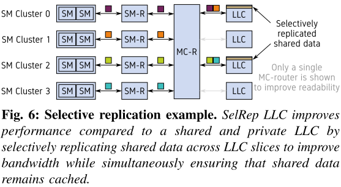
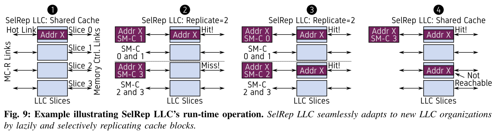
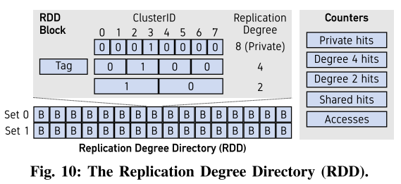
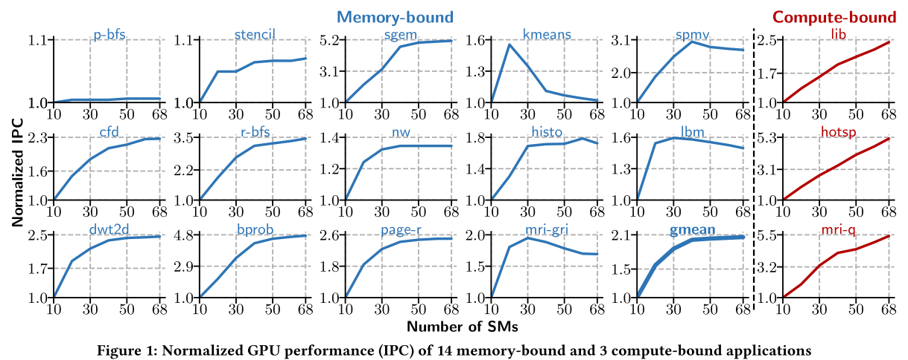
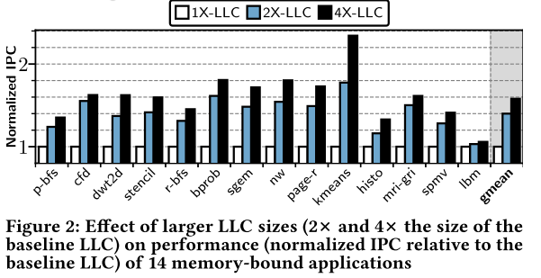
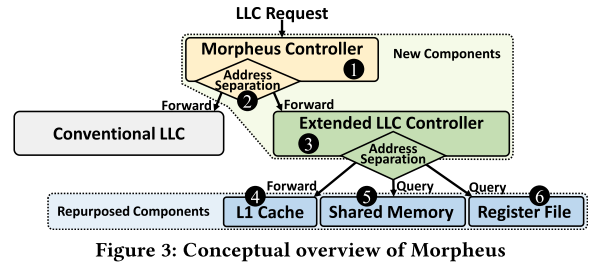
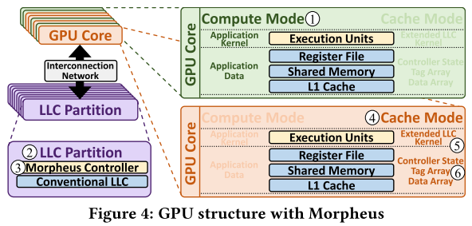
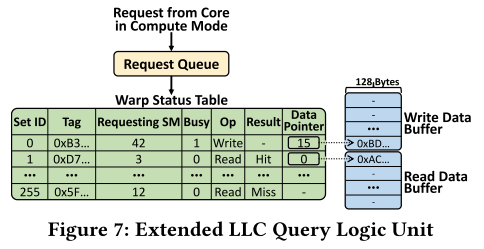
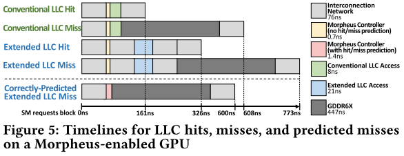

# 一、模拟器相关

## 1. Predicting Execution Times With Partial Simulations in Virtual Memory Research: Why and How

**会议/作者信息：**

> MICRO 2020
>
> Mohammad Agbarya, Idan Yaniv, 以色列理工学院
>
> Jayneel Gandhi, VMware研究院
>
> Dan Tsafrir, 以色列理工学院 & VMware研究院

**作用：**

> 作为背景，引证将存储与计算模型分开处理可行。
>
> Related Works：在这篇论文中，作者通过虚拟内存的部分模拟研究，证明了将存储模型和计算模型分开处理的可行性。他们通过仅模拟内存子系统，并将其输出送入一个数学线性模型来预测执行运行时间，从而实现了比完全模拟快至多1000倍的效率。这为我们的研究提供了有力的支持，证明了我们将硬件存储模型和计算模型分开处理的方法是可行的。在我们的研究中，我们还在存储子系统的模拟基础上，增加了一个详细的事件驱动的计算模型。这种方法不仅继承了部分模拟的高效性，能够快速地进行模拟并预测执行运行时间，而且能够更准确地模拟和预测计算过程中的各种事件和状态变化。

**研究层次：**

> 虚拟内存的运行时预测模型

**研究重要性：**

> 虚拟内存内容不太相关，研究方法可借鉴

**研究差异：**

> 同：有内存子系统的模拟
>
> 异：这篇论文模拟虚存，我们模拟硬件存储

### （1）研究问题

虚拟内存的研究越来越多地利用部分模拟，只模拟内存子系统，其输出被送入一个数学线性模型，预测执行运行时间。部分模拟比完全模拟快100 - 1000倍，但它们有一个固有的缺点：它们不报告应用程序运行时间，而应用程序运行时间是最终反映处理器性能的指标。数学线性模型也只是假设而不是验证其模型的准确性。

### （2）挑战

完整的模拟以每秒几千条指令的速度运行，可能比在物理CPU上执行应用程序慢数百万倍。由于现代工作负载可能会运行几分钟到几个小时，完全模拟它们将需要几周甚至几个月的时间，因此可能不可行。这些高开销严重限制了工作负载的大小和硬件配置的数量，实际上，可以模拟这些硬件配置以探索设计空间。其他人也观察到，过度依赖全（周期精确）模拟器可能导致过拟合到特定设计点[59]。完全模拟的另一个弱点是它需要研究人员进行大量的开发工作。例如，流行的gem 5模拟器包含150万行代码[18]，[19]，因此理解和修改这个复杂的完整模拟器的代码可能具有挑战性。完整的模拟执行起来很慢，因为它们捕获了整个系统的细节。

模型可能与真实的运行时有高达25%-192%的偏差，这样的错误是不可接受的，当处理器的平均性能提高率约为每年10%。预测的准确度应该在1%以内，以便进行更可靠的计算机体系结构研究。

研究人员通常采取采样的指令流输入，以减少模拟时间。盲采样的一个主要缺点是它可能是非代表性的，因为它忽略了真实的工作负载的时变行为。事实上，当应用盲采样时，开创性的SimPoint工作测量到80%的平均模拟误差[67]。

### （3）方案

开发了一个新的运行时模型Mosmodel，它比现有的模型精确1-2个数量级（第七节）。它允许用户：（i）支持应用程序的地址空间与任意组合的不同大小的页面（作者用实验将不同页面大小的运行时参数加入到新模型），以及（ii）控制和系统地改变这些页面的数量和位置。Mosalloc是Mosaic Memory Allocator的缩写。使用术语“mosaic”是因为分配器将不同大小的页面镶嵌到一个连续的虚拟地址空间中。第五节描述了Mosalloc的设计和实现。Mosmodel在三个方面改进。

首先，在Mosalloc的帮助下，它建模了更多的执行点，而不仅仅是两个。

其次，它适应了一个新的经验观察——直观的追溯：当未命中频率下降并接近零时，CPU在减轻TLB未命中方面可能会变得越来越有效。1次多项式（线性线）和2次多项式（抛物线）不足以灵活地模拟这种观察到的行为，因此将Mosmodel定义为3次多项式。

不同工作负载的运行时可以通过不同的性能指标更好地预测，无论是TLB未命中，还是TLB命中，或者是遍历页表所花费的总周期量。因此，Mosmodel利用三个相应的变量，根据每个工作负载选择最合适的变量。

## 2. DiffTune: Optimizing CPU Simulator Parameters with Learned Differentiable Surrogates

**会议/作者信息：**

> MICRO 2020
>
> Alex Renda, Yishen Chen, Charith Mendis, Michael Carbin
>
> 麻省理工学院 计算机科学与人工智能实验室

**作用：**

> 作为背景，模拟器参数设置的一个可选方式。
>
> Related Works：DiffTune通过学习可微替代模型来优化CPU模拟器参数。首先，它使用模拟器运行一组基准测试，收集数据来训练替代模型。然后，它使用梯度下降方法在替代模型上优化模拟器参数。这种方法允许在大规模参数空间中有效地搜索最优参数。

**研究层次：**

> 模拟器参数转为最优化问题

**研究重要性：**

> 模拟器参数设置方式不太相关

**研究差异：**

> 同：都有模拟器参数选择的需求
>
> 异：这篇论文使用优化问题来拟合最优参数选择，我们使用别人已经测量过的参数

### （1）研究问题

CPU模拟器通常由处理器设计概念子集的粗糙抽象模型组成。此外，每个组成模型通常依赖于多个近似设计参数，诸如指令通过处理器的执行级所花费的周期数。为仿真选择适当的模型详细程度以及设置仿真参数需要大量的专业知识。

CPU模拟器通常由处理器设计概念子集的粗糙抽象模型组成。其中一种是可以在给定固定模型细节级别的情况下设置CPU模拟器可学习参数，训练这些参数使其权重保存模拟器的细节，再将调整好的参数插回原模拟器（优化问题）。这种参数设置可通过测量（带宽等）获取。

本文觉得参数测量，以及后续参数优化可能无效果。所以采取学习的方法获取参数。

### （2）挑战

测量参数：设置参数的一种方法是收集物理机中每个单独参数实现的细粒度测量[9，10]，然后将参数设置为它们的测量值[11，12]。当模拟器的语义和测量方法的语义一致时，这些测量可以作为有效的参数值。但是，如果模拟器和测量方法之间不匹配，则测量可能无法提供有效的参数设置[13，第5.2节]。此外，一些参数可能不对应于可测量值。

优化参数：为单个参数开发详细测量方法的替代方案是从物理机性能的粗粒度端到端测量中推断参数。具体地，给定基准的数据集，每个基准都标记有它们在给定CPU上的真实行为（例如，与它们的执行时间或与微体系结构事件（如高速缓存未命中），确定一组参数，使模拟器的预测和机器的真实行为之间的误差最小化。这通常是一个离散的，非凸优化问题，经典的策略，如随机搜索[14]，是棘手的，因为参数空间的大小很大（llvm-mca有大约1019336个可能的参数）。

### （3）方案

本文提出了一种用于程序参数学习的优化算法：DiffTune。使用DiffTune来学习x86基本块CPU模拟器的参数。DiffTune的算法将程序、程序参数的描述和描述程序期望输出的输入-输出示例的数据集作为输入，然后产生程序参数的设置，该设置最小化程序的实际输出和期望输出之间的差异。然后将学习的参数插回原始程序。

代理模型是从程序参数到程序输出的函数的近似值。通过要求代理是可微的，然后可以计算代理的梯度并应用基于梯度的优化[20，21]来识别程序参数的设置，以最小化程序输出（如代理所预测的）和期望输出之间的误差。

# 二、GPU Cache访存相关

## 1. Selective Replication in Memory-Side GPU Caches

**会议/作者信息：**

> MICRO 2020
>
> Xia Zhao, 军科
>
> Magnus Jahre, 挪威科技大学
>
> Lieven Eeckhout, Ghent大学

**作用：**

> 作为以后研究的调研

**研究层次：**

> 并行化共享数据请求，对Last Level Cache的带宽优化

**研究重要性：**

> 对数据密集型应用程序很有帮助

### （1）研究问题

当代GPU使用的共享LLC将共享数据存储在单个LLC切片中。数据密集型应用程序依赖于共享数据来全局协调在任何给定时间运行的数千个线程。这些全局数据结构通常被频繁地访问。因此，它们具有高局部性，并且倾向于缓存在GPU的LLC中。对共享全局数据的请求都进入同一个LLC切片，串行化的内存请求会造成严重的拥塞。因此，共享数据请求被串行化，导致数据密集型应用程序无法获得所需的带宽。

超过一半的共享数据是在LLC中命中的，平均为50.9%。多个SM访问相同的高速缓存线的LLC在同一时间左右，LLC中83.3%的只读缓存行在1000个周期的时间窗口内被2个以上的SM访问，32.8%的LLC缓存行被9个以上的SM访问。

本文目的是尽可能并行化共享数据请求，提升共享LLC带宽。

### （2）其他研究

LLC管理已经在多核处理器中被广泛研究（例如，[12]，[13]，[16]，[19]，[23]，[25]，[26]，[37]，[44]，[63]），这些方法不直接适用于GPU，因为它们专注于减少延迟而不是增加带宽。

### （3）挑战

第一是将LLC中的共享数据复制多份（非共享私有LLC），提高并行请求处理能力，但会造成LLC的容量减小。Adaptive LLC [75]根据应用程序行为动态选择共享或私有组织。不幸的是，这种全有或全无的方法解决LLC串行化问题时，仅当共享数据足够小，足够最大限度地复制LLC时有效果。需要更细粒度的进行共享数据复制，关键的挑战是调整复制程度，使带宽最大化，通过将共享数据的请求路由到不同的LLC切片，同时保护局部性，以确保共享数据保持在LLC中。

### （4）方案

选择性复制（SelRep）复制共享的只读数据，因为（i）只读数据在GPU计算工作负载中很常见（97%的共享高速缓存行是只读的），以及（ii）只读数据可以被复制而不会产生一致性问题。

在编译时，SelRep LLC使用数据流分析来识别只读共享数据结构，并使用专用只读加载指令替换对这些结构的访问。在运行时，利用一种新的轻量级硬件机制—复制度目录（RDD）来分析负载的行为，通过彻底搜索所有静态复制度，然后选择最佳执行者来实现。RDD同时预测所有复制度的LLC命中率。这些命中率被馈送到分析模型以预测和权衡积极影响（改进的带宽）与负面影响（更多LLC未命中）的增加的复制。

也使用最近提出的PAE地址映射，该映射将内存请求均匀地分布到LLC切片和内存控制器的不同地址，以最大限度地提高内存子系统中的并行性[42]。

- 编译时分析。SelRep LLC的编译器将PTX指令级访存指令以及后续使用这些访存指令目的寄存器的相关指令分析来识别对每个地址的所有访问，然后确定它们是读还是写。识别只读数据之后，编译器用特殊的加载只读指令（ld.global.ro）替换其全局数据的加载（ld.global指令）。为了在运行时利用这些信息，在内存请求的请求包中添加了一个只读位。因此，SelRep LLC通过检查该元数据位来识别适合于复制的存储器请求。

* 运行时支持。图8显示了SelRep LLC可以通过对MC路由器的微小修改来实现。复制程度目录（RDD）预测只读存储器请求是否会在具有不同复制程度以及共享和私有组织的LLC中命中。内存地址在路由计算（RC）单元中可用，如果只读位被设置，将请求的地址转发给RDD。SelRep LLC将时间划分为固定长度的时间段(例如，20 K时钟周期)，并在时间段结束重新评估策略的选择。在时间段结束时，从RDD中检索所有复制度的命中率，并将其提供给带宽模型(第III-B节)。SelRep LLC使用分析带宽模型来预测哪个LLC组织最大限度地提高了带宽(第III-C节)。然后为下一个时间段选择该配置。由于内存密集型GPU应用程序通常对带宽非常敏感，因此提高带宽往往会提高性能。

自适应LLC [75]还使用硬件机制来选择私有或共享LLC组织。与SelRep LLC不同，它不能预测选择性复制的LLC命中率。此外，当使用共享LLC组织时，它只能预测LLC命中率。原因是自适应LLC将其预测器定位在LLC切片中，这导致其仅看到私有配置中的单个SM集群的访问。因此，自适应LLC需要周期性地返回到共享LLC组织以考虑阶段行为。SelRep LLC通过将RDD放置在MC路由器中来避免这个问题，这使得它能够监视所有访问，而不管LLC组织如何。

SelRep LLC用于动态选择复制度的分析带宽模型。首先计算LLC切片相似性（LSP）：

$$
LLC\quad Slice\quad Parallelism： LSP = \sum^{S-1}_{i=0}{\frac{R_i}{max(R0,R1,...,R_{S-1})}}\quad\quad\quad\quad\quad\quad (1)
$$

$$
LLC Slice Parallelism： LSP = \sum^{S-1}_{i=0}{\frac{R_i}{max(R0,R1,...,R_{S-1})}} (1)
$$

总有效带宽B是LSP和每个LLC切片可以提供的带宽的函数。反过来，LLC切片提供的带宽取决于其命中率H：

$$
B = LSP×(H×B_{LLC} +Min\{(1−H)×B_{LLC},B_{mem}\}).\quad\quad\quad\quad\quad\quad (2)
$$

更具体地，有效带宽是提供给LLC命中的带宽的总和（即，其中 $B_{LLC}$ 是每个LLC切片的最大带宽）和LLC未命中的带宽的总和。如果LLC未命中的带宽需求小于存储器带宽，则存储器系统将能够隐藏LLC未命中影响。因此，LLC未命中有效地接收与LLC命中相同的带宽。否则，未命中带宽由LLC片对总DRAM带宽 $B_{mem}$ 的比例份额确定。

公式2准确地反映了带宽与LLC容量之间的权衡，这对于有效利用选择性复制至关重要。更具体地，增加复制度会增加LSP和 $R_{miss}$ ，并且等式2使得SelRep LLC能够智能地平衡这些冲突的影响。

在运行时，SelRep LLC在每个时间段结束时为所有共享度计算公式1和2。为了实现这一点，SelRep LLC维护用于对每个LLC切片的请求的数量的计数器（即，R1）。此外，RDD提供预测的命中数（ $R_{hit}$ ）。最后，SelRep LLC找到具有最高预测带宽B的复制度，并指示MC路由器在下一个时间段中使用该复制度。

## 2. Morpheus: Extending the Last Level Cache Capacity in GPU Systems Using Idle GPU Core Resources

**会议/作者信息：**

> MICRO 2020
>
> Sina Darabi, Negar Akbarzadeh, Hamid Sarbazi-Azad, Sharif University of Technology
>
> Mohammad Sadrosadati, Joël Lindegger, Jisung Park, Juan Gómez-Luna, Onur Mutlu, ETH
>
> Mohammad Hosseini, Institute for Research in Fundamental Sciences (IPM)
>
> Jisung Park, POSTECH

**作用：**

> 作为以后研究的调研

**研究层次：**

> 用部分闲置SM的L1 Cache/Shared Memory/Rigister File对其他正在计算的SM做片上LLC的空间扩展

**研究重要性：**

> 多SM并不能发挥全部并行性的数据很有用，提出的方法对数据密集型应用程序很有帮助

### （1）研究问题

GPU内存带宽会成为性能瓶颈，导致GPU内核利用率不足。Morpheus的核心思想是利用未使用的内核资源来扩展GPU的LLC容量。

### （2）其他研究

[9-18]仅让GPU核心的子集执行内存受限的应用程序，并以三种方式之一利用剩余的GPU核心：（1）对这些核心进行功率门控以保存能量[9]，（2）将它们用于已经运行的存储器受限应用的冗余执行以获得更好的可靠性[10-11]，以及（3）将额外的计算密集应用程序协同调度到这些核心，以增加GPU的总吞吐量[12-18]。

### （3）挑战

内存受限的应用程序无法充分利用GPU的计算吞吐量，因为它们受到有限内存带宽的限制。这会导致长时间的内存访问延迟，这不能通过线程级并行隐藏，导致核心空闲和性能饱和[4，21-29]。

两个关键的观察。首先，9个内存绑定应用程序（p-bfs、cfd、dwt 2d、stencil、r-bfs、bprob、sgem、nw、page-r）的SM数量增加，它们的性能逐渐饱和（停止增加）。相比之下，计算密集型应用程序的性能随着SM的增加而不断提高。其次，对于5个内存受限的应用程序（kmeans、histo、mri-gri、spmv、lbm），在一定数量的SM之后，性能急剧下降。例如，在kmeans应用程序使用超过20个SM后，性能大幅下降，68个SM的应用程序的性能几乎与10个SM相同，比20个SM低50%。结论是，限制运行内存受限应用程序的SM数量（在一些SM计数之后）不仅不会显着损害性能，而且在某些情况下甚至可以提高性能。

2×和4× LLC大小都提高了所有评估的内存限制应用程序的性能。特别是，4倍大的LLC将性能提高了2.34倍（kmeans），平均提高了1.57倍（几何平均值）。结论是，一个更大的LLC有效地和一致地提高内存绑定的应用程序的性能。

### （4）方案

在Morpheus中，每个GPU核心有两种执行模式：计算模式和缓存模式。计算模式下的核心按常规操作并运行应用程序线程。处于高速缓存模式的核，Morpheus调用使用核的片上存储器（即，寄存器文件、共享内存和L1），以扩展LLC容量，用于运行内存受限的工作负载。

Morpheus在GPU硬件中添加了一个控制器，将LLC请求转发到传统LLC（由硬件管理）或扩展LLC（由helper kernel管理）。控制器执行三个主要任务：它（1）根据所请求的存储器地址（即，LLC Set Index），（2）跟踪未完成的扩展LLC请求，以及（3）预测扩展LLC查找的结果（命中/未命中），使得其仅将预测在扩展LLC中命中的请求转发到处于高速缓存模式的GPU核心，这减轻了扩展LLC未命中的开销。Morpheus控制器使用Bloom过滤器[19]进行命中/未命中预测，提供零假阴性和可忽略的假阳性率。Morpheus的GPU设计具有四倍大小的传统LLC。

为了提高Morpheus的效率，在基本设计的基础上采用了两种优化技术。首先，通过在扩展LLC内核中采用高速缓存压缩技术来增加扩展LLC的有效容量。其次，通过在GPU指令集架构中添加新的专用指令来加速扩展LLC中的数据阵列访问。

> * 是否可压缩LLC cache来实现SPMM加速。

图3给出了Morpheus中LLC查找过程的概念概述。启用Morpheus的GPU中的LLC请求首先到达Morpheus控制器（图3中的1）。Morpheus控制器将LLC请求转发到传统LLC（与现有GPU完全相同）或扩展LLC（建议）。转发决定基于静态地址映射方案，称为地址分离2。对扩展LLC的访问由扩展LLC控制器3使用处于高速缓存模式的核的片上存储器单元来服务。扩展LLC控制器或者将给定请求转发到核的L1高速缓存4，或者直接查询寄存器文件6或共享存储器5。转发或查询决定基于与Morpheus控制器中相同的静态地址分离原则。

Morpheus将Morpheus控制器实现为每个LLC分区的新硬件单元，并且将扩展的LLC控制器实现为软件（即，扩展的LLC内核）以高速缓存模式运行在核上。图4显示了一个支持Morpheus的GPU的图形示例，其中包含这些新组件。LLC请求源自计算模式中的核（图4中的1），并且基于静态地址映射方案通过互连网络移动到LLC分区2，类似于常规GPU中使用的方案。然后在启用Morpheus的GPU上的LLC分区3本地的Morpheus控制器，将请求转发到本地常规LLC，或者通过互连网络转发到基于静态地址分离方案（§4.1.1）在高速缓存模式4下运行的负责GPU核心。负责的高速缓存模式GPU核心由地址分离方案确定。扩展LLC控制器被实现为在高速缓存模式5下在核上运行的软件助手内核（扩展LLC内核）的多个实例。该内核基于静态地址分离方案（§4.1.1）针对每个传入请求查询本地存储器单元6中的一个，并且通过互连网络将响应发送回Morpheus控制器3。如果请求是扩展LLC中的命中，则通过互连网络将该高速缓存块发送到最初发出LLC请求1的GPU核心。如果请求是扩展LLC中的未命中，则LLC分区将其完全像常规GPU中的LLC未命中一样对待。

Morpheus控制器有三项主要任务：（1）在常规LLC和扩展LLC之间分离LLC请求，（2）处理扩展LLC和LLC分区之间的通信，以及（3）预测扩展LLC查找的结果（命中/未命中），使得Morpheus控制器仅将预测为扩展LLC中的命中的请求转发到处于高速缓存模式的GPU核心，这减轻了扩展LLC未命中的开销。图7显示了主要组件。

- [ ] 地址分离。由于支持Morpheus的GPU采用两个不同的LLC（即，传统LLC和扩展LLC），应该有一种机制将每个高速缓存块映射到这些LLC之一。为此，Morpheus将存储器地址空间静态地划分为大小与常规LLC容量和扩展LLC容量成比例的两个分区。传统LLC负责缓存第一个分区，而扩展LLC负责缓存第二个分区。当Morpheus控制器收到LLC请求时，一个称为地址分离器的单元检查set index是否在扩展LLC服务的存储器地址范围内。如果是，该单元将LLC请求转发到Morpheus控制器中的下一个单元，命中/未命中预测器。否则，常规LLC以与常规GPU架构中完全相同的方式处理请求。

- [ ] 命中/未命中预测。与传统LLC中的未命中相比，扩展LLC中的未命中在等待时间方面更昂贵。图5分解了传统和扩展LLC中命中和未命中的概率（见第6节）。作者观察到，传统LLC中的未命中花费608 ns来服务，而扩展LLC中的未命中花费773 ns（即，27%）。这主要有两个原因。首先，与传统LLC未命中相比，扩展LLC未命中增加了往返互连网络延迟（图5中的两个灰色框），以在高速缓存模式下在Morpheus控制器和GPU核心之间移动请求和响应。其次，用于访问扩展LLC的等待时间比用于常规LLC的等待时间长，因为在扩展LLC中，标签查找和数据阵列访问必须由扩展LLC内核管理（即，软件）。

Morpheus减轻了扩展的LLC未命中使用命中/未命中预测器的开销。在Morpheus控制器中的地址分离机制确定给定请求落入扩展LLC的地址空间之后，命中/未命中预测器决定该请求是否可能是扩展LLC中的命中。如果该请求被预测为命中，则Morpheus控制器将该请求转发到扩展LLC。否则，Morpheus控制器直接访问片外DRAM以服务于存储器请求。图5示出了正确预测的扩展LLC未命中的时间轴。如果正确地预测未命中，则避免了（1）互连网络往返以及（2）用扩展LLC内核查询标签阵列的不必要延迟。因此，正确预测的扩展LLC未命中可以与常规LLC未命中一样快地被服务。

为了在命中/未命中预测器存在的情况下保持正确性，必须了解是否可以接受以及哪些类型的错误预测。作者观察到，当实际上请求未命中时，错误地将请求预测为LLC命中是可以接受的。这是因为预测的LLC命中导致在扩展的LLC中进行查找，此时将发现误预测。然而，这样的误报是不期望的，因为它们将扩展的LLC未命中的等待时间增加到与不存在命中/未命中预测的等待时间相同的等待时间。相反，即使所请求的地址在LLC中，也错误地将请求预测为LLC未命中，这可能违反一致性和一致性保证。例如，如果对脏缓存块的请求被错误地预测为LLC未命中，则请求核将从主存储器接收过期值，这违反了基本缓存正确性。因此，为了正确性，命中/未命中预测器必须不产生这样的假阴性，否则它应该从其误预测中恢复，使得不出现正确性问题。

作者使用Bloom过滤器设计命中/未命中预测器[19]。Bloom过滤器非常适合作者的需求，因为它们提供了快速和低成本的集合成员查询，而不会出现误报。在作者的命中/未命中预测器中，布隆过滤器表示当前在给定的扩展LLC集中的LLC块。为了避免越来越频繁的误报，必须定期清除Bloom过滤器，2在此之后存在误报的风险。接下来作者描述一个使用两个Bloom过滤器的算法，这两个过滤器被交替清除，从而避免了假阴性。

## 3. RnR: A Software-Assisted Record-and-Replay Hardware Prefetcher

**会议/作者信息：**

> MICRO 2020
>
> Chao Zhang, Yuan Zeng, Lehigh University
>
> John Shalf, Lawrence Berkeley National Lab
>
> Xiaochen Guo, Lehigh University

**作用：**

> 作为以后研究的调研

**研究层次：**

> 软件辅助的硬件预取器

**研究重要性：**

> 对含有大量重复、但不规则的内存访问模式的应用（SPMV等）很有帮助

### （1）研究问题

具有不规则内存访问模式的应用程序不能像具有良好局部性的应用程序那样很好地从内存层次结构中受益。相对较高的未命中率和较长的存储器访问延迟会导致处理器停止并降低系统性能。预取可以通过预测哪些内存地址将在不久的将来被访问并提前发出内存请求来帮助隐藏未命中惩罚。

### （2）其他研究

各种硬件预取器，以基于在过去观察到的访问序列来预测未来的存储器访问[9]，[10]，[25]，[36]，[38]，[41]，[47]，[52]，[53]，[60]。商业高性能处理器也采用了越来越复杂的硬件预取器[21]，[30]，[51]。

预取器设计通常针对应用存储器访问模式中的常见行为进行定制。常规的内存访问模式，如流或stride，很容易使用简单的硬件预取器检测和预测[45]，[46]，[55]。不规则的存储器访问模式需要复杂的硬件设计来记录存储器访问历史或训练模型参数以预测未来的访问模式。在大多数硬件预取器中，在程序执行期间，公共模式被记录在共享表中。由于这些模式表容量有限，硬件预取器面临区分类似内存访问模式的挑战[9]，[25]，[36]，[38]，[41]，[47]，[52]，[53]。此外，硬件预取器并不精确地知道何时需要数据。一类硬件预取器专注于识别空间相关性，而不是存储器访问的顺序或时序[9]，[47]，[53]。另一类硬件预取器利用时间相关性[8]，[25]，[38]，[58]，[59]。同时，通常使用的数据结构（例如，图表示[44]、[48]和稀疏矩阵存储格式[23]）可以提供关于将以什么顺序需要哪些数据的信息。软件预取器[5]，[7]根据程序员的知识或常见的程序行为来决定如何发出预取指令。然而，软件预取器添加指令来生成地址，这可能会抵消预取带来的性能增益。此外，软件预取器不知道系统的运行时动态——总线拥塞和高速缓存争用可能导致预取返回数据的可变延迟。因此，软件预取器面临着及时发布预取的挑战。

### （3）挑战

软件预取器增加了指令开销，而硬件预取器不能以高精度有效地预测不规则的存储器访问序列。

### （4）方案

观察到在许多重要的非常规应用中（例如，迭代求解器、图形算法和稀疏矩阵-向量乘法），存储器访问序列在多次迭代或编程阶段上重复。当模式较长时，传统的时空预取器不能达到高的预取精度，但这些重复模式可以被程序员知晓。

理想的预取机制应该1）准确地识别何时以及哪些数据要预取，以及2）将地址生成与处理器解耦。在这项工作中，一个新的软件辅助记录和重放（RnR）硬件预取器是pro-So，提出了允许程序员控制何时和哪些数据预取。RnR预取器提供轻量级编程接口，以识别应用程序中哪些数据结构和代码区域具有重复的内存访问模式。由于预定义数据结构上的目标存储器访问的第一次出现而导致的该高速缓存未命中将被记录在存储器中。关于程序的执行何时将使用数据的定时信息被记录在元数据中以用于将来的及时预取。预取器将被调用以重放记录的地址序列，并且当在程序执行期间预期重复的存储器访问模式时提取对应的数据块。预取速度由硬件控制，以实现及时的预取。所提出的RnR预取器由软件指导。因此，它可以更好地了解要记录哪些数据，何时记录以及何时重放。因此，所提出的RnR预取器可以实现接近100%的未命中覆盖率和预取精度的应用程序与长期重复不规则的内存访问模式。

提出了一个软件辅助的硬件预取器，专注于重复不规则的内存访问模式的数据结构，不能贝内于传统的硬件预取器。其关键思想是提供一个编程接口，在首次出现内存访问模式时记录缓存未命中序列，并通过在随后的重复中重放模式来预取。所提出的记录和重放（RnR）预取器提供轻量级软件接口，使得程序员可以在应用代码中指定：1）哪些数据结构具有不规则的存储器访问，2）何时开始记录，以及3）何时开始重放（预取）。

