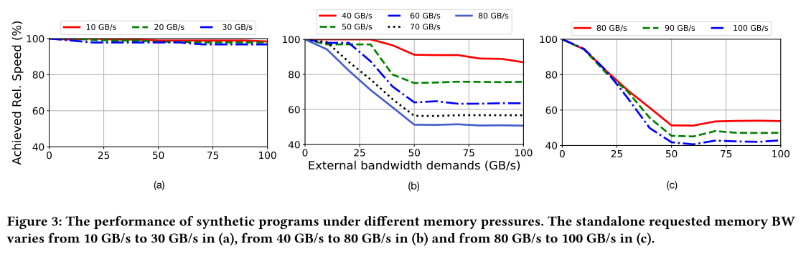
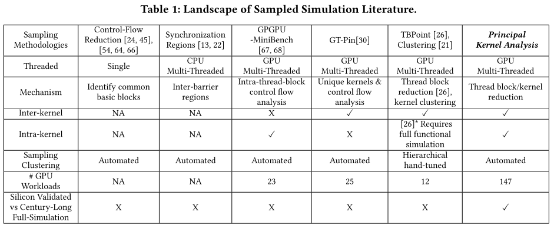

# 一、模拟器相关

## 1. Photon: A Fine-grained Sampled Simulation Methodology for GPU Workloads

**会议/作者信息：**

> MICRO 2023
>
> Changxi Liu, 新加坡国立大学
>
> Yifan Sun, College of William & Mary, USA
>
> Trevor E. Carlson, 新加坡国立大学

**作用：**

> * 作为背景：对GPU的工作负载进行采样，实现加速模拟。
>
> * Photon在三个不同的级别上结合了基于采样的模拟解决方案，包括内核采样，warp采样和基本块采样。
>
> * 提出GPU工作负载包含有限类型的内核、线程束、基本块和指令，因此不需要进行大量耗时的前期分析。这些单元通常是高度重复的，并表现出类似的行为，从而避免以非常详细的方式分析和模拟所有这些单元。
>
> * **使用BBV特征向量评估指令基本块/warp的相似性。**

**研究层次：**

> 采样模拟的采样方式选择。

**研究重要性：**

> 显著加速模拟速度，并能够通过采样层次的选择保证精度。

**研究差异：**

> 同：均为采样模拟。CPU架构的单线程工作负载采样主要来自两个代表性的工作：SimPoint和SMARTS （分别为配置文件驱动和统计采样模拟方法）。此外，采样仿真方法包括LoopPoint、FlexPoints和BarrierPoint，被用于多线程应用程序仿真。这篇论文对GPU模拟进行采样。
>
> 异：架构不同，CPU一侧为单/多线程，GPU一侧为SIMT模型。
>
> GPU架构与CPU架构不同：（1）需要特定的方法，因为来自不同级别GPU工作负载的数百到数千个基本工作单元，包括线程，基本块和指令，同时执行并与同一级别的其他工作交互。（2）采样模拟方法应该出现在不同的层次，因为没有一种方法可以处理所有的GPU工作负载，这是因为一些GPU工作负载具有大量的线程束，每个线程束仅包含数十个指令，而其他GPU工作负载具有有限数量的线程束，每个线程束执行大量指令。（3）由于GPU工作负载包含有限类型的内核、线程束、基本块和指令，因此不需要进行大量耗时的前期分析，这些单元通常是高度重复的，并表现出类似的行为，从而避免以非常详细的方式分析和模拟所有这些单元。

### （1）研究问题

抽样模拟方法。

### （2）其他研究
MacSim是Trace驱动的Intel集成显卡模拟器，使用时序模型执行由功能仿真生成的trace。trace驱动的模拟器不依赖于功能模型，但它们确实需要预先生成的trace，可能会使评估某些设计功能（如动态同步机制[51]和值相关优化[54]）变得具有挑战性。

另一方面，执行驱动的GPU模拟器，包括MGPUSim，gem 5 APU和GPGPUSim，直接执行二进制，但由于在性能模拟期间需要功能模拟，因此性能较低。其他的模拟器，包括Node-Sim [32]和NVArchSim [57]，支持execution和trace驱动模式。当前的GPU模拟器显示出低于30 KIPS的模拟性能[32]，因为模拟器在比真实的GPU核心少得多的CPU核心上模拟GPU工作负载。

### （3）挑战

为了执行采样模拟，模拟器必须支持两种模式，快进模式（仅允许功能仿真）和详细模式（启用时序模型）。采样模拟器在这两种模式之间切换，并将整个应用程序分为快进模式区域和详细模式区域。快进区域的最终结果由其他区域以详细模式预测。CPU的抽样模拟方法可以分为两个主要方向：统计抽样和配置文件驱动的抽样模拟。统计抽样模拟[59，60]利用详细模式中的许多小区域来表示整个应用程序，只要这些区域足以覆盖所有应用程序行为。另一方面，配置文件驱动的采样模拟[11，45，48]利用前期分析和聚类方法来选择代表性区域以详细模式进行模拟。然后使用这些区域来确定工作负载的总体性能。然而，随着线程数量的增加，这些应用程序表现出复杂的行为，使得使用传统的采样方法准确地模拟其性能变得具有挑战性。

### （4）方案

五点观察：

* 大多数GPU工作负载由于线程之间的交互而没有表现出稳定的Kernel内执行相位。现有的CPU采样模拟主要依赖于相位检测方法[10，22，45，49，59，60]。
* IPC在整个工作负载执行期间可能不会保持稳定。
* 基本块的执行时间可以随时间而稳定。
* 规则应用的warp可以随时间推移保持稳定。
* 具有类似GPU BBV（Basic Block Vectors）的GPU内核也具有类似的IPC。BBV通常用于基于CPU的采样方法[11，45，48]以确定相位相似性。BBV是在程序执行期间至少执行一次的基本块的列表，由基本块的第一条指令的程序计数器标识。SimPoint [48]指出，如果程序的两个部分具有相似的BBV，则它们具有相似的执行行为。对于GPU工作负载，执行相同指令序列的线程束具有相同的BBV。

三级采样：

* Warp采样。在warp级别对工作负载进行采样可以避免warp内部的一部分指令模拟，并可以显著缩短模拟时间。warp采样适用于具有大量warp的应用程序，因为在这种情况下大多数warp执行相同的指令。

* 基本块采样。在线程束比较大的kernel中，第一个线程束的完成时间通常接近GPU内核的完成时间，例如，对于多个输入，矩阵乘的第一个线程束在大多数指令完成之后完成。此外，基本块采样适用于不规则的应用程序（例如SPMV），因为它将kernel分解为更小的元素，可以更好地利用统计属性。

* Kernel采样。GPU工作负载，特别是像VGG-16这样的实际应用，通常包含多个Kernel。Photon通过避免对重复的Kernel的详细模拟来加速模拟。

## 2. ArchExplorer: Microarchitecture Exploration Via Bottleneck Analysis

**会议/作者信息：**

> MICRO 2023
>
> Chen Bai，香港中文大学，阿里达摩院
>
> Jiayi Huang，Yuzhe Ma，香港科技大学广州校区
>
> Xuechao Wei，Sicheng Li，Hongzhong Zheng，阿里达摩院
>
> Bei Yu，香港中文大学
>
> Yuan Xie，香港科技大学，阿里达摩院

**作用：**

> 作为背景，设计空间探索的一个例子。
>

**研究层次：**

> 自动化瓶颈分析的设计空间探索

**研究重要性：**

> 是模拟器的后端，设计空间探索

**研究差异：**

> 同：使用Stall关键路径分析性能瓶颈。
>
> 异：不使用详细的周期精确模拟。

### （1）研究问题

微体系结构探索是一个设计空间探索（DSE）问题，旨在寻找性能-功耗-面积最优的微处理器参数。架构师经常面临数十亿或数万亿的参数组合，其中一种组合需要很长的运行时间才能通过详细的模拟获得PPA的结果。

这篇论文规避了大量的建立机械模型所需的领域内专家知识，并减轻了黑盒方法较高的计算需求。关键是通过自动化瓶颈分析的DSE，其中瓶颈是阻碍程序执行进度的因素，通过自动化的瓶颈检测和消除来减少对专家知识的需求。

### （2）其他研究

在工业界，微体系结构参数是根据大量的仿真结果分析和架构师的专业知识确定的。问题仍然是架构师给出的解决方案是否最优，或者可以从次优的解决方案中获得多少好处。

在学术界，研究人员采用机制模型或黑箱方法。机制模型通过展开micro-executions来研究PPA与微结构参数之间的关系，为单个组件[26，27，48，55]或整个微处理器[19，31，43]构建可解释的方程。微架构探索是通过扫描设计空间或使用机制模型快速评估来进行的。然而，该模型需要大量的领域知识来构建和验证。更常用的解决方案使用黑盒方法[7，8，10，12，15，16，28，32，34，35，37，60]，该方法通过大型数据集使用机器学习技术训练黑盒模型，而且更好的结果往往出现在黑盒模型中[8，12，28，35，37]。然而，黑箱方法并不是很好，它们需要很高的计算资源来构建用于训练的数据集[12，28]。对黑盒方法的另一个批评是，盲目地（纯粹由算法驱动，而不是与专业知识紧密结合）探索微架构似乎很天真，忽略了架构师已经知道的大多数设计的特征。

### （3）挑战

该问题的两个挑战是极大的和非光滑的设计空间和较高的仿真开销。

DSE的两个设计原则：

* 首先，应该尽可能多地捕获对执行时间有贡献的依赖项。更准确地估计资源利用率有利于DSE。
* 其次，并发事件应该是可区分的。在准确估计瓶颈对执行时间的贡献时，可扩展性是必不可少的。本文提出了一种基于关键路径分析的新的图模型公式[24，36，44，45，56]来实现这两个设计原则。

### （4）方案

ArchExplorer包含三个阶段：在给定设计空间的情况下，利用先验知识对初始微架构参数进行采样或选择。

* 第一阶段引入了一个新的DEG公式，消除了以前工作的限制。基于新的DEG，本文提出了诱导DEG，
* 第二阶段中构建关键路径。
* 第三阶段计算微执行运行时的资源贡献来生成瓶颈分析报告，再根据报告重新分配资源，产生新的设计。

## 3. Path Forward Beyond Simulators: Fast and Accurate GPU Execution Time Prediction for DNNWorkloads

**会议/作者信息：**

> MICRO 2023
>
> Ying Li，Yifan Sun，William & Mary
>
> Adwait Jog，University of Virginia

**作用：**

> 作为在较高层次（数据驱动、数据层次）加速模拟的背景

**研究层次：**

> 数据驱动的DNN模拟器

**研究重要性：**

> 对专用领域模拟减少硬件参数的输入，直接在较高层次简化模拟流程

### （1）研究问题

周期精确的模拟器耗时长，提出数据驱动的模拟器。不在乎指令的具体细节执行过程，在更高层次做模拟。

### （2）挑战

周期精确的模拟器对于模拟当今的大规模系统和DNN变得越来越不切实际，需要寻找替代的轻量级解决方案。

### （3）方案

首先从HuggingFace，TorchVision并测量模型、层和Kernel在各种GPU上的执行时间。分析表明，每个GPU上的执行时间与工作量（由浮点运算表示，FLOPs）线性相关。特别是，经过分类，Kernel执行时间表现出几乎完美的线性关系。我们发现，使用复杂的统计方法，如主成分分析（PCA）和神经网络，对于在GPU上运行的高度规则的DNN工作负载是不必要的。与其在单个模型中引入更多的硬件参数来预测所有设备上所有工作负载的性能，不如用更少的参数构建更多的模型，这对于DNN系统评估来说更加实用和准确。遵循这条路径，这篇论文揭示了FLOP如何用于内存密集型和计算密集型工作负载评估，并实现较高精度。

基于对性能测量的详细调查，建立了几个基于线性回归的性能模型，这些模型具有不同的复杂度和预测精度，包括端到端（E2E）模型、分层（LW）模型、内核（KW）模型和InterGPU内核（IGKW）模型。

## 4. PCCS: Processor-Centric Contention-aware Slowdown Model for Heterogeneous System-on-Chips

**会议/作者信息：**

> MICRO 2021
>
> Yuanchao Xu，Xipeng Shen，北卡罗来纳州州立大学
>
> Mehmet E. Belviranli，科罗拉多矿业学院
>
> Jeffrey Vetter，橡树岭国家实验室

**作用：**

> 作为设计空间探索的例子

**研究层次：**

> 多应用同时运行时的带宽冲突建模

**研究重要性：**

> 对于同时运行多个带宽需求高的应用程序的硬件优化很重要

### （1）研究问题

SoC内部包含种类不同的加速器和共享的内存单元。设计这样的SoC，需要考虑的问题是如何针对对应的问题领域，选择最好的Processing Units (PU)、每种PU的数目、每个PU的频率、整个SoC的带宽。

这篇论文主要是建模在多种应用同时运行于硬件上时的带宽分配，带宽并不是按比例分配给各种应用。

### （2）其他研究

许多先前的性能模型已经将存储器争用纳入考虑[9，10，12，15，16，23，27，29-31，38，41，42，46，47]。然而，它们用于芯片出来后的优化，而不是在SoC设计阶段使用。在创建性能模型以指导硬件设计的工作中[7，19，40，48]，最先进的工作是Gables [19]，这项工作第一次尝试将存储争用集成到Roofline模型中。然而，它提出的性能模型非常粗糙，有许多过度简化。例如，它假设可用的存储器带宽在异构PU之间按比例分布。这些简化造成了很大的误差。在SoC设计中，如何有效地处理存储器争用一直是一个亟待解决的问题。

### （3）挑战

设计SoC的难点在于，SoC需要同时运行多种应用，这些应用一起运行的时候对于SoC的性能影响是尚未被研究清楚的问题，只有了解这个问题，才能更好地进行SoC设计的决策。过去有很多工作关注对于给定的SoC如何部署多种不同应用以提高性能，也有很多工作关注如何设计SoC以适应多应用场景，但是这些工作缺少对于内存带宽的良好建模，他们的建模过于粗糙，比如认为带宽是按比例分配给异构PU。这种粗糙的建模往往会得到错误的结论，比如他们认为当所有应用的带宽需求总和低于系统总带宽，就不会导致性能下降，这个与实际实验的结果是非常不符的。

### （4）方案

提出一个新的模型用于辅助SoC设计，称为processor-centric contention-slowdown modeling (PCCS)。

作者做了以下实验：通过生成一系列不同的计算密度和带宽需求的kernel，去测量在Nvidia Jetson AGX Xavier上性能随着带宽需求变化和变化的曲线。考虑一个PU以及该PU上运行一个kernel，然后在其他PU上运行的kernel的带宽需求为external bandwidth demands。

这里他们展示了三种情况：

1. 当前kernel的带宽需求低，图a)，external bandwidth对性能影响很小
2. 当前kernel的带宽需求中等，图b)，随着external bandwidth增加，性能下降呈现三段趋势：平-速降-平
3. 当前kernel的带宽需求高，图c)，随着external bandwidth增加，性能呈现两段趋势：速降-平

基于上述观察，作者给出了一个three-region的模型，描述低-中-高带宽冲突的三段式性能模型。使用者可以用PCCS去观测不同task映射、不同memory配置、不同PU配置下的性能下降曲线，从而选择好的SoC配置。

## 5. Principal Kernel Analysis: A Tractable Methodology to Simulate Scaled GPU Workloads

**会议/作者信息：**

> MICRO 2021
>
> Cesar A. Baddouh，Mahmoud Khairy，Timothy G. Rogers，普渡大学
>
> Roland Green，Cerebras芯片公司
>
> Mathias Payer，瑞士洛桑联邦理工学院

**作用：**

> 作为采样模拟的背景

**研究层次：**

> 主要内核分析、程序采样方法

**研究重要性：**

> 显著加速模拟速度，并能够通过分层采样、可扩展的分析方法保证精度。

### （1）研究问题

现有的CPU采样机制（如SimPoint）减少了每个线程的工作负载，并且不适合减少线程数量至关重要的GPU程序。GPU空间上的采样解决方案缺乏真实芯片的验证，需要按工作负载进行参数调整，并且无法扩展。因此需要一个易于处理的采样解决方案，在当代规模的工作负载上进行验证，以提供可靠的模拟结果。通过研究具有长达几个世纪的模拟时间的扩展工作负载，作者发现了现有解决方案的实际和算法局限性，并提出了主要内核分析：一种分层程序采样方法，通过使用可扩展的分析方法，易处理的聚类算法和内核内IPC稳定性检测来选择代表性的内核部分，从而简洁地表示GPU程序。

### （2）其他研究

现有的方法限制了工作负载或模拟平台，引入了各种限制。常见的方法包括：

（i）缩放工作负载输入[14，23，56]，由于运行时间极短，这降低了模拟结果的适用性（忽略缩放效应）；

（ii）模拟缩放工作负载的前几十亿条指令[10，32，60]，限制在有限的模拟范围内（通常将测量限制在预热阶段）；

（iii）减少模拟GPU的规模[29，42，49]，这迫使工作负载适应不同的硬件。

这些方法中的每一种都有局限性，并且没有公开的工作来验证它们对它们所期望代表的扩展工作负载和系统的影响。

传统的机制来选择CPU程序的代表部分[13，22，24，45，64，66]集中于从单个线程中选择基本块。这种方法不适合GPU程序。GPU程序中各个线程的控制流图相对较小，因为与CPU线程相比，每个线程执行的工作量有限。因此，在不减少线程数量的情况下选择每个线程的基本块向量不会显著减少模拟时间。之前选择GPU程序的代表性部分的工作[26，67，68]缺乏真实芯片的验证，需要按工作负载调整，并且不能扩展。

像TBPoint [26]这样的智能解决方案需要完整的功能模拟来产生线程块级的分析信息，并依赖于内核间的聚类。此方法无法扩展到MLPerf等现代工作负载。因此，没有GPU工作负载采样方法获得普遍接受。从长时间运行的工作负载中收集甚至有限数量的统计数据很快就变得不切实际，并且任何依赖于整个程序的详细分析的采样方法都无法扩展到当代工作负载。

### （3）挑战

1. 在CPU上的采样方法不适合GPU程序；
2. 没有现有的采样方案经过真实芯片的验证；
3. 现代工作负载太大无法通过整个程序的详细分析模拟。

### （4）方案

作者提出了自动化的Principal Kernel Analysis（PKA）的方法，减少了内核的数量和长度，用于代表可完全扩展的GPU应用程序。

这基于三个关键观测：

* 首先，即使实际工作负载可以启动数百万个内核实例（MLPerf的SSD训练中为530万），这些内核也可以使用从详细的芯片profiling中获得的主成分分析，通过一组独立于架构的指标进行表征和分组。

* 其次，详细的芯片性能分析在规模化的工作负载中是不切实际的，因此需要两级性能分析。对于具有不切实际的分析时间的工作负载，PKA对应用程序内核的子集执行详细的分析，并对其余部分执行轻量级分析。使用各种分类算法（随机梯度下降，高斯朴素贝叶斯，多层感知器），PKA将轻度轮廓化的内核映射到详细轮廓化阶段确定的组中。使用这种逐内核分析，执行主内核选择（PKS），以提取获得目标预计执行时间误差所需的最小内核集。
* 第三个观察来自于单个内核的行为。在一个内核内的IPC通常稳定在一个值，这将是内核的最终IPC的代表。借用金融分析部门试图预测股票价格随时间稳定的方法[20]，在整个模拟过程中跟踪内核IPC的标准差。一旦在线稳定计算达到适当的置信区间，就使用有关运行内核的占用信息，根据剩余工作量进行主内核投影（PKP）。在线机制可以在模拟中快速执行，并针对轻量级芯片进行验证。
