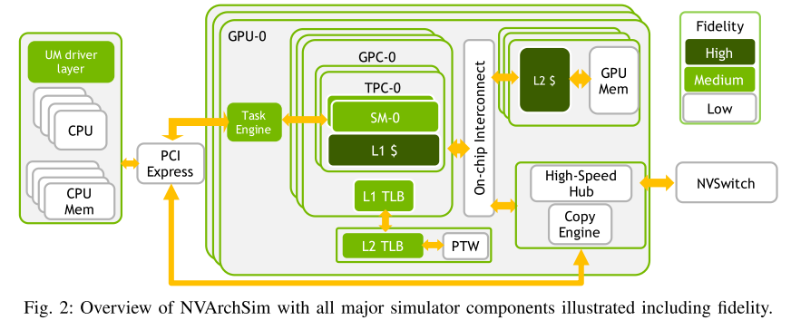
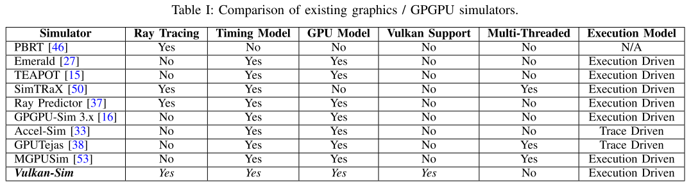

# 一、模拟器相关

## 1. NVBit: A Dynamic Binary Instrumentation Framework for NVIDIA GPUs

**会议/作者信息：**

> MICRO 2019
>
> Oreste Villa，Mark Stephenson，David Nellans，Stephen W. Keckler，NVIDIA

**作用：**

> * 强相关，利用NVBit修改插桩功能提取SASS指令信息是论文的一个小节。

**研究层次：**

> GPU上的动态二进制插桩工具。

**研究重要性：**

> 重要，填补了GPU上动态二进制插桩工具的空白。

**研究差异：**

> 同：都是为应用程序在GPU上的执行提供插桩功能。
>
> 异：NVBit不依赖于编译器版本、不依赖于源代码编译、动态执行过程中插桩。
>

### （1）研究问题

开发了GPU上插桩工具的用户级API，可用于检查/监测指令执行，以及拦截CUDA驱动程序的API调用。从用户的角度来看，NVBit工具将实现一个或多个GPU设备功能，这些功能根据用户定义的插桩点注入应用程序的GPU内核中。NVBit框架允许用户编写任意复杂的工具。

### （2）其他研究
针对CPU架构的二进制插装工具包括ATOM [35]，Intel Pin [12，19]，DynamoRIO [2]和HP Caliper [13]，这些框架都采用了某种形式的动态二进制重写，而不需要应用程序源代码。

GPU上的基于编译器的插装工具SASSI [36] [32]和Ocelot [8]有很大限制：

* 绑定到特定的编译器版本，需要重新编译目标应用程序。
* 不能通过PTX [30]代码的即时编译针对GPU驱动程序生成代码。
* 不能插桩无源代码的加速库如cuBLAS，cuFFT，cuSOLVER和cuDNN [29]。
* 需要在编译时选择插装站点、函数和参数类型，因此无法根据动态应用程序行为调整插装。

### （3）挑战

调用硬件上的profile开关，除英伟达别人不知道这些开关。

## 2. Vortex: Extending the RISC-V ISA for GPGPU and 3D-Graphics

**会议/作者信息：**

> MICRO 2023
>
> Blaise Tine，Fares Elsabbagh，Krishna Yalamarthy，Hyesoon Kim，佐治亚理工学院

**作用：**

> 中相关，作为背景，模拟器很慢，需要加速模拟的一个硬件上实现GPU模拟的例子。
>

**研究层次：**

> FPGA实现的GPU微架构模拟

**研究重要性：**

> 重要，在FPGA上的GPU模拟器速度快，可信度更高。

**研究差异：**

> 同：与其他研究类似，都是在FPGA上实现GPU的架构。
>
> 异：扩展了RISC-V指令集，架构演变对生态变化较小。

### （1）研究问题

GPU缺乏硬件开源的原因之一是其ISA和软件堆栈的复杂性。这项工作在FPGA上实现了Vortex，一个基于PCIe的软GPU的完整软件和硬件堆栈。

### （2）其他研究

模拟器[10] [54] [31] [63] [41] [23]在中间语言（IR）级别（PTX [52]，HSAIL [56]）对硬件架构进行建模，可能会忽略对性能有重大影响的微架构[32]。没有涵盖其他重要领域，例如运行时评估，功耗，可靠性和详细的微架构评估，这些评估可以在使用RTL级实现时进行。

已经有一些开源GPGPU硬件的实现[1] [21] [16] [4] [17] [11]已经被提出，提供了各种GPGPU组件的详细微架构描述。然而，这些实现缺乏对该高速缓存子系统的详细描述，该子系统是GPGPU中最关键的性能组件之一。此外，这些实现中使用的ISA是自定义的或专用的，限制了应用程序的支持和广泛采用。

### （3）挑战

在高端FPGA上模拟GPGPU的设计和实现。挑战是：首先，确定了GPGPU ISA的子集，该子集涵盖了现代GPGPU上SIMT执行模型的基本功能，并且很适合FPGA。第二，确定一种有效的方法，在RISC-V ISA之上实现GPGPU微架构，同时保持与标准的兼容性。第三，探索适合FPGA的微架构，最大限度地提高资源利用率。

### （4）方案

本文的方案：

* 提出了一个涵盖基本SIMT微架构功能的最小RISC-V ISA子集。
* 设计Vortex的SIMT微架构，以及其纹理单元、光栅化流水线的实现。
* 在FPGA上实现了Vortex高带宽非阻塞缓存，采用多端口多Bank结构。

## 3. A Hybrid Framework for Fast and Accurate GPU Performance Estimation through Source-Level Analysis and Trace-Based Simulation

**会议/作者信息：**

> HPCA 2019
>
> Xiebing Wang，Alois Knoll，慕尼黑工业大学
>
> Kai Huang，中山大学
>
> Xuehai Qian，南加州大学

**作用：**

> 是IR级别模拟的一个例子。
>
> 中相关，作为背景，模拟器很慢，需要加速模拟的一个LLVM IR指令级别上实现GPU模拟的例子。
>
> 对相关工作的总结很好。

**研究层次：**

> LLVM IR级别的OpenCL内核模拟器

**研究重要性：**

> 能够显著加速应用程序模拟。

**研究差异：**

> 同：基于指令的模拟。
>
> 异：指令静态分析，再通过分支搜索生成trace，避免了插桩工具的开销，在IR级别模拟。

### （1）研究问题

通过OpenCL源代码编译成LLVM IR指令，然后对执行流进行静态分析，并通过基于循环的双向分支搜索生成真实动态执行的trace。动态地模拟trace，利用OpenCL源代码的内核的虚拟执行获得估计时间。

### （2）其他研究

GPU性能评估技术可以分为四类：分析方法、基于机器学习的方法、基于测量的方法和基于模拟的方法。

分析方法针对工作负载和硬件的抽象，使用公式[31]来推导在GPU上执行工作负载所花费的时间。高级抽象通常是线程级和warp级[32] [33]。也有提出的基于并行编程模型的高级预测方法[34] [35]，如BSP [36]，PRAM [37]和QRQW [38]。定量分析技术[39] [40] [41] [42]也被用来抽象对内核性能有贡献的组件。大多数分析方法需要额外的动态分析来获得硬件性能计数器指标，并且由于大量的校准工作，一些模型对于新架构来说已经过时或难以使用。

基于机器学习的方法首先通过采样程序和平台相关指标作为特征来构建训练集，然后使用训练模型预测性能，例如K-最近聚类[43]，回归[7]，随机森林[9] [44]，神经网络[8] [45]等。基于机器学习的方法可以快速响应估计性能，因为训练阶段是离线执行的。然而，在巨大的设计空间上的硬件计数器度量的特征采样是繁琐的，并且训练的模型对未知应用是敏感的。

基于测量的方法通过运行目标工作负载的一部分作为样本来获取程序行为，以寻求各个工作组之间的相关性和干扰[46]，然后估计整个内核执行时所消耗的时间。通常，基于测量的方法普遍适用于不同的架构，然而，为各种应用和平台校准模型参数的工作是繁重的。

基于模拟的方法详细模拟GPU在周期级处理目标负载的过程，并记录运行时硬件和软件功能模块的中间状态。通过这种方式，程序的行为和性能可以有效而准确地描绘出来[47]。有一些广泛使用的模拟器，如GPGPUSim [25]，Barra [48]和Ocelot [49]。最近，RTL级仿真器[50]被提出，但很少有研究报告。关于GPU模拟加速，有一些研究选择目标工作负载的一部分[51]或执行预表征[52]，然后从模拟结果中导出执行时间。还有一些研究专注于GPU基准测试[53]的生成，以揭示GPU的性能谱，以及GPU内存系统的建模[54]。这些研究是对GPU性能评估技术的补充。

### （3）挑战

首先，性能模型总是需要针对目标程序的适当配置进行微妙的调整，以获得令人信服的估计；这使得很难派生出通用的而不是面向应用程序的方法。

其次，由于商用产品的不断升级，性能评估方法很难跟上当代GPU体系结构的快速变化。

第三，细粒度的GPU模拟器可以给予相当准确的估计，但极大的时间消耗使其不适合实际使用[11] [12]。

### （4）方案

高级内核源代码首先被转换为LLVM [14]中间表示（IR）指令，根据GPU的并行原理生成程序执行trace。这项工作开发了一个轻量级的模拟器，在warp粒度动态地执行trace中的算术和内存访问操作。

硬件参数和微基准测试指标也被馈送到模拟器，以获得估计的执行时间。

与传统的基于分析或机器学习的方法相比，该框架不需要由第三方分析器捕获的额外硬件性能计数器，或者在估计之前执行整个或部分目标内核之后获得的测量结果。

细粒度的GPU模拟器速度慢，该框架可以在几秒钟内给予估计结果。平均而言，所提出的框架可以给予性能估计的平均绝对百分比误差（MAPE）为17.04%。

## 4. Need for Speed: Experiences Building a Trustworthy System-Level GPU Simulator

**会议/作者信息：**

> HPCA 2021
>
> Oreste Villa，Daniel Lustig，Zi Yan，Evgeny Bolotin，Yaosheng Fu，Niladrish Chatterjee，Nan Jiang，David Nellans，英伟达

**作用：**

> 1. 强相关，模拟器设计原则写的很好，模拟器对于学术界工业界的作用也很清楚。
> 2. 作者认为*** 片上互连模型几乎是微不足道的，且大多数通道都是简单的延迟加带宽模型，但也有一些通道包含更多关于数据包开销的细节，因为开销是一个重要因素。***可以作为我们简化片上网络模拟的引证。
> 3. ***NVAS中与内存相关的组件（如缓存）与大多数其他组件相比往往具有更高的保真度，因为经过良好优化的GPU工作负载往往是内存密集型和延迟不敏感的。NVAS的SM模型包含中等水平的准确性：足以捕获每个指令的吞吐量和延迟，并正确维护指令依赖性。*** 需要更多SM微架构细节的研究通常会推迟到公司内的其他工具。*** SM模型的灵活性使NVAS能够轻松地对新指令或核内加速器（如NVIDIA Tensor Cores [42]）的影响进行建模，这些加速器会显著改变指令吞吐量。***
> 4. ***与其他事件驱动的模拟器一样，NVAS模块只在它们有工作要执行的周期中执行动作。***

**研究层次：**

> 英伟达官方模拟器设计经验

**研究重要性：**

> 很重要，对于模拟器的一些细节上的权衡给出了建议

**研究差异：**

> 同：基于指令的模拟。
>
> 异：给出了设计原则，以及在执行速度、准确度、模拟粒度和细致程度做了很多取舍，能够模拟的速度更快、多GPU数目更多、准确率更高。

### （1）研究问题

现代工作负载中不断增长的内存占用和数据类型的多样性要求GPU采用微架构异构性和增加的内存系统复杂性来扩展性能。在设计周期的早期对新架构特性进行有效的模拟，可以快速有效地探索这一日益多样化的工作负载之间的设计权衡。这项工作提供了对NVArchSim（NVAS）的设计和开发的回顾，NVAS是NVIDIA内部使用的架构模拟器，用于设计和评估由于工作负载类型，大小，复杂性或缺乏建模灵活性而难以使用其他方法进行评估的功能。这项工作分享了英伟达设计实现模拟器的经验。

#### A. 设计原则 

体系结构级模拟器的设计原则：

* 首先，模拟器需要准确和值得信赖两个截然不同的属性。虽然准确性可以通过与现有芯片的比较来衡量，但可信度反映了模拟器模拟尚未融入芯片的新想法的能力。
* 其次，模拟器必须能够运行各种各样的工作负载，包括新的和新兴的工作负载，这可能需要新的方法来捕捉它们的特点。
* 第三，模拟器运行必须快。如果模拟的周转时间太慢，架构师通常会转向其他（可能不太合适）工具来做出工程决策。

NVAS提供了快速设计迭代的高速执行和足够的准确性之间的平衡，功能级研究可以在更详细（更慢）的产品特定仿真中进行调整、改进和验证之前快速进行。

#### B. 设计动机与针对这些动机的策略

NVAS的动机是需要捕获应用程序的系统级数据重用和通信模式，从小型微基准测试到新的大型深度学习训练和推理工作负载，其中包含数十亿条GPU warp指令。为了满足这一需求，NVAS采取了一些策略：

1) 采用混合trace-和executon-驱动的仿真方法。对于GPU模拟，trace-驱动的执行往往比execution-驱动的模拟更快[29]。partial执行方法允许NVAS克服trace-only驱动模拟的许多限制，例如value-dependent指令执行，而不会牺牲其速度优势。
2) 只利用松散的周期精度，只要这种保真度不会实质上损害整体系统级仿真精度。为了证明这种方法，NVAS提供了三项研究，检查仿真权衡时，实现不同层次的SM指令依赖跟踪的细节，片上互连建模，和片外DRAM保真度。
3) NVAS强调需要准确捕捉数百个GPU工作负载的趋势，而不是仅为少数工作负载实现超高的相关性。

#### C. 模拟粒度与保真度

在模拟器开发过程中，必须愿意接受和接受某种程度的不准确性是不可避免的。在NVAS开发中，松散周期精度的指导原则是基于GPU是面向吞吐量的计算设备的观察。由于单线程指令级并行性（ILP）高，CPU对内存系统延迟和每指令调度非常敏感。这使得获得事件的精确周期持续时间对于实现与仿真平台的良好硅相关性非常重要。相反，由于大量使用大规模多线程，GPU往往具有延迟容忍能力。微架构延迟中的小不准确性对整体GPU模拟器精度的影响可以忽略不计，因此在实现大多数GPU结构时不需要接近周期的精度。利用这种延迟容限，可以将GPU模拟作为动态交互的组件的复杂模型，而不是像CPU那样的系统，其中需要跟踪所有组件的详细逐周期进展。

NVArchSim的开发方法是，只有当细节对系统级性能精度有显著提高时，才向组件添加更多的细节，并且仿真速度不会受到实质性影响。*** 片上互连模型几乎是微不足道的。大多数通道都是简单的延迟加带宽模型，但也有一些通道包含更多关于数据包开销的细节，因为开销是一个重要因素。*** 根据NVAS的经验，最小化每个组件的细节还可以更快地修改和开发新的架构组件和互连，特别是对于非专业用户。

***NVAS中与内存相关的组件（如缓存）与大多数其他组件相比往往具有更高的保真度，因为经过良好优化的GPU工作负载往往是内存密集型和延迟不敏感的。NVAS的SM模型包含中等水平的准确性：足以捕获每个指令的吞吐量和延迟，并正确维护指令依赖性。*** 需要更多SM微架构细节的研究通常会推迟到公司内的其他工具。*** SM模型的灵活性使NVAS能够轻松地对新指令或核内加速器（如NVIDIA Tensor Cores [42]）的影响进行建模，这些加速器会显著改变指令吞吐量。***

***与其他事件驱动的模拟器一样，NVAS模块只在它们有工作要执行的周期中执行动作。***

#### D. NVTracer 

***所有ISA指令的功能执行对于大工作负载是不可行的。***GPU指令集架构在语义上和它们实现的不同指令的数量上都变得越来越复杂，因为产品发展到支持新的工作负载。幸运的是，大多数GPU程序不会根据动态生成的数据的状态做出复杂的控制流决策。这种编程确定性允许在现有GPU硬件上跟踪绝大多数指令，然后通过考虑它们的吞吐量、延迟、危险依赖性以及与存储器系统的交互来在模拟的架构模型上“重放”。因此，NVAS应用程序trace格式主要捕获静态指令解码信息（如在二进制中）、每个线程束的动态执行指令的序列以及访问这些指令的存储器地址的列表（如果有的话）。trace不记录指令时间戳或其他事件定时信息，也不记录执行不显式需要的任何体系结构状态。例如，虽然危险依赖性被编码在trace中并且是应用的语义的一部分，但是延迟和吞吐量是可以在模拟的目标架构中修改的架构参数。

应用程序trace是使用NVTracer在SASS（GPU汇编）级别收集的，NVTracer是在NVBit [57]之上开发的二进制插装工具，并存储在高度压缩的文件中。每个trace代表一个CUDA应用程序，包含一个记录高级CUDA驱动程序API调用的流和记录应用程序中每个逻辑线程束的SASS执行的其他流。一个工作负载执行一个内核启动，包含100个线程块，每个线程块由256个线程组成，将导致NVAS trace包含1个CUDA驱动程序API流，带有cudaLaunchKernel事件，以及由800个逻辑warp中的每一个执行的SASS指令流（和访问的虚拟地址）。

基于执行的指令序列和地址（在线程束和内核调用内）的相似性，该格式中的几层压缩与强力二进制压缩相结合，使得***每个线程束级指令（包括所有虚拟内存地址，如果存在的话）的典型平均大小小于1字节的非常紧凑的trace***成为可能。在此之上，索引层允许快速遍历（O(1)），独立于其他正在执行的线程束。这是必要的，因为虽然逻辑线程束内的指令顺序在重放期间不会改变，但独立线程束向前进展的相对顺序基于模拟GPU的属性。例如，包含100个SM（每个SM具有32个扭曲槽）的GPU将以与包括仅具有8个warp槽的单个SM的另一GPU完全不同的顺序来执行扭曲流。

#### E. 混合的Trace- 和Execution-驱动仿真

基于trace的模拟的一个公认的问题是，不确定的工作负载无法准确建模。非确定性GPU执行可能因运行而异的原因有很多，包括（但不限于）生产者/消费者同步、内存中自循环等。对于所有这些情况，捕获应用程序的一个特定执行可能不代表许多执行中的应用程序行为。

### （2）其他研究

Accel-Sim为Turing架构添加了新的GPU模拟模型，并为GPGPUSim添加了新的trace驱动模拟模式[29]。增加的trace驱动模式依赖于NVBit工具。对于AMD GPU，Multi2Sim支持AMD的GCN 1 ISA，而gem5-gpu和MGPUSim能够模拟GCN 3 ISA [21]，[22]，[55]，[56]。

一般来说，CPU模拟器可以分为许多交叉类：应用程序级与全系统，trace驱动与execution驱动，功能执行与定时执行[36]。与GPU模拟不同，大多数CPU模拟器还必须考虑系统中除了CPU本身之外的其他组件，因此经常使用全系统模拟[7]，[47]，[59]。此外，由于CPU执行的延迟敏感性，CPU模拟器通常使用execution驱动和周期精确的方法来获得高精度[7]，[47]。得益于开源的插桩工具，快速的基于插桩工具的仿真也可以用于馈送仿真[27]，[34]，[51]。为了加速仿真，并行化，采样，使用虚拟化的快速转发和检查点经常被使用[7]，[51]，[53]，[59]。

## 5. Vulkan-Sim: A GPU Architecture Simulator for Ray Tracing

**会议/作者信息：**

> MICRO 2022
>
> Mohammadreza Saed, Yuan Hsi Chou, Lufei Liu, Tor M. Aamodt，UBC
>
> Tyler Nowicki，华为加拿大

**作用：**

> 不相关，也可以作为在GPU模拟器上添加硬件单元的例子。

**研究层次：**

> Vulkan—跨平台的2D和3D绘图应用程序接口，光线跟踪周期级模拟器

**研究重要性：**

> 重要，填补支持Vulkan的光线追踪模拟器的空白。

**研究差异：**

> 同：光线追踪模拟器。
>
> 异：针对广泛使用的Vulkan API。

### （1）研究问题

在GPGPU-Sim上实现了光线跟踪周期级模拟器，将其与Mesa（一个支持Vulkan API的开源图形库）集成，并添加了专用的光线遍历和相交单元。还集成了功耗预测工具Accel-Wattch预测光线追踪程序的实时功耗。

### （2）其他研究

