# 一、模拟器相关

## 1. Phase Tracking and Prediction

**会议/作者信息：**

> HPCA 2003
>
> Timothy Sherwood，Suleyman Sair，Brad Calder，加利福尼亚大学

**作用：**

> * 作为采样、加速模拟的原因，能够发现更多程序执行phase的可优化点。
>
> * 这篇文章给出了在基本块的粒度上采样的方法。

**研究层次：**

> 程序执行phase检测，程序相似性检测

**研究重要性：**

> 重要，能够据此减少大量相似代码模拟，显著提升模拟速度。

**研究差异：**

> 同：与Dhodapkar和Smith的工作[10，9]相比，均是基于程序的执行代码分析
>
> 异：与Dhodapkar和Smith的工作[10，9]相比，根据代码的执行频率对代码的phase检测进行加权；与下面的Sieve: Stratified GPU-Compute Workload Sampling相比，这篇文章支持在基本块的粒度上采样，而Sieve支持内核的粒度上采样。

### （1）研究问题

许多程序作为一系列phase执行，其中每个phase可能与其他phase非常不同，但在一个phase内仍然具有相当均匀的行为。程序在许多硬件指标上具有可重复的基于phase的行为—缓存行为，分支预测，值预测，地址预测，IPC等。这项研究的主要目标是开发一个统一的运行时phase检测和预测机制，可用于指导任何寻求利用大规模程序行为的优化。

以前的phase就是指一个interval，本文拓展了其概念，如果存在两个不相邻的interval，它们这两段执行情况相似，也成为这两个interval隶属于同一phase。本文的一个关键点是，在任何程序度量中看到的phase行为直接是代码执行方式的函数。如果可以在运行时通过计算单个度量准确地捕获这种行为，就可以使用它来指导许多优化和策略决策，而无需为每个优化重复phase检测机制。

本文提出一个有效的运行时phase跟踪架构，是基于检测正在执行的代码的比例的变化。此外，本文还提出了一种新的phase预测架构，不仅可以预测哪段phase即将发生，也可以预测一个phase即将过渡到哪段新phase。由于phase跟踪实现是基于代码执行频率的，因此它独立于任何单独的架构。这使得phase跟踪器可以用作一般的分析技术，在每个phase的基础上建立架构信息的配置文件或数据库，以便以后用于硬件或软件优化。

### （2）其他研究
相位识别和基于相位的优化相关的工作：

本文的作者在[19]中对程序的时变行为进行了初步研究，表明程序在许多硬件指标上具有可重复的基于phase的行为—缓存行为，分支预测，值预测，地址预测，IPC和RUU占用。随着时间的推移观察这些指标，作者发现许多程序都有重复的模式，而且重要的指标往往会同时发生变化。这些位置代表phase边界。

本文的作者在[20]中提出，通过只分析随时间推移执行的代码，就可以自动识别程序中的周期性和phase性行为。目标是自动找到[19]中观察到的重复模式，以及这些模式的长度（周期）。本文的作者在[21]中扩展了这项工作，使用机器学习技术，通过仅跟踪执行的代码将程序的完整执行分为phase（cluster）。作者发现，分组到同一phase的执行interval在所有检查的架构中具有相似的行为。根据这个分析，phase创建了一个名为SimPoint的工具[21]，它可以自动识别程序中的一小部分执行interval（(simulation points）来执行架构模拟。这些(simulation points提供了程序完整执行的准确和有效的表示。

Dhodapkar和Smith [10，9]的工作与本文的工作关系最密切。他们发现了phase和指令working set之间的关系，当working set改变时，phase也会改变。他们提出，通过检测phase和phase变化，可以响应于这些phase变化重新配置多配置单元。他们已经将其working set分析用于指令缓存、数据缓存和分支预测器重新配置以节约能耗[10，9]。

本文中提出的工作通过跟踪在基于[20]中使用的分析器的interval期间执行代码的比例来识别phase和phase变化。相比之下，Dhodapkar和Smith [10，9]仅根据执行的代码（working set）跟踪phase和phase变化，而不根据执行频率对代码进行加权。

本文的工作之间的其他差异包括对预测phase变化的架构的检查，以及[10，9]的不同用途，例如值分析和处理器宽度重新配置。本文提供了一个架构，它可以相当准确地预测下一个phase将是什么，预测什么时候会有一个phase的变化。相比之下，Dhodapkar和Smith没有检查基于phase的预测[10，9]，而是专注于检测working set大小何时发生变化，然后反应性地应用优化。

Merten等人[15]开发了一个运行时系统，用于动态优化频繁执行的代码。然后在[3]中，巴恩斯等人扩展了这个思想来执行phase导向的编译器优化。主要思想是创建针对给定phase的优化代码“packages”，目标是在该phase的“packages”内执行。巴恩斯等人主要集中在使phase导向的编译器优化成为现实所需的编译器技术上，而没有研究硬件phase检测和分类的机制。将[3]中的技术与本文的phase分类和预测架构结合使用，将提供一个强大的运行时执行环境。

### （3）挑战

在运行时通过计算单个度量准确地捕获代码的相似phase，就可以使用它来指导许多同属于相同phase的代码段的优化，而无需为每个优化重复phase检测机制。

### （4）第一部分—phase检测方案（第二部分的预测转移到下一个phase的方案不相关）

#### A. 基于phase的行为

图1有助于激发我们解决问题的方法。下图显示了两个程序gcc和gzip的行为，这些行为是通过从开始到结束的执行过程中各种不同的统计数据来衡量的。图中的每个点都需要执行超过1000万条指令。所示的度量是统一L2缓存未命中的数量（ul2）、执行指令所消耗的能量（energy）、指令缓存未命中的数量（il1）、数据缓存未命中的数量（dl1）、分支误预测的数量（bpred）和平均IPC。结果表明，所有的指标往往一致变化，虽然不一定在同一方向。除此之外，在很大的时间尺度上可以看到重复出现的行为模式。

#### B. 按被执行的代码跟踪phase

phase跟踪器架构工作在两个不同的时间尺度。它非常快速地收集配置文件信息，以跟上处理器的速度，同时将其收集的任何数据与长期收集的信息进行比较。phase profile generation architecture如图2所示，关键思想是在执行过程中捕获基本块信息，同时不依赖于任何编译器支持。较大的基本块需要更重的权重，因为它们占执行的更重要部分。为了近似收集基本块信息，phase profile generation architecture捕获分支PC和分支之间执行的指令数。架构的输入是一个信息元组：分支标识符（PC）和自上一个分支PC执行以来的指令数。这使得能够粗略地捕获每个基本块执行的沿着基本块的权重，就像在[20，21]中所做的那样，用于识别Simualtion Point。

通过只检查被执行的代码对phase进行分类，使phase跟踪器独立于任何单独的架构。这使得phase跟踪器可以用作一般的分析技术，在每个phase的基础上建立架构信息的配置文件或数据库，以便稍后用于硬件或软件优化。与架构的独立性也非常重要，因为它允许在程序的行为由于基于phase的优化而发生变化时一致地跟踪phase信息。

这一点与Dhodapkar和Smith [10，9]的技术之间的差异更明显。Dhodapkar和Smith使用位向量来跟踪特定interval内代码的working set。而本文的技术是基于[20]中使用的***基本块向量***。Dhodapkar和Smith的位向量跟踪与哪些代码块被touched相关的度量，而本文的度量跟踪每个代码块执行所花费的时间比例。这是一个微妙但重要的区别。本文作者发现在复杂的程序（如gcc和gzip）中，有许多指令块只是间歇性地执行。在跟踪纯working set时，这些不经常执行的块可以掩盖那些主导应用程序行为的频繁执行的块。另一方面，通过跟踪代码执行的频率，可以将重要的指令（基本块）与大量不经常执行的指令区分开来。

跟踪基本块执行比例的另一个好处是，可以使用这些信息来识别不同的代码段何时执行，以及这些代码段何时以不同的方式执行。一个简单的例子是在图形处理程序中对输入图像运行参数化卷积。如果在一个图像上运行一个简单的3x3卷积，与在同一个图像上运行一个7x7卷积相比会得到非常不同的行为。尽管是相同的卷积代码正在执行，但是7×7卷积将具有更多的内存引用，并且这些内存引用在该高速缓存中的冲突与在3×3情况下的冲突非常不同。使用每个基本块的执行比例可以区分这些差异，因为在3x3卷积中，head of loop的调用频率是7x7卷积的两倍多。同样的概念也适用于其他数据结构，以链表为例，当链表遍历中的节点数在不同的循环调用中改变时，在循环内执行的指令数与在循环外花费的时间也改变。当包含对所执行代码的比例的度量时，可以捕获这种行为，并且这可以区分不同长度的链表遍历。

#### C. 代码的Profile

为了索引到图2中的累加器表中，使用Hash函数将分支PC减少到从1到Nbuckets的数字。即使对于一些更复杂的程序，如gcc，32个桶也足以区分不同的phase。为每个桶保留一个计数器，并且计数器按照从最后一个分支到正在处理的当前分支的指令数递增。每个累加器表条目都是一个大的（在本研究中为24位）饱和计数器，在我们的1000万条指令的分析间隔期间不会饱和。更新累加器表是唯一需要以相当于处理器执行程序的速率执行的操作（每执行一个分支执行一次）。相比之下，下面描述的phase分类只需要每1000万条指令执行一次（在每个interval结束时），因此几乎不是性能关键的。

使用的哈希函数与[21]中用于生成phase的随机投影方法基本相同。在之前的工作中，作者利用数据的随机投影来降低所采集样本的维数。随机投影采用尺寸为L×B的矩阵形式的trace数据，其中L是trace的长度，B是唯一基本块的数量，并将其乘以尺寸为B ×N的随机矩阵，其中N是远小于B的数据的期望维数。这将创建一个大小为L ×N的新矩阵，它具有与原始数据非常相似的聚类属性。随机投影方法在与聚类算法一起使用时是一种强大的技术，并且用于捕获phase行为。本文中使用的散列方案本质上是一种退化形式的随机投影，使硬件实现可行，同时仍然具有低误差。如果随机投影矩阵的所有元素都由0或1组成，并且它们被放置为使得矩阵的列不包含多于一个1，则随机投影与这种简单的散列机制相同。

图3显示了应用上述技术捕获整数基准gzip的phase行为的效果。图中的x轴以十亿条指令为单位，如图1所示。y轴上的每个点表示phase跟踪器的累加器表的条目。图上的每个点对应于分析interval结束时相应累加器表项的值。暗值表示高执行频率，而亮值对应于低频率。在图3中可以清楚地看到图1中gzip的相同趋势。在这两个图中，当以粗粒度观察它们时，可以看到存在标记为A、B和C的至少三个不同的phase。该图是phase跟踪器能够仅基于执行的代码将程序的执行分解为相应phase的图形证据，并且这些phase对应于图1中跨不同程序度量看到的行为。

#### D. 形成Footprint

在分析interval过去并且分支基本块信息已经累积之后，必须对phase进行分类。为此，保留过去phase信息的记录。如果固定分析interval的指令数量，那么可以将每个桶除以这个固定的数字，以获得映射到该桶的所有指令所占的执行百分比。但是并不需要知道每个桶的确切百分比。可以将相位信息压缩到几个最高有效位，而不是保留完整的计数器值。这个压缩的信息将保存在Past Footprint表中，如图2所示。

需要观察的计数器值位数与Nbuckets有关。随着存储桶数量的增加，数据分布在更多的存储桶（表条目）上，使得每个存储桶的条目更少（更好的分辨率），但代价是更多的面积（无论是存储桶的数量还是每个存储桶更多的位）。为了安全起见，本文希望将数据分发到桶中以提供有用的信息。

如果使用的桶太少，则由于散列函数而可能发生混叠效应，其中两个不同的phase将看起来具有非常相似的Footprint。因此，本文希望使用足够多的存储桶来唯一地标识phase之间代码执行的差异，同时只使用少量的区域。

为了检查别名效应并确定合适的桶数，图4显示了在所有顺序执行间隔之间找到的桶权重差异之和。y轴显示每个程序的差异总和。这是通过对程序中每个interval i 和interval i-1捕获的桶之间的差求和来计算的。x轴是使用的不同桶的数量。所有结果都与使用无限数量的桶（或每个单独的基本块一个）来创建Footprint的理想情况进行了比较。例如，在gcc程序中，32个桶的差异总和是无限个桶捕获的差异总和的72%。一般来说，32个桶足以区分两个phase。

#### E. 将Footprint分类为phase ID

将当前向量与表中的每个向量进行比较，下一节将详细介绍如何执行比较并确定什么是匹配。如果有匹配，将分析的执行部分分类为与Past Footprint向量相同的phase，并且当前向量不插入到Past Footprint表中。如果没有匹配，那么刚刚检测到一个新的phase，因此必须创建一个新的唯一phase ID。当分配一个新的phase ID时，还分配一个新的Past Footprint条目，将其设置为当前向量，并将新分配的phase ID与该条目一起存储。这样，每个唯一的phase ID只保留一个向量，作为该phase的代表。

为了检查需要跟踪的phase ID的数量，图5显示了前p个phase所占的执行百分比，其中p显示在x轴上。结果表明，大多数程序的phase行为可以使用相对较少数量的phase ID来捕获。如果只跟踪和优化每个应用程序中的前20个phase，能够准确地将phase预测/优化应用于平均超过90%的程序执行。在最坏的情况下，也能够优化大部分程序（超过80%），只针对少数重要的20个重复phase。

#### F. Phase匹配

搜索Past Footprint表以找到匹配，这个查询很复杂，但是我们不一定要搜索精确的匹配。具有非常相似的Footprint的两个执行部分可以很容易地被认为是匹配的，即使它们不完全相同。为了比较两个向量，本文使用两者之间的曼哈顿距离，它是绝对差的元素和。该距离用于确定当前interval是否应被分类为与过去的间隔相同的phase ID。

图6中的不同phase线显示了硬件在使用不同阈值执行phase分类时发现phase变化（一个phase和下一个phase之间的转换）的能力。例如，当使用100万的曼哈顿距离作为阈值时（在x轴（log2单位）上显示为20），硬件识别出在更复杂的离线SimPoint分析中发生的80%的phase变化。相反，20%的phase更改被错误地分类为具有与最后一个执行interval相同的phase ID。

同样，图6中的相同phase线表示硬件将两个连续interval准确分类为相同phase的能力（再次与离线聚类分析相比）。例如，当使用100万的曼哈顿距离（在x轴上显示为20）时，硬件将在相同phase中的80%的interval识别为正确地在相同phase中，但是这些interval中的20%被分类为具有与先前phase不同的phase ID。

为了在高捕获率和降低误报率之间取得平衡，本文选择使用100万的阈值。

#### G. 每phase性能指标均匀性

一个phase的单个执行片段的优化调整和应用，将同样适用于隶属于该phase的其他部分。为了量化本文实现这一目标的程度，作者在每个phase测试了各种统计数据的同质性。

与整个程序相比，检查每个phase的均匀性（用full表示）。对于两个程序和每个程序的前5个phase，显示了每个指标的平均值和标准差。phase的名称是它在指令方面所占的执行百分比。这些结果表明，本文的方案将程序划分为phase后，每个phase内的行为是相当一致的。

## 2. A Quantitative Roofline Model for GPU Kernel Performance Estimation Using Micro-benchmarks and Hardware Metric Profiling

**会议/作者信息：**

> Journal of Parallel and Distributed Computing 2017
>
> Elias Konstantinidis，Yiannis Cotronis，雅典国立卡波蒂斯坦大学

**作用：**

> 中相关，可以作为理论相关的背景
>

**研究层次：**

> 屋顶线模型+影响性能的因素=预测应用迁移到新GPU上的峰值性能
>
> 从指令吞吐量层面上分析，没有考虑造成性能瓶颈的硬件细节，不是指令级别的模拟

**研究重要性：**

> 不太重要，性能公式很简单。基本上是以每种指令（SP,DP,INT,ADD,LDST,MEM）的吞吐量和数据类型来累加计算整个程序的大概峰值性能，发现不了任何硬件上的问题，做不了对硬件改动的指导。

**研究差异：**

> 同：都是理论/分析/统计方法
>
> 异：全自动预测过程，开发了自己的Benchmark测试集

### （1）研究问题

以Roofline模型[Roofline: an insightful visual performance model for multicore architectures]为基础，提出了性能模型中引入影响有效GPU计算吞吐量的最重要因素。通常，原始的屋顶线模型依赖于处理器的理论峰值。在所提出的模型中，加入了通过微基准测量的计算吞吐量和内存带宽峰值速率。此外，峰值计算吞吐量被进一步调整为估计的内核所允许的最大执行速率。这种调整以“黑盒”方式构建一组内核参数，方法是使用CUDA提供的分析工具收集硬件指标。这些参数与作为微基准数据提取的GPU参数的组合用于预测特定内核在目标GPU上的预期性能。因此，与使用纯理论峰值相比，这项工作能够通过应用所提出的模型来实现更准确的结果。

所提出的技术源自屋顶线模型[45]，与纯理论峰值方法相比，主要出于两个原因，可以更好地理解计算和内存工作负载。首先，非必要的和加载/存储指令的执行被认为是通过建模其在指令流水线中的影响，因此，它们对有益指令的有效峰值性能的影响。此外，通过考虑实际流量来测量存储器流量要求，这意味着任何微不足道的局部性都被间接考虑为缓存事务不会产生任何DRAM流量，并且存储器访问合并的程度也被考虑为直接影响所进行的存储器流量。该模型提供了一个调整后的屋顶线的峰值性能。

### （2）其他研究

* 性能模型：早期的工作是由Liu等人完成的，提出了一个GPU性能模型，该模型通过使用一组因素将GPU应用程序分为三类[26]。Hong等人[14]提出了一种基于内存请求和显示内存warp级别并行性的GPU性能模型。Kothapalli等人提出了另一种性能预测模型。[22]他们考虑了各种特殊的GPU特性，并试验了矩阵乘法，列表排名和直方图生成内核。
* 分析方法：Velho等人采用简单的线性回归模型进行性能建模[44]，并将其应用于三个常见问题（矩阵乘法，FFT和NeedleMan-Wunsch算法）。类似地，Baghsorkhi等人提出了一种分析方法，以便在GPU内核上执行性能预测[4]，他们在矩阵乘法和FFT内核上进行了验证。Stevens等人在[42]中提出了一种基于数值内核的内核参数和GPU系数的线性GPU性能模型。在这方面，该模型不考虑计算和存储器操作的重叠。Sim等人提出了一个分析性能预测框架，重点是引导程序员进行有益的优化，以提高性能[41]。在[47]中，作者基于对GPU伊萨代码和其他低级组件（如流水线，共享内存和全局内存数据）的研究创建了一个性能模型。他们采用了目前相当古老的GeForce 200架构的原生GPU指令集。[11]提出了两种使用OpenCL API的GPU性能模型。一个基于采样的线性模型，不能处理合并或缓存效应，以及一个机器学习模型，可以在有或没有缓存的情况下使用。[8]中提出了一种设计用于性能预测的工具，该工具采用模拟器和分析模型作为权衡，以快速生成结果。[24]中的作者在他们的工作中使用了一个性能模型，涉及计算/内存限制分析；它基于各种操作的IPC指标和GPU的最大内存带宽，结合一组内核的指令计数参数；主要重点是一个算法，用于调度并发内核，专注于优化的执行顺序，通过结合内核与相反的资源需求，即计算密集型沿着与内存带宽密集型内核。
* 统计方法：Ali Karami等人提出了一个性能分析器框架[15]，专注于OpenCL内核，它基于主成分分析（PCA）和多元回归模型，利用硬件分析指标提取的数据。Mirsoleimani等人还采用了多元线性回归模型，以构建GPU的性能预测器[28]。Zhong等人在他们开发的工具中加入了一个性能模型[48]，该工具旨在通过动态切片沿着并发内核执行来优化工作负载的调度，从而提高GPU的利用率。他们提出的性能模型是基于马尔可夫链理论，因为他们试图捕捉并发执行内核的不确定性。
* 理论模型：Ma等人提出了一个GPU性能的理论模型[27]，称为“线程众核存储器”，它被认为是PRAM模型的改进。
* GPU执行的具体方面的分析：Boyer等人构建了Grophetron++框架，他们使用该框架来预测GPU内核的加速比，特别关注CPU-GPU数据传输成本[7]。Werkhoven等人也专注于CPU-GPU传输，他们开发了一个特定于计算重叠通信的成本模型[43]。[17]提出了一种用于分析内存访问模式的工具，以优化GPU内核；这基于存储器访问模拟，考虑到许多方面，即数据重用，全局存储器访问合并，共享存储体冲突，通道偏斜和分支发散；与以前的方法相比，它们在代码上有32%的改进。
* 针对特定应用的性能模型：Guo等人以及Li等人专注于稀疏矩阵向量乘法（SpMV）[13，25]。Baumeister等人Feichtinger等人的工作涉及时域有限差分（FDTD）应用[5]，而Feichtinger等人已经建立了基于晶格玻尔兹曼（LBM）模拟的性能模型[12]。
* 微基准测试：Choi等人开发了一个类似于本工作中提出的mixbench的基准测试，他们提出了一个用于分析各种硬件设备的模型，重点关注执行时间，功耗和能源效率，以及执行中应用程序的操作强度[10]。他们的目标是将应用程序的操作强度与HPC领域用作构建块的各种类型设备（GPU，APU，SOC）的效率联系起来。他们开发的基准测试基于与mixbench相同的原则，但有一些微小的技术差异，例如，他们采用手动展开循环，对总是写回内存的结果进行不同的处理，并且每次执行都被指定为特定的操作强度值，而mixbench基于自动展开的模板变量，减少了中间结果，但避免将它们写回内存，并调用多个内核映射到广泛的操作强度。Lemeire等人[23]还提出了GPU微基准测试，用于分析各种操作中的问题和完成延迟。这项工作的作者还提出了一套用于评估快速片上GPU存储器的微基准测试[18]。
* 本文这项工作是基于以前发表的工作[21]，它将该方法扩展到全自动预测过程。

### （3）挑战

要预测迁移到GPU加速器或从一种类型的GPU迁移到另一种类型的GPU的影响并不容易。性能瓶颈可能因体系结构更改或处理器资源平衡的变化而不同。

### （4）方案

本文的方案：

* 经验证明，GPU性能对设计决策和微调很敏感。由于GPU是面向吞吐量的处理器，因此这项工作遵循基于吞吐量的性能建模方法。以屋顶线模型为基础，提出的性能模型引入并采用了影响有效GPU计算吞吐量的最重要因素。屋顶模型的作用是区分程序执行中的两个主要性能限制因素，即计算吞吐量和内存带宽。内存流量对GPU的影响很重要，因为后者需要提供大量数据以保持其计算资源忙碌。由于缺少大型缓存层次结构，这变得更加关键。
* 峰值性能测量：虽然理论规格为硬件可实现的性能奠定了良好的基础，但在实践中并不总可行。在某些情况下，测量的性能是理论速率的一小部分，特别是在存储器带宽测量的情况下。为了估计计算和存储器传输性能的实际峰值，这项工作开发了一组微基准内核（[mixbench, 56 Forks, 305 Stars](http://github.com/ekondis/mixbench/releases/tag/v0.02)），通过该微基准内核来评估所研究的设备的真实的性能。
* 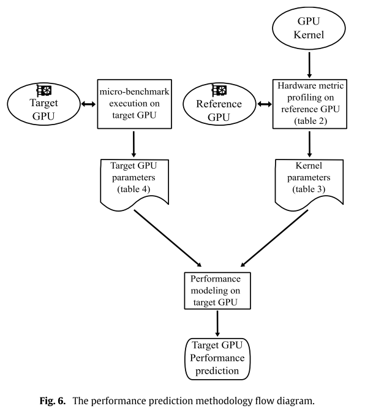

  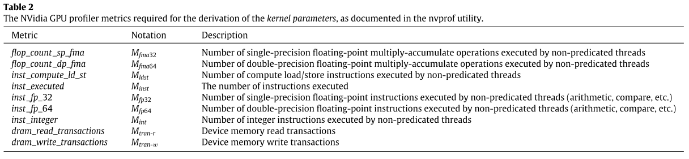

  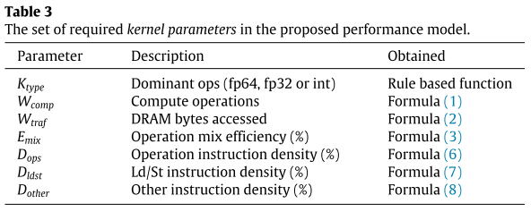

  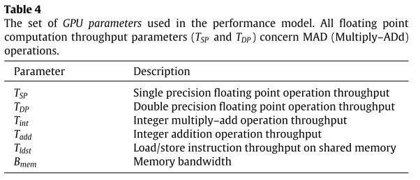
* 性能预测：公式推导=依据指令吞吐，数据类型等求和。

## 3. An Analytical Model for a GPU Architecture with Memory-level and Thread-level Parallelism Awareness

**会议/作者信息：**

> ISCA 2009
>
> Sunpyo Hong，Hyesoon Kim，佐治亚理工学院
>

**作用：**

> * 强相关，作为数学分析建模的背景
>
> * 用CWP（计算warp级并行度）和MWP（存储warp级并行度）区别内存密集型和计算密集型应用：
>
>   CWP大于MWP —— 内存密集型，CWP小于MWP —— 计算密集型

**研究层次：**

> PTX级别指令的数学分析建模

**研究重要性：**

> 重要，是最早的用数学分析模型在GPU上预测程序执行时间的文章

**研究差异：**

> 同：均采用数学分析模型。
>
> 异：本文彻底分析了内存密集型和非密集型工作负载，以评估应用程序的性能。与先前工作只提供优化空间，以减少程序调优时间不同，本文第一次提供了预测执行时间。这项工作的分析模型不考虑缓存未命中的成本，假设几乎100%的缓存命中率；执行分支指令的成本没有详细建模。

### （1）研究问题

对于软件工程师来说，了解GPU架构上的并行程序的性能瓶颈以提高应用程序的性能则十分困难。目前的方法依赖于程序员调整他们的应用程序，充分利用设计空间，而不完全了解他们的应用程序的性能特征。

为了深入了解GPU架构上并行应用程序的性能瓶颈，这项工作提出了一个简单的分析模型，估计大规模并行程序的执行时间。模型的关键部分是通过考虑运行线程的数量和内存带宽来估计并行内存请求的数量（内存warp级并行度）。基于内存warp级并行度，该模型估计内存请求的成本，从而估计程序的总执行时间。

### （2）其他研究

##### A. 分析模型

超标量处理器的分析模型[21，19，18]大多数都没有考虑内存级并行性，甚至缓存未命中。[15]提出了一个一阶超标量处理器模型，使用一阶模型对长延迟缓存未命中和其他主要性能瓶颈事件进行建模。[7]通过考虑挂起命中、数据预取和MSHR（未命中状态/信息保持寄存器）的成本改进了一阶超标量处理器模型，不对预取和MSHR进行建模会显著增加一阶处理器模型中的错误。

[25]提出了一个使用随机建模的多线程机器的简单分析模型，使用内存延迟、切换开销、可以交错的线程数量以及线程切换之间的间隔，为多线程架构的性能评估提供了深入的见解。然而，[25]没有考虑同步效应。此外，应用程序的特性表示与统计建模，不能为每个应用程序提供详细的性能估计。[25]的模型还提供了对饱和点和效率度量的见解，这可能有助于减少优化空间。

[27]开发了一个基于统计建模的分析模型来计算共享存储系统中处理器的吞吐量，开发了一个模型来估计由于缓存未命中或资源限制而导致的处理器停顿时间，还讨论了MSHR内部的合并存储效应。

##### B. GPU性能模型

GPGPU社区提供了如何优化GPGPU代码以提高内存级并行性和线程级并行性的见解[11]。然而，所有的分析都是定性的，没有使用任何分析模型。最相关的指标是占用率指标，它只提供了一般性的指导。[24]提出了两个指标，通过计算应用程序的利用率和效率来减少程序员的优化空间。然而，[24]的工作集中在非内存密集型工作负载上。本文。[6]实现了一个GPU模拟器GPGPU-Sim，并使用模拟输出分析了CUDA应用程序的性能。

### （3）挑战

许多活跃运行的线程更可能隐藏DRAM存储器访问延迟。但是，SM处理器占用率并不能充分估计性能改进。首先，当每个线程块的线程数小于64时，可能会显示出相同的占用率。第二，即使SM处理器占用率提高了，在某些情况下，性能也没有提高。因此需要其他指标来区分这三种情况，并了解性能的关键组成部分是什么。

### （4）方案

每个SM可以以分时方式执行多个线程束，同时一个或多个线程束正在等待内存值。因此，并发执行的线程束的执行成本可以被隐藏。分析模型的关键组成部分是找出有多少内存请求可以服务，当一个线程束正在等待内存值，有多少线程束可以一起执行。

为了表示warp并行度，引入了两个度量，MWP（内存warp并行度）和CWP（计算warp并行度）。

* MWP：表示在从SM处理器执行来自一个线程束的存储器指令（存储器请求仅被发送到存储器系统）之后直到来自同一线程束的所有存储器请求被服务（处理器可以执行来自该线程束的下一个指令）的时间段期间可以同时访问存储器的每个SM的线程束的最大数量。在本文中，等待存储值的线程束被称为存储器线程束。从一个线程束发送存储器请求之后直到来自同一线程束的所有存储器请求被服务的时间段被称为一个存储器线程束等待期。
* CWP：表示SM处理器在一个内存warp等待周期加1期间可以执行的warp数量；CWP需要加上1，以包括正在等待内存值的线程束本身（这表示CWP始终大于或等于1）。

##### A. CWP大于MWP

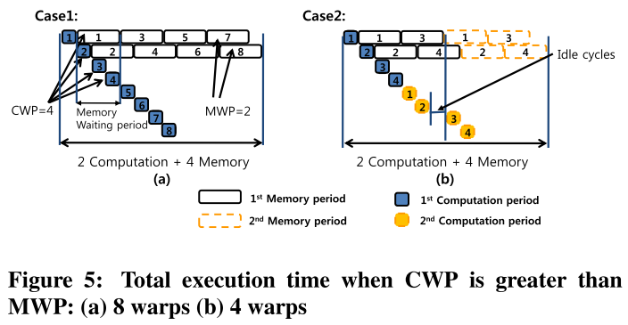

图5a中的Case 1，系统可以同时为两个内存warp提供服务。一个计算周期大约是一个内存等待偏差周期的三分之一，因此处理器在一个内存等待warp周期内可以完成三个warp的计算周期。(即，在这种情况下，MWP为2，CWP为4。)

图5b中的Case 2，每个warp有两个计算周期和两个内存等待周期。第二计算周期只有在相同warp的第一存储等待周期结束后才能开始。MWP和CWP与第一种情况相同。即使在计算周期之间有一些空闲周期，但总的执行周期与情况1相同。当CWP高于MWP时，有足够的warp等待内存值，因此计算周期的成本几乎总是可以被内存访问周期隐藏。

##### B. MWP大于CWP

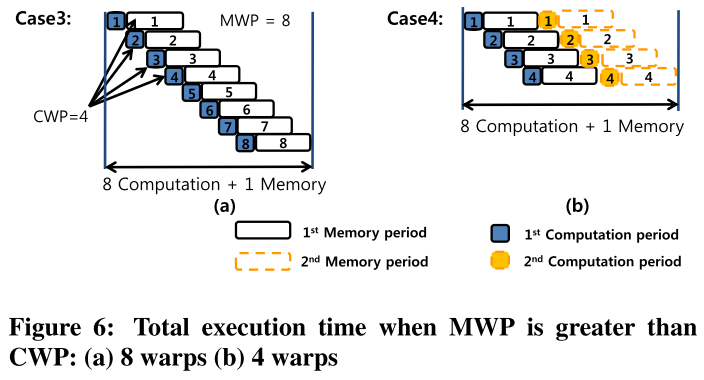

图6中的Case 3，系统可以同时为8个内存warp提供服务。同样，在这种情况下，CWP仍然是4。图6a中的Case 3，除了最后一个warp之外，所有的存储等待时间都与其他warp重叠。总执行周期是8个计算周期和仅一个内存等待周期的总和。

即使不是所有的线程束都是独立的，当CWP高于MWP时，许多存储器等待时段是重叠的。图6b中的情况4给出了示例。每个线程束有两个计算周期和两个内存等待周期。由于计算时间占主导地位，因此总执行周期再次是8个计算周期和仅1个存储器等待周期的总和。

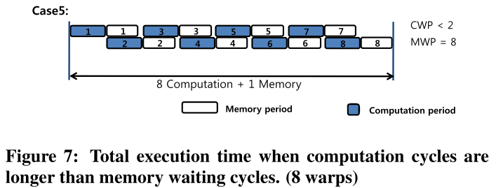

图7中的Case 5显示了一个极端的案例。在这种情况下，在完成一个存储器等待时段的同时，甚至不能完成一个计算时段。因此，CWP小于2。注意，CWP总是大于1。即使MWP为8，应用程序也无法利用任何内存warp并行性。因此，总的执行周期是8个计算周期加上一个存储器等待周期。注意，即使是这种极端情况，Case 5的总执行周期也与Case 4相同。当计算周期比存储周期长时，发生Case 5的情况。

##### C. 没有足够多的warp执行

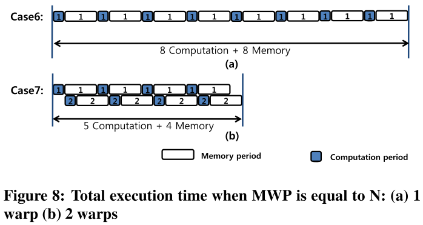

如果应用程序没有足够数量的warp，系统就不能利用所有可用的warp并行性。MWP和CWP不能大于一个SM上的活动warp数。对于图8a中的Case 6和图8b中的Case 7这两种情况，MWP和CWP都等于N，即每个SM的活动warp数。

图8a中的Case 6显示了只有一个warp运行的情况，所有的执行都是序列化的。因此，总的执行周期是计算和内存等待时间的总和。在这种情况下，CWP和MWP都是1。图8b中的Case 7显示有两个运行的线程束。假设MWP是2。即使一个计算周期小于一个存储器等待周期的一半，因为只有两个warp，CWP仍然是2。由于MWP，总执行时间大约是所有计算周期和内存等待周期之和的一半。

## 4. Sieve: Stratified GPU-Compute Workload Sampling

**会议/作者信息：**

> ISPASS 2023
>
> Mahmood Naderan-Tahan，Hossein SeyyedAghaei，Lieven Eeckhout，根特大学

**作用：**

> 1. 强相关，提供了内核级别采样的快速方式
> 1. 也是NvBit提取SASS指令采样后再周期精确地模拟
> 1. 这篇文章给出了在内核的粒度上采样的方法

**研究层次：**

> 同一内核的不同调用采样去重

**研究重要性：**

> 重要，仅在内核调用层次采样，将相同行为的同一内核的不同调用去重

**研究差异：**

> 同：都是对内核层次进行采样。
>
> 异：与PKS采用12各架构无关特征进行聚类相比，本文仅使用指令计数值并用CoV变异系数分层，更简单有效。

### （1）研究问题

使用真实的工作负载来驱动GPU架构探索变得越来越具有挑战性，因为使用现有模拟器的模拟时间很长。用于GPU计算工作负载的最先进的采样方法—主内核选择（PKS），对于具有大量内核和内核调用的具有挑战性的GPU计算工作负载来说存在不足。本文介绍了Sieve，一种用于GPU计算工作负载的准确且低开销的分层采样方法，该方法根据指令计数对内核调用进行分组，目标是最大限度地减少层内的执行时间变化。

### （2）其他研究

已经有大量关于CPU采样模拟的工作[16]-[20]，[24]，[38]，[39]，[51]，但专门为加速GPU模拟而开发和定制的采样技术最近才受到关注[23]，[25]，[41]，[44]。

#### A. 主内核选择

最先进的GPU工作负载采样方法是主内核选择（PKS）[11]，它被证明可以为各种GPU计算工作负载提供高精度和高速度。PKS首先使用一组与微体系结构无关的执行特征来分析工作负载的所有内核调用，然后根据相似性将内核调用分组到簇中。PKS然后为每个簇选择一个代表性的内核调用进行模拟。然后通过计算所有代表性内核调用的加权性能来估计整体应用程序性能。

为了进一步加速模拟，[11]提出主核投影（PKP）的技术补充PKS，即PKP+PKS=主核分析（PKA）。PKP建立在性能在内核调用中快速收敛的观察基础上，即，随着内核调用执行随着时间的推移而进行，总体性能数（例如IPC）快速收敛到其稳态值。因此不需要模拟整个内核调用，并且一旦性能数值收敛，就可以通过停止模拟来实现显著的模拟加速。

#### B. 采样方法

已经提出了用于对单线程工作负载进行采样的各种提议（随机抽样[15]，定期抽样[50]，以及目标抽样SimPoint [37]）以及多线程工作负载（对于服务器工作负载[49]和同步密集型工作负载[12]，[13]，[35]）。虽然大多数采样方法考虑固定长度的样本[43]，但有些考虑可变长度的样本[27]。SimPoint计算固定长度指令间隔的基本块分布。基于基本块分布的跨指令间隔的相似性产生有限的代表性指令间隔或所谓的模拟点的集合。Sieve使用的执行特性甚至比SimPoint使用的执行特性更简单，即每次内核调用的指令计数。

也已经有识别CPU基准测试的相似性工作。特别是，[20]使用微架构独立的特征分析工作负载，然后使用主成分分析（PCA）和聚类分析来确定大型工作负载空间中的选定数量的代表性基准。[19]将基于PCA的工作负载分析与SimPoint相结合，以确定基准测试中的代表性模拟点。PKS [11]提出的方法与此类似，除了它针对GPU工作负载并识别来自相同工作负载的内核之间的代表性内核调用。

#### C. GPU模拟

[52]基于基本块配置文件生成合成的微型但具有代表性的GPU计算工作负载。[25]使用GTPin，一种用于Intel GPU的动态二进制插装工具，使用一组广泛的功能来识别OpenCL工作负载中的代表性100 M指令区域，这些功能包括内核名称，执行的基本块，读取或写入的字节数。TBPoint [23]收集了一组广泛的执行特性（与分支和内存发散以及线程块变化有关），然后通过层次聚类对内核调用进行分组。PKS [11]遵循类似的工作流程，同时通过在本地硬件上进行分析来收集十几个与微架构无关的执行特征，同时利用k均值聚类来扩展到更大的工作负载。PKS存在维数灾难问题，即所有内核调用在12-D工作负载空间中彼此远离，这使得很难识别代表性的内核调用；本文作者发现唯一的关键执行特性的配置文件是由Sieve所做的每内核调用的指令数：这不仅减少了分析时间，它也提供了更高的准确性，同时保持同样高的模拟加速。SeqPoint [33]根据迭代的输入序列长度识别基于序列的深度神经网络训练工作负载中的代表性迭代，可以在不产生分析或模拟开销的情况下获得。虽然SeqPoint是专门为了加速DNN训练模拟而开发的，但Sieve是一种更普遍适用的采样技术。

除了合成工作负载生成和基于采样的模拟之外，GPU建模方法包括分析建模、混合抽象模拟和并行模拟。在过去的十年中，已经提出了一系列具有不同功能的分析GPU性能模型，特别是[21]，[22]，[29]，[47]。NVArchSim（NVAS）[44]是Nvidia使用的专有混合跟踪驱动模拟器，其中部署了不同级别的抽象（详细与高抽象时序模型）以平衡模拟速度和准确性。MGPUSim [41]是一个用于建模多GPU系统的并行模拟器。

### （3）挑战

首先，虽然PKS对于许多工作负载是准确和有效的，但是它无法对所有工作负载保持较高精度，特别是一些具有大量内核以及内核调用的应用程序（例如Cactus [31] and MLPerf [34]测试集）。原因是，PKS从工作负载中选择代表性内核调用的簇中存在太高的可变性，即分组在簇内的不同内核调用在PKS的执行周期计数中表现出太高的可变性，以致于不能选择代表簇内所有调用的内核。

第二，分析工作负载或收集作为PKS输入的十几个执行特征非常耗时，甚至变得不切实际。

第三，尽管PKS在分析过程中使用与微体系结构无关的执行特性，但它使用特定的硬件平台来执行聚类，这使得最终选择的具有代表性的内核调用并不真正独立于微体系结构。

### （4）方案

本文提出的[Sieve](https://github.com/gpubench/sieve)是一个准确和低开销的GPU计算工作负载的采样方法。Sieve基于一个简单而直观的观察，即同一内核的不同调用通常会导致（非常）相似甚至相同的指令计数。Sieve基于指令计数可变性将内核调用分组到层中。分层过程有效地将内核调用筛选到层中，使得层内的执行时间可变性最小化。此外，Sieve依赖于一个低开销的分析phase，在这个phase中，每个内核调用只收集一个与微架构无关的执行特性，即指令计数。

Sieve通过只使用一个独立于微架构的执行特性（即指令计数）来描述和分类内核调用，从而克服了上面的限制。由于每个聚类内的可变性较低，Sieve的准确性明显高于PKS。因为Sieve只需要收集一个执行特征，所以分析也很快。此外，通过Sieve获得的代表性内核调用的模拟实现的加速比仍然很高，与PKS相当。

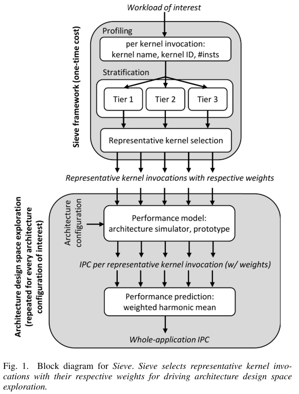

Sieve的第一步是profile感兴趣的工作负载，profile信息用作分层的输入，分层选择并输出最具代表性的内核调用以及它们各自的权重。然后，这些代表性的内核调用用于详细的模拟或工作负载分析。

##### A. Profile

Sieve的profilephase为每个内核调用收集以下信息：内核名称、内核调用ID和动态执行的指令数。

profilephase是一次性的开销，其目的是为Sieve后端提供信息，以选择代表性的内核调用。然后在架构设计空间探索期间多次模拟代表性的内核调用。虽然分析是一次性成本，但它可能非常耗时。Sieve通过仅测量易于分析的单个程序特性（即动态指令计数），使分析变得很快。

##### B. 分层

Sieve使用一种简单而有效的方法将内核调用分类到不同的层次中。Sieve考虑内核的所有调用，并基于指令计数对它们进行分类，以使**每个层由具有相同或相似动态指令计数的同一内核的内核调用的集合组成**。通过这样做，Sieve有效地将内核调用“筛选”到具有以下共享属性的层中：（1）来自相同的内核，以及（2）具有相同或相似的指令计数。以这种方式选择的层显示出有限的执行时间可变性，因为层内的所有内核调用都是相同内核的执行，并且执行大致相同数量的指令，即，由同一层内的内核调用执行的工作是类似的。

我们将内核调用分为三个所谓的层：

Tier-1：在调用之间指令的数量没有变化，内核在调用之间执行完全相同数量的指令。

Tier-2：在同一内核的调用之间，执行的指令数量几乎没有变化。

Tier-3：在同一内核的调用之间，执行的指令数量有很大的变化。

使用变异系数（CoV）来量化内核调用之间指令计数的变异性。CoV定义为标准偏差$\sigma$除以平均指令计数$\mu$：

$$CoV=\sigma/\mu$$

如果CoV低于预定义和用户设置的阈值$\theta$，则内核属于第2层；否则，它属于第3层。阈值$\theta$越小，层内变异性越小。这意味着更高的准确性，但更低的速度。作者评估了Sieve对$\theta$的灵敏度，以获得准确性和速度，并发现$\theta=0.4$的阈值在准确性和速度之间取得了良好的平衡。

由于第3层中的可变性很大，需要进一步对调用进行分层，以便每个层中的可变性很小。因此做些和使用Kernel Density Estimation（KDE）[8]，[36]，它对内核调用进行分组：（1）最小化层的数量，（2）确保指令计数的变化小于预设阈值。同样依赖于CoV来计算指令计数，并且使用与之前相同的阈值$\theta$。分层过程的最终结果是，最终得到了许多内核调用的层或组，它们都具有相同或相似的指令计数，并且来自同一个内核。

##### C. 代表性内核调用选择

对于Tier-1，这很简单，因为所有内核调用都有相同的动态指令计数。因此，只需选择按时间顺序排列的第一个内核调用。对于Tier-2和Tier-3，选择具有代表性的内核调用稍微复杂一些，因为层内存在一些可变性(尽管可变性很小)。选择具有最主要CTA大小的第一个时间顺序的调用，这意味着所选的内核调用以一种代表性的方式占用了层的其余部分的可用硬件资源。(作者还考虑选择具有最大CTA大小的调用，以更好地对GPU架构施加压力，但我们发现这一点不太准确。)

除了识别每个层的代表性调用之外，还需要计算其相对权重。通过计算层内所有调用的指令计数之和来实现这一点。将每层的总指令数除以整个工作负载的总指令数，得到该层的权重，从而得到其代表性内核调用的权重。因此，表示具有高指令计数的层的调用接收更高的权重。

##### D. 性能预测

Sieve提供的输出是代表性的内核调用及其各自的权重，我们随后使用这些权重来驱动架构设计空间探索。要预测整体应用程序性能，需要对每个感兴趣的体系结构配置执行以下两个步骤：

* 首先执行或模拟代表性的内核调用，并计算它们各自的性能值，例如，每个周期执行的指令数（IPC）。

* 第二，通过用各自的权重对每层IPC数进行加权来计算整体应用级性能数。这通过如下计算加权调和平均IPC来完成：

  $$IPC = 1/\sum^{N}_{i=1}{(w_i/IPC_i)}$$

  其中$N$是层的数量，$IPC_i$和$w_i$分别是每层的IPC和权重。权重加起来等于1，即，$\sum^{N}_{i=1}w_i =1$。

## 5. MGPUSim: Enabling Multi-GPU Performance Modeling and Optimization

**会议/作者信息：**

> ISCA 2019
>
> Yifan Sun，Trinayan Baruah，Shi Dong，Xiang Gong，Shane Treadway，Yuhui Bao，Spencer Hance，Carter McCardwell，Vincent Zhao，Harrison Barclay，Rafael Ubal，David Kaeli，东北大学
>
> Saiful A. Mojumder，Ajay Joshi，波士顿大学
>
> Amir Kavyan Ziabari，Zhongliang Chen，AMD
>
> José L. Abellán，西班牙圣安东尼奥天主教大学
>
> John Kim，KAIST

**作用：**

> 中相关，可以作为AMD GPU的背景。
>
> 可以学习它对模拟器整个系统架构的抽象的写法。

**研究层次：**

> 事件驱动的周期精确的AMD多GPU模拟器，

**研究重要性：**

> 重要，在AMD GPU模拟器中提供高模块化和高性能模拟的解决方案

**研究差异：**

> 同：GEM5与MGPUSim同时开发的，都支持GCN 3 ISA模拟，但MGPUSim强调强大的软件工程原理、高性能并行仿真和多GPU平台建模。
>
> 异：GPGPUSim和Multi2Sim不支持模拟多GPU；Multi2Sim使用简单的API，用户通过调用模拟器的创建执行上下文、内存分配、内存复制和内核启动API来实现模拟器的运行。

### （1）研究问题

AMD GCN 3指令集架构的多GPU模拟器。

主要的模拟器设计原则：

* DR-1：无修改的扩展。计算机体系结构模拟器的用户通常需要扩展模拟器来模拟新的结构。实现对模拟器的扩展应该很简单，因为重大修改不仅会阻碍研究人员的进步，还会影响再现性。
* DR-2：没有magic。模拟器应避免使用允许一个组件直接访问数据的“magic”（即，类字段访问、getter/setter函数调用或任何其他函数调用）。使用“magic”会在整个系统建模中引入不准确性，因为它忽略了两个组件之间的通信开销。它还损害了模块化，因为两个组件耦合在一起，很难替换其中一个（本质上类似于封装在软件开发中如此强大的原因）。
* DR-3：通过计时跟踪数据。仿真器应该利用仿真器中的真实数据值，而不是允许仿真器访问数据。将数据流和时间计算分开会隐藏系统设计中的错误，并使依赖于值的建模变得困难。
* DR-4：并行模拟并行硬件。数字电路并行工作，例如DRAM控制器和计算单元同时且独立地更新它们的状态。因此，计算机体系结构模拟器还应该能够使用多线程模拟来更新组件状态，而不会引入不准确性。
* DR-5：避免不必要的状态更新。模拟器倾向于访问每个建模的组件来更新状态，即使不需要这样的更新。应该避免不必要的状态更新，以最大限度地提高性能。

### （2）其他研究

#### A. GPU模拟器

自从GPU被用于高性能通用计算领域以来，研究人员开发了GPU架构模拟器，以支持研究社区进行GPU架构探索。GPGPU-Sim [10]和Multi2Sim [50]是众多公开可用的GPU模拟器中最受欢迎的，它们分别基于NVIDIA的PTX伊萨和AMD的GCN 1 ISA对GPU进行建模。AMD GEM 5 APU [19]是一款最新的GPU模拟器，专注于并行开发的APU设备，也能够模拟GCN 3 ISA。虽然MGPUSim的灵感来自于这些前辈模拟器，但MGPUSim强调强大的软件工程原则，高性能并行模拟和多GPU平台建模。

#### B. 并行GPU模拟器

为了加速GPU模拟，已经提出了并行GPU模拟器[14，29，30，32]。Barra[14]主要关注并行功能仿真，而MGPUSim同时执行仿真和时序仿真。GPUTejas [32]是一个基于Java、跟踪驱动的并行架构模拟器，可以实现高性能和可扩展性。MGPUSim不是跟踪驱动的，而是执行驱动的，以支持无magic和跟踪数据与时序的设计要求。Lee等人提出的并行模拟器框架。[29，30]修改GPGPUSim，并且仅在处理器访问存储器系统时才进行刷新。MAFIA [23]是一个在GPGPU-Sim上运行并发内核的多线程模拟器。然而，与MGPUSim相比，MAFIA并没有并行化单个内核的模拟。因此，在这个框架中执行单个内核将花费与GPGPU-Sim中大致相同的时间。不同于GPUTejas和Lee等人的的框架，MGPUSim实现了可扩展的加速而不影响仿真精度。

#### C. 多GPU微架构研究

考虑到GPU间网络和支持的内存系统抑制了当前多GPU平台的可扩展性，研究集中在优化内存组织上。Kim等人提出了可扩展内核执行[25]，允许单个内核在多个GPU上执行，就像平台上只有一个GPU一样。Ziabari等人[58]提出了统一内存层次结构（UMH）和NMOESI，使用大型GPU DRAM作为系统内存的缓存单元，实现CPU和多GPU内存一致性。MCM-GPU [7]考虑将多个GPU封装在同一个包中的多芯片模块。他们引入了L1.5缓存，并使用内存关联调度来减少跨GPU流量。由Milic等人提出的NUMA感知多GPU系统。[34]也试图减少互连上的流量。Young等人[57]提出了CARVES，它使用硬件和软件相结合的方法来允许多个GPU共享一块内存。随着多GPU研究社区越来越大，开发强大的工具来进一步支持相关领域的研究非常重要，而MGPUSim的开发填补了差距。

#### D. 类似缓存的内存系统

Meswani等人[33]考虑了一个两层存储器系统，并引入了允许用户控制数据存储在更接近芯片的存储器中的机制。CAMEO [13]是另一个先前的研究，它使用类似缓存的存储系统管理两层存储系统。之前的工作主要集中在为CPU应用类似缓存的内存系统设计，而PASI是为多GPU系统量身定制的类似缓存的内存管理解决方案。

#### E. 局部性API

Vijaykumar等人[52]建议使用局部性描述符来减少单GPU和多GPU环境中的内存移动。MGPUSim的解决方案只尝试减少GPU间的数据移动，因此可以使用更简单的API，只需要有限的代码修改。

#### F. GPU中的虚拟地址管理

Ausavarungnirun等人提出了MASK [9]，这是一个处理在单个GPU上运行的多个应用程序的虚拟内存管理的框架。相比之下，MGPUSim强调一个基于地址分配的解决方案，用于在多个GPU上执行的单个应用程序。在Mosaic [8]中已经提出了GPU的页面分割。然而，Mosaic也被设计为在单个GPU系统中工作。多GPU平台上的高效页面拆分需要在内存一致性方面进行新的考虑，以确保正确执行。PASI提供了一个整体硬件解决方案，结合了页面迁移，内存一致性和页面分割，以提高多GPU数据共享效率。

### （3）挑战

最近的研究表明，多GPU系统的性能可能受到CPU到GPU和GPU到GPU同步的严重约束，并受到多GPU内存管理开销的限制[31，35，58]。设计一个有效的内存管理系统和跨GPU通信结构仍然是开放的问题，亟待解决以充分释放未来的多GPU平台的潜力。为了支持下一代多GPU平台的设计探索，需要快速准确的仿真工具和框架。

现有的公开可用的GPU模拟器，如GPGPUSim [10]和Multi2Sim [50]，最初是为单GPU平台开发的，不支持模拟最先进的多GPU平台。这是因为：

* 现有的GPU模拟器模拟过时的GPU架构，较新的GPU增加了特殊功能，如系统级原子和GPUDirect [37]，以促进多个GPU之间的协作执行; 
* 现有的模拟器缺乏模块化，这使得建模和配置多GPU平台成为一项繁琐的任务; 
* 现有的模拟器在模拟速度方面不是很有效，在真实的GPU上执行几秒可能需要几天的时间来模拟。使用Multi 2Sim [50]建模的GPU系统上执行应用程序，比本机执行慢44000倍，这意味着要花一天多的时间来模拟2秒的本机执行。[32]报告说，GPGPU-Sim比真实的系统慢480000倍，这意味着GPGPU-Sim需要11天来模拟2秒的本地执行。这种有限的仿真速度使得在现有的仿真器中无法仿真大规模系统和工作负载。

在模拟多GPU平台时，由于建模平台中组件数量的增加，该问题进一步加剧。因此，计算机架构师在研究多GPU平台时受到限制。虽然最近的AMD GEM 5 APU模拟器[19]解决了第一个问题，但仍然需要在模拟器中提供高模块化和高性能模拟的解决方案。此外，由于AMD GEM 5 APU模拟器侧重于APU设备，该模拟器无法轻松模拟通常使用离散GPU的大规模高性能计算环境。

### （4）方案

本文提出的MGPUSim是一个多GPU模拟平台，MGPUSim忠实地模拟了AMD GCN 3 ISA[2]。MGPUSim的核心特性包括高灵活性/可配置性、易于扩展性和多线程能力：

* 高可配置性使用户能够轻松地对具有不同指令调度算法、内存层次设计和系统中GPU数量的平台进行建模。
* 高扩展性允许研究人员在不显著修改模拟器本身的情况下向模拟器添加新功能。
* 利用多线程实现了高效的功能仿真和详细的时序仿真，可以利用多个硬件线程，从而将功能仿真和详细时序仿真的仿真速度分别提高3.5倍和2.5倍。
* MGPUSim与在真实的AMD R9 Nano硬件上执行相比，平均只有5.5%的差异。

#### A. 模拟器框架

1. 事件驱动的仿真引擎：将事件定义为组件的状态更新，MGPUSim的事件驱动模拟引擎为整个模拟维护一个事件队列，并按时间顺序触发事件。
2. 组件：MGPUSim模拟的多GPU平台的每个实体都是组件，GPU、CU和缓存模块都是组件的实例。
3. 连接：两个组件只能通过使用请求的连接相互通信。连接也被用来模拟芯片内互连网络和芯片间互连网络。
4. 钩子（Hooks）：钩子是一小段软件，可以连接到模拟器上读取模拟器状态或更新模拟器状态。事件驱动的模拟引擎、所有组件和连接都是可挂接的。钩子可以执行非关键任务，如收集执行跟踪、转储调试信息、计算性能指标、记录停顿原因和注入故障（用于可靠性研究）。

#### B. GPU建模

GPU架构由命令处理器（Command Processor，CP）、异步计算引擎（Asynchronous Compute Engines，ACEs）、计算单元（Compute Units，CU）、缓存和内存控制器组成。CP负责与GPU驱动程序通信，并在ACE的帮助下启动内核。ACE分派内核的wavefronts以在CU上运行。在MGPUSim中，CU（如图4所示）包含一个调度器、一组解码器、一组执行单元和一组存储单元。CU包括标量寄存器文件（Scalar Register Files，SGPR）、向量寄存器文件（VectorRegister Files，VGPR）和本地数据共享（Local Data Share，LDS）存储。取指仲裁器和发射仲裁器分别决定哪个wavefront可以获取指令和发布指令。解码器需要1个周期来解码每个指令，然后将指令发送到执行单元（例如，SIMD单元）。每个执行单元都有一个流水线设计，包括读操作数、执行和写回phase。

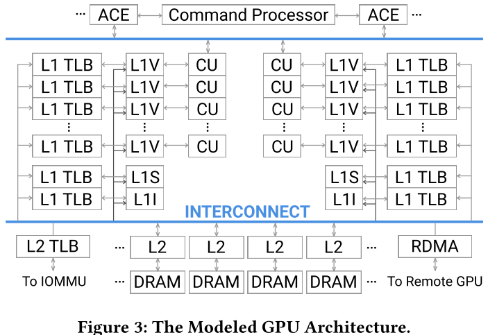

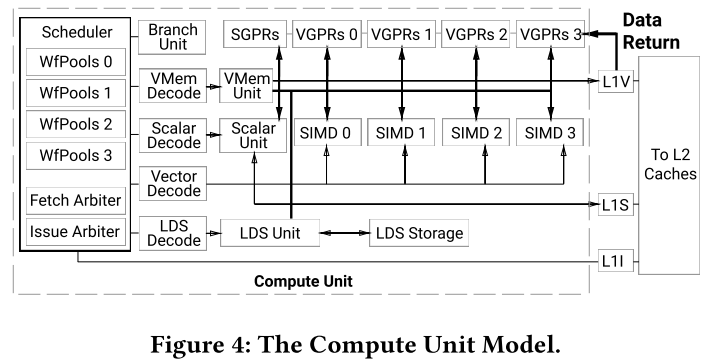

MGPUSim包括一组高速缓存控制器，包括write-through高速缓存、write-around高速缓存、write-back高速缓存和存储控制器。默认情况下，L1缓存和L2缓存分别使用write-through和write-back策略。该高速缓存控制器不强制一致性，因为GPU存储器模型是完全松弛的。计算单元向L1高速缓存发送用于读取和写入请求的虚拟地址。在两级TLB的帮助下，虚拟地址在L1缓存处被转换为物理地址。图3中显示了默认配置。然而，缓存的层数和TLB的层数都是完全可配置的。最后，为每个GPU配备了一个远程直接内存访问（RDMA）引擎来管理GPU间的通信。

#### C. 模拟器API

MGPUSim可以在两种不同的模式下运行，native模式和Go模式。

* native模式下，MGPUSim提供了一个C编程语言的OpenCL运行时库的自定义实现，用户可以将MGPUSim提供的OpenCL库与工作负载可执行文件链接起来，这样定制的OpenCL库就可以将API调用重定向到MGPUSim，并在模拟的GPU上运行GPU内核。
* Go模式下，MGPUSim允许用户用Go语言编写主程序来定义内存布局和启动内核。

MGPUSim的GPU驱动程序提供了一组类似OpenCL的API，允许工作负载在Go模式下控制模拟GPU。每个用户工作负载都应该通过调用Init函数来为以下API调用创建执行上下文。然后，工作负载可以调用设备发现函数并使用SelectGPU函数来指定要使用的GPU。最后，工作负载的主体可以通过使用内存分配、内存复制和内核启动API来实现。由于API与OpenCL类似，因此经验丰富的OpenCL程序员在使用MGPUSim API时应该会感到非常舒适。此外，MGPUSim让每个工作负载、驱动程序和模拟都在单独的线程中运行，从而允许多个工作负载在模拟器中并行运行。

#### D. 调试MGPUSIM

为了微调MGPUSim中的GPU模型，开发了一组57个微基准测试，涵盖了广泛的指令类型和内存访问模式。每个微基准测试都由一个手动编写或脚本生成的GCN 3汇编内核、一个用于本机执行的C++主机程序和一个用Go语言编写的用于模拟的附加主机程序组成。下面的四个微基准可以很好地代表完整的集合：

* 以ALU为中心的微基准：这个Python生成的微基准生成内核，其中包含不同数量的ALU操作（v_add_f32 v3，v2，v1），然后是s_endpgm指令来终止内核。使用ALU微基准测试可以验证指令调度，指令流水线，和指令缓存。
* L1微基准测试：此微基准测试生成对同一地址的不同数量的内存读取。除了第一次访问之外，所有访问都是L1缓存命中，能够测量该高速缓存延迟。
* 以DRAM为中心的微基准测试：此微基准测试使用64字节步幅重复访问GPU DRAM。由于所有高速缓存级别都使用64字节块，因此预期所有访问都会导致L1和L2高速缓存未命中，并最终从DRAM读取。使用这个微基准测试来测量DRAM延迟。
* L2缓存微基准测试：这个微基准测试首先读取1MB内存块中的每个缓存行，将整个1MB加载到L2缓存中。L1缓存预计将保留最后16 KB，其大小等于其总容量。在此之后，第二次扫描从开始扫描相同的1MB数据，导致L1未命中和L2命中。使用这种策略来找到L2缓存延迟。
