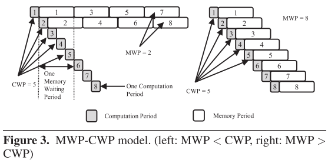

<head>
    
    
</head>

# 一、模拟器相关

## 1. An Instruction Roofline Model for GPUs

**会议/作者信息：**

> Performance Modeling, Benchmarking and Simulation of High Performance Computer Systems (PMBS) 2019
>
> Nan Ding, Samuel Williams，美国劳伦斯伯克利国家实验室

**作用：**

> * 低相关
>
> * 这篇文章提供了另一种峰值性能与计算强度的表示方法

**研究层次：**

> GPU的指令Roofline模型

**研究重要性：**

> 重要，指令Roofline模型能够识别取指解码发射瓶颈，并且当按类型分类时，可以识别流水线利用率

**研究差异：**

> 同：与传统的Roofline模型相同，定义强度、计算能力指标
>
> 异：传统的Roofline模型以FLOP为中心，而指令Roofline以执行的指令计数为中心，涵盖不同精度的指令

### （1）研究问题

Roofline性能模型提供了一种直观的方法来识别性能瓶颈并指导性能优化。然而，经典的以FLOP为中心的方法不适合于执行比浮点运算更多的整数运算的新兴应用程序。本文提出了一种基于NVIDIA GPU的指令Roofline模型。指令Roofline将跨所有存储器层次结构的指令和存储器事务合并在一起，并且提供比面向FLOP的Roofline模型更多的性能洞察，即指令吞吐量、strided存储器访问模式、存储Bank冲突和线程预测。这种方法能够了解NVIDIA GPU上性能和性能瓶颈的各个方面，并驱动代码优化。

### （2）其他研究
经典的Roofline模型已成功地用于不同体系结构的性能分析。在之前的工作中，研究人员创建了额外的计算上限（例如，“no FMA”峰值）和内存上限（例如，缓存级别）[3、5、6]。然而，当瓶颈本质上不是浮点而是与整数指令吞吐量或存储器访问有关时，这种改进是错误的。

### （3）挑战

Roofline模型[2-4]可以判断代码在跨整个内存层次结构时是受内存限制还是受计算限制。但即使有足够的数据局部性，也不能保证较高性能。许多应用程序执行的int运算比浮点运算更多，例如图形分析、基因组学等。经典的、以FLOP为中心的Roofline模型不适合这些领域。

英特尔Advisor [7]引入了分析整数密集型应用程序并生成标量和向量整数运算（IntOP）上限的功能。英特尔Advisor中的Roofline模型的核心是基于运算（浮点运算或整数运算）。在这两种情况下，垂直轴保持性能（FLOP/s，int/s或int/s+float/s），而水平轴保持算术强度（每字节的操作数）。

虽然英特尔Advisor在这方面非常有效，但它有两个方面的问题。首先，它只捕获流水线吞吐量，可能无法检测到指令取指解码发射瓶颈。其次，它是一个x86 CPU的解决方案。

### （4）方案

为了GPU加速应用程序的指令Roofline分析，需要针对一组不同的指标。首先，作者不计算浮点和/或整数操作，而是计算指令。计数指令使得能够识别取指解码发射瓶颈，并且当按类型分类时，可以识别流水线利用率。线程预测是GPU上的另一个关键性能因素。当一个分支被执行时，不接受该分支的线程将被断言（用向量的说法是屏蔽的），这样它们就不会执行后续的操作。当频繁使用预测时，可能会观察到较差的内核性能，因为在任何给定周期中执行工作的线程很少。最后，GPU计算的本质使得高效的数据移动成为影响应用程序执行时间的关键因素。因此还必须描述全局和共享内存访问模式，以评估数据移动的效率并激励未来的代码优化。尽管开发人员可以使用nvprof [8]和nvvp [9]来诊断上面讨论的性能瓶颈，但指令roofline模型提供了一种在单个图中描述性能瓶颈的方法。

#### 指令Roofline架构

首先是如何定义Instruction Roofline ceilings和memory pattern walls。这里使用NVIDIA最新的V100 GPU（GV 100）[10]来描述该方法，但它适用于任何GPU架构。

##### A. Instructions and Bandwidth Ceilings

每个GV 100流多处理器（SM）由四个处理块（warp调度器）组成，每个warp调度器可以在每个周期调度一条指令。因此，理论上最大（基于warp的）instruction/s 为80（SM）× 4（warp调度器）× 1（指令/周期）× 1.53（GHz）= 489.6 GIPS。内存访问被合并到事务中。全局/本地内存、L2缓存和HBM的事务大小为32字节。共享内存事务大小为128字节。实际上根据内存模式，一个warp级加载可能会生成1到32个事务。这使得“事务”成为分析内存访问时的自然单元。作者利用[2]的方法来测量GPU带宽，但根据事务大小重新缩放为每秒数十亿事务（GTXN/s）。

指令Roofline模型如公式（2）所示。内核的性能以每秒数十亿条指令（GIPS）为特征，是峰值机器带宽（GTXN/s)、指令强度和机器峰值GIPS的函数。GPU上的“指令强度”被定义为每个事务的基于warp的指令。图1所示为GV 100的最终指令roofline。当标准化为典型的32字节事务大小时，14000、2996和828 GB/s的L1、L2和HBM带宽分别维持437、93.6和25.9 GTXN/s。

##### B. 全局存储墙

当一个warp执行一条指令来访问全局内存时，考虑线程束中线程的访问模式是至关重要的，因为低效的内存访问会产生多余的事务，从而降低性能。

warp级加载指令可以生成1到32个事务。可以将这样的比率重新转换为两个关键指令强度：每个全局事务有1或1/32 warp-level global loads。当warp中的所有线程引用相同的内存位置并且仅生成单个事务时，会出现前者，称之为stride-0。相反，另一个极端可能发生在许多场景中，包括随机访问和跨越超过32个字节（如果是FP 32/INT 32，则为stride-4，如果是FP 64，则为stride-8）。对于单位步幅（stride-1），存储器访问提供1/8（FP 64）和1/4（FP 32，INT 32）的全局LD/ST强度。因此，在指令Roofline上，可以绘制三个强度“墙”，表示stride-0、stride-1（单位步幅）和stride-8。

##### C. 共享内存墙

GPU共享内存是每个SM内的一个高度存储的结构，提供4字节访问。理论上，这允许一个warp中的所有32个线程在一个128字节的事务中并发随机访问共享内存。然而，由于GV 100上只有32个存储体，两个线程争用同一个存储体但不同的4字节字将导致“存储体冲突”，并将生成多个事务。在最坏的情况下，所有32个线程都命中同一存储体中的不同4字节字，并且生成32个事务。与全局/局部内存墙一样，可以在指令Roofline模型上看到存储体冲突。注意，有两个关键的指令强度：每个共享事务的1或1/32 warp-level shared loads。

## 2. A Performance Analysis Framework for Identifying Potential Benefits in GPGPU Applications
**会议/作者信息：**

> PPoPP 2012
>
> Jaewoong Sim，Hyesoon Kim，Richard Vuduc，佐治亚理工学院
>
> Aniruddha Dasgupta，AMD能耗和性能优化实验室

**作用：**

> 强相关，可以参考构建性能瓶颈识别的数学计算方法。
>

**研究层次：**

> CUDA执行驱动的性能瓶颈识别，理想性能数学估计。
>

**研究重要性：**

> 重要，性能瓶颈识别，最先提供了GPU的指标和工具给程序员编程指导。

**研究差异：**

> 同：均可识别代码中的性能瓶颈。
>
> 异：GPUPerf框架不单单确定代码中存在哪些瓶颈，还估计消除这些瓶颈可能带来的理想情况下的性能好处。

### （1）研究问题

为GPGPU和其他新兴的众核平台调优代码是一个挑战，很少有模型或工具可以精确地找出性能瓶颈的根本原因。本文提出了一个性能分析框架，可以帮助揭示GPGPU应用程序的这些瓶颈。虽然存在少数GPGPU分析工具，但不幸的是，大多数传统工具只是为程序员提供通过运行应用程序获得的各种测量和指标，并且通常难以映射这些指标以了解stall的根本原因，也难帮助程序员决定下一步采取什么优化步骤来缓解瓶颈。本文首先开发了一个分析性能模型，可以精确地预测性能，旨在提供程序员可解释的指标。然后应用静态和动态分析来实例化特定输入代码的性能模型，并展示该模型如何预测潜在的性能优势。

### （2）其他研究

#### A. GPU性能建模

Hong和Kim [9]（An Analytical Model for a GPU Architecture with Memory-level and Thread-level Parallelism Awareness）提出了基于MWP-CWP的GPU分析模型。同时，Baghsorkhi等人[2]提出了一种基于工作流图（WFG）的分析模型来预测GPU应用程序的性能。WFG是控制流图（CFG）的扩展，其中节点表示指令，弧表示延迟。Zhang和Owens [20]提出了一个性能模型，测量了在指令流水线、共享内存和全局内存上花费的执行时间，以找到瓶颈。虽然Zhang和Owens也致力于识别瓶颈，但他们的方法并没有提供估计的性能优势。此外，我们的分析模型解决了更详细的性能瓶颈，如SFU资源争用。[18]提出了Roofline模型，这对于可视化计算限制或内存限制的多核架构非常有用。本文的X-Y效益图不仅显示了这些限制，还估计了理想的性能效益。我们的工作也与GPGPU应用程序的优化和调优相关[4，7，12，15，16，19]。Ryoo等人[16]引入了两个指标，通过计算GPU应用程序的利用率和效率来修剪优化空间。Choi等人[4]提出了一种用于自动调整的稀疏矩阵向量乘法（SpMV）内核的性能模型。Yang等人提出的GPGPU编译器框架[19]执行GPGPU特定的优化，可以改进朴素的GPGPU内核。

#### B. CUDA性能分析工具

有一些工具可用于CUDA应用程序的性能分析。但是，大多数工具只是提供当前运行的应用程序的性能指标。相反，GPUPerf估计潜在的性能优势，从而为如何优化应用程序提供指导。Kim和Shrivastava [10]提出了一种工具，可用于分析CUDA程序的内存访问模式。它们模拟了主要的内存效应，如内存合并和内存Bank冲突。然而，它们不处理运行时信息，因为它们的方法是编译时分析，这通常会导致不准确的结果，例如并行度不足。Meng等人[11]提出了一个GPU性能预测框架。给定CPU代码，该框架预测GPU加速的成本和收益。他们的预测也是建立在MWP-CWP模型上的，但本文的工作大大改进了MWP-CWP模型。还有一些GPU模拟器可用于程序分析。Collange等人开发的G80功能模拟器Barra [5]可以在收集统计数据的同时执行NVIDIA CUBIN文件。Bakhoda等人[3]通过实现运行PTX指令集的GPU模拟器来分析CUDA应用程序。一个名为MacSim [1]的异构模拟器也可以用于获得CUDA工作负载的详细统计数据。

### （3）挑战

图1显示了四种独立优化技术的某些组合应用于内核时的归一化性能。最左边的条是平行基线，接下来的四个条显示了内核在四种优化中的一种优化下的性能，剩下条是组合优化。四种优化都提高了基线的性能，因此值得将它们应用于基线内核。然而，大多数程序员不能估计每一个优化的好处的程度。因此，程序员通常只能使用直觉判断。在这里，共享内存优化是一个合理的启发式起点，因为它解决了内存层次结构。现在想象一个程序员，他已经应用了共享内存，想要尝试更多的优化。如果每个优化都是为了解决特定的瓶颈或资源约束而设计的，那么选择下一个优化的关键是了解每个瓶颈或资源约束对当前代码的影响程度。目前很少有（如果有的话）GPU的指标和工具提供这种指导。例如，GPU上广泛使用的占用度量仅指示线程级并行度（TLP），而不是内存级或并行级并行度（MLP或ILP）。

### （4）方案

本文提出的框架GPUPerf从沿着四个维度定量评估潜在的性能优势：线程间并行级并行（ $B_{itlp}$ ）、内存级并行（ $B_{memlp}$ ）、计算效率（ $B_{fp}$ ）和串行化效果（ $B_{serial}$ ）。这四个指标建议程序员（甚至编译器）应该首先尝试什么类型的优化。

GPUPerf有三个组件：前端数据收集器、分析模型和性能顾问。图2总结了该框架。GPUPerf接受CUDA内核作为输入，并将输入传递给前端数据收集器。前端数据收集器执行静态和动态分析，以获得各种信息，这些信息被提供给GPGPU分析模型。该分析模型极大地扩展了现有模型MWP-CWP模型[9]，支持新的GPGPU架构(“Fermi”)，并解决了其他限制。性能顾问消化模型信息并提供可解释的指标，以了解潜在的性能瓶颈。也就是说，通过检查模型中的特定术语或因素，程序员或自动化工具至少在原则上可以直接使用这些信息来诊断瓶颈，或许还可以开出解决方案。

#### A. MWP-CWP Model

为GPUPerf开发的分析模型基于使用MWP和CWP的模型[9]（An Analytical Model for a GPU Architecture with Memory-level and Thread-level Parallelism Awareness）。MWP-CWP模型接受以下输入：指令数、内存请求数、以及存储器访问模式，以及GPGPU架构参数，例如DRAM延迟和带宽。给定内核的总执行时间是根据输入预测的。尽管该模型可以很好地预测执行成本，但从模型中对性能瓶颈的理解并不那么简单。这是GPUPerf的主要动机之一。

内存warp并行度（MWP）：MWP表示每个流多处理器（SM）可以同时访问内存的最大warp数量。MWP是内存级并行性的指标，可以反映GPGPU SIMD执行特性。MWP是存储器带宽、存储器操作的某些参数（诸如延迟）以及SM中的活动线程束的数量的函数。粗略地说，内存操作的成本被建模为MWP上的内存请求的数量。因此，正确建模MWP是非常关键的。

计算warp并行度（CWP）：CWP表示在一个内存等待时间段加1期间可以完成一个计算时间段的warp数量。例如，在图3中，两种情况下的CWP都是5。一个计算周期简单地说就是每个存储器指令的平均计算周期。CWP主要用于对三种情况进行分类，解释如下。

三种情况：MWP-CWP模型的关键组成部分是确定GPGPU中的多线程可以隐藏多少成本。根据MWP和CWP之间的关系，MWP-CWP模型对以下三种情况进行分类。

* MWP < CWP：计算成本被内存操作隐藏，如左图所示。总执行成本由内存操作决定。
* MWP >= CWP：内存操作的成本被计算隐藏，如右图所示。总的执行成本是计算成本和一个内存周期的总和。
* 没有足够的warps：由于缺乏并行性，计算和内存操作成本都只是部分隐藏。

#### B. MWP-CWP模型的改进

一些限制使MWP-CWP模型忽略了某些优化技术,例如，它假设一个内存指令后面总是跟随着连续的相关指令，因此MLP总是1。此外，它理想地假设有足够的并行级别，因此很难预测预取或其他提高指令/存储器级并行性的优化的效果。

* 高速缓存效应：Fermi GPGPU有一个硬件管理的高速缓存内存层次结构。由于基线模型不对缓存效应进行建模，因此总内存周期是通过将内存请求乘以平均全局内存延迟来确定的。作者通过计算平均内存访问延迟（AMAT）来模拟该高速缓存效应；总内存周期通过将内存请求与AMAT相乘来计算。
* SFU指令：在GPGPU中，昂贵的数学运算，如超越和平方根，可以用称为特殊功能单元（SFU）的专用执行单元来处理。由于SFU指令的执行可以与其他浮点（FP）指令重叠，因此在SFU和FP指令之间具有良好的比率，SFU指令的成本几乎可以被隐藏。否则，SFU争用会影响性能。本文对特殊功能单元的这些特性进行建模。

* 并行性：基线模型假设ILP和TLP足以隐藏指令延迟，从而在计算计算周期时使用峰值指令吞吐量。然而，当ILP和TLP不足以隐藏流水线延迟时，有效指令吞吐量小于峰值。此外，本文将MLP效应纳入新的模型。MLP可以减少总的内存周期。
* 二进制级别的分析：MWP-CWP模型仅使用PTX级别的信息。由于在PTX代码生成之后存在代码优化阶段，因此仅使用PTX级别的信息会妨碍精确建模。本文开发了静态分析工具来提取二进制级别的信息，并利用硬件性能计数器来解决这个问题。

#### C. 性能顾问

性能顾问的目标是传达性能瓶颈信息，并估计减少或消除这些瓶颈的潜在收益。它通过四个潜在的收益指标来实现，其影响可以使用图4所示的图表来可视化。x轴显示内存操作的成本，y轴显示计算成本。应用程序代码是这个图表上的一个点（这里是A点）。x轴和y轴值的总和是执行成本，但是因为计算和存储器成本可以重叠，所以 $T_{exec}$ 的最终执行成本（例如，wallclock时间）是相对于A移动的不同点A'。移位量被表示为 $T_{overlap}$ 。通过y = x的对角线将图表划分为计算边界和内存边界区域，分别指示应用程序是否受到计算或内存操作的限制。从点A'开始，收益图表示出了四个不同的潜在收益度量中的每一个如何移动该空间中的应用执行时间。

给定算法可以进一步由两个附加值表征。第一个是理想的计算成本，其通常是执行所有基本计算工作的最小时间（例如，浮点运算），在图4中表示为 $T_{fp}$ 。第二个是将所有数据从DRAM移动到内核的最小时间，用 $T_{mem\_min}$ 表示。当内存请求被预取或所有内存服务被其他计算隐藏时，可能希望隐藏或消除所有内存操作成本。理想情况下，算法设计者或程序员可以提供 $T_{fp}$ 和 $T_{mem\_min}$ 的估计值或界限。然而，当信息不可用时，可以尝试从内核中执行的FP指令的数量来估计 $T_{fp}$ 。

假设有一个内核，在点A'，具有不同类型的低效率。计算的效益因子旨在量化通过消除这些低效率而可能实现的改进程度。作者使用四个潜在的效益指标，总结如下：

* $B_{itilp}$ 表示通过增加线程间并行级别的潜在好处。
* $B_{memlp}$ 指示通过增加内存级并行性的潜在益处。
* $B_{fp}$ 表示当理想地消除低效计算的成本时的潜在收益。与其他好处不同的是，我们不能实现100%的 $B_{fp}$ ，因为内核必须有一些操作，如数据移动。
* $B_{serial}$ 显示了当摆脱了由于同步和资源争用等序列化效应而产生的开销时的节省量。

$B_{itilp}$ 、 $B_{fp}$ 和 $B_{serial}$ 与计算成本相关，而 $B_{memlp}$ 与内存成本相关。这些指标总结在表1中。

#### D. GPGPU分析模型

一些公式计算。

#### E. 前端数据采集器

前端数据收集器负责获取实例化分析模型的各种信息。为此，前端数据收集器使用三种不同的工具/方法来提取信息：计算可视化分析器、指令分析器（IA）和静态分析工具，如图5所示。

##### E.1 Compute Visual Profiler

使用Compute Visual Profiler [14]来访问GPU硬件性能计数器。它提供了准确的架构相关信息：占用率、全局加载/存储请求总数、线程中使用的寄存器数量、DRAM读/写次数和缓存命中/未命中次数。

##### E.2 指令分析器

虽然硬件性能计数器提供了准确的运行时信息，但仍然无法获得一些关键信息。例如，对于考虑同步的影响和SFU利用的开销至关重要的指令类别信息不可用。GPUPerf的指令分析器模块基于Ocelot [6]，这是一个模拟PTX执行的动态编译框架。指令分析器收集指令混合信息（SFU、Sync和FP指令）和循环信息，例如循环行程计数。循环信息用于组合来自CUDA二进制（CUBIN）文件的静态分析和运行时执行信息。虽然从PTX到CUBIN有代码优化，但观察到的大多数循环信息仍然保持不变。

##### E.3 静态分析工具

静态分析工具可以处理PTX、CUBIN和IA的信息。使用静态分析的主要动机是获得二进制而不是PTX代码中的ILP和MLP信息。由于在目标代码生成期间执行的指令调度和寄存器分配，PTX和CUBIN之间的并行度可能显著不同。因此，在二进制上计算ILP/MLP是至关重要的。

首先，使用cuobjdump [13]反汇编目标CUBIN文件。然后，我们构建一个控制流图（CFG）和def-use链与反汇编指令。在加载请求（def）和发起存储器请求（use）的第一个指令之间的存储器请求的数量是本地MLP。基本块中的局部MLP的平均值是基本块MLP。对于ILP，将可以在基本块内调度的指令分组在一起。若一条指令对任何其他指令具有真正的依赖性，它们不能在同一周期发射。然后，基本块ILP是基本块中的指令数除以块中的组数。

其次，将该静态ILP/MLP信息与来自IA的动态信息组合。基于基本块执行频率对ILP/MLP给予给予高权重。下面的公式显示了精确的公式，在这个公式中，基本块（BB）K的ILP/MLP被表示为 $ILP(MLP)_K$ 。 $ILP(MLP)_{AVG}$ 与等式（4）和（14）中的ILP/MLP相同。

$$
ILP(MLP)_{AVG} = \sum^{\#BBs}_{K=1} \frac{ILP(MLP)_K \times \#accesses\_to\_BB_K}{\#basic\_blocks}
$$

## 3. TBPoint: Reducing Simulation Time for Large-Scale GPGPU Kernels

**会议/作者信息：**

> IPDPS 2014
>
> Jen-Cheng Huang，Lifeng Nai，Hyesoon Kim，Hsien-Hsin S. Lee，佐治亚理工学院
>

**作用：**

> * 强相关，可以参考内核级、线程块级采样方法
>
> * 作者相当于把Phase_Tracking_and_Prediction论文中的phase扩展到线程块/内核级别
>
> * 作者提出的基于profiling的采样原则很准确
>

**研究层次：**

> 内核级、线程块级采样

**研究重要性：**

> 重要，将采样应用到了内核/线程块级，除基本块的级别未涉及，最大限度地满足了基于trace的模拟器所需。

**研究差异：**

> 同：与phase检测类似，是phase检测的后续应用
>
> 异：phase检测原本是用来识别interval间的指令片段的相似性，这项工作将phase检测推广的更宽

### （1）研究问题

为了加快模拟器的模拟时间，可以并行化周期精确的GPGPU模拟器，但是当模拟大规模GPGPU系统时，这种模拟所需的资源变得很大。本文提出了TBPoint，一个对GPGPU内核采取基于profiling的采样方法，以减少周期精确的仿真时间。

### （2）其他研究

##### A. CPU采样模拟

为了减少CPU模拟的时间，采样技术已经被广泛使用[5]，[6]，[7]，但没有一个被研究用于GPGPU模拟。

##### B. 基于profiling的采样

基于profiling的采样思想是profile程序并基于程序特性找到可能具有同质行为的指令interval。通过模拟一个interval来表示具有同质行为的其他interval的性能，可以减少模拟时间。

针对单线程CPU应用程序的最流行的基于profiling的采样技术是Simpoint [6]，其功能描述如下。

* 在profile时，程序被划分为包含固定数量指令的采样单元，例如一百万条指令。

* 然后，分析器为每个采样单元收集基本块向量（BBV）。向量的维度表示程序中的基本块。维度的值是由总指令计数归一化的基本块的执行指令计数，如公式1所示。

  

* BBV作为特征向量被输入到cluster算法k-means中，将采样单元分组到cluster中。对于每个cluster，被选为模拟点的采样单元代表cluster中其他单元的性能。

* 在模拟时，只需要模拟选择为模拟点的采样单元。其他采样单元可以通过快进跳过。每个模拟点可以具有不同的权重，这取决于集群中的采样单元的数量。总CPI可以通过公式1预测。

由于GPGPU内核可以被认为是多线程应用程序，Pinpoint [9]是Simpoint的扩展，用于采样多线程应用程序，可以适用于GPGPU内核。在Pinpoint中，BBV是通过在真实的系统上实际执行所有线程而在每个线程的基础上收集的。但是，由于以下原因，它不符合基于特征分析的采样要求：

* 分析需要针对不同的硬件配置重新进行，因为分析结果（模拟点）只能应用于具有与分析平台相同的硬件配置的模拟平台。
* 虽然BBV与单线程应用程序中的性能有很强的相关性[10]，但由于warp调度效应，不确定GPGPU内核是否也是如此。

### （3）挑战

虽然GPGPU内核看起来类似于CPU多线程应用，但是应用现有的CPU采样技术，包括（1）系统采样和（2）用于多线程应用程序的基于profiling的采样，存在一些问题。例如，定期采样的系统采样[7]可能会导致比所需更大的采样大小，特别是对于具有常规执行模式的内核。此外，基于profiling的采样[5]需要配置与模拟平台类似的profiling平台，并且有时profiling可能需要在模拟配置改变后重新进行，例如SM上的warp数量或SM的数量，从而产生显著的开销。

### （4）方案

GPGPU应用可以具有多个内核。对于每个内核，可以通过两种方式减少模拟时间：（1）减少内核启动的次数，以及（2）减少内核启动的模拟时间。因此，本文的目标是通过发射间采样和发射内采样来减少每个内核的GPGPU模拟时间。为了减少内核启动的次数，前者选择需要模拟的内核启动。如果不同的内核启动具有相同的行为，则只需要模拟其中一个来表示其他内核启动。为了减少内核启动的模拟时间，启动内采样选择需要在内核启动内模拟的线程块。

TBPoint对于发射间采样，使用几个内核特性将具有均匀性能的内核分组为phase。对于每个phase，选择一个内核启动进行模拟，并应用启动内采样。对于启动内采样，以均匀的性能对线程块进行采样。为了定位这些线程块，作者开发了一个数学模型，考虑线程调度的影响。利用这个模型，作者提出了同质区域识别和同质区域采样。前者在分析过程中识别哪些线程块具有相同的性能，后者在模拟过程中对这些线程块进行采样。对于其余的线程块，它们均被模拟。

基于profiling的采样原则如下：

* 硬件独立性：剖析应该对可以执行剖析的平台没有约束。
* 一次性分析：对于每个程序/输入组合，分析只需执行一次，结果可以用于不同的硬件配置。
* 数学模型支持：抽样方法应得到详细数学模型的支持，以确认其准确性。

#### A. 发射间内核采样

使用层次cluster[12]，将具有同质性能的内核启动分组。只模拟一个内核在每个cluster内的发射，并预测每个cluster内的其他内核发射的性能将是相同的模拟发射，从而减少模拟时间。图2显示了发射间内核取样的程序

* 首先，每次内核启动都被表示为一个特征向量，这是cluster算法的输入。
* 特征向量描述了包含四个特征的内核特征，每个特征属于向量的一个维度。
* 然后，层次cluster处理特征向量并将其分组到cluster中。
* 由于每个特征向量代表一个内核启动，因此同一集群内的内核启动被认为具有同质性能（IPC）。

特征向量的设计是重要的，因为特征向量应该正确地描述内核启动的特性，使得分层cluster可以将具有同质性能的内核启动分组到一个cluster中。本文选择用来组成特征向量的特征及其性能影响如下所示：

* **内核启动大小** ：内核启动的线程指令的数量被用作捕获内核启动的大小的特征。
* **控制流发散** ：因为简单地捕获内核启动的线程指令的数量并不能反映其控制流发散的程度，所以内核启动的warp指令的数量被用作捕获控制流发散程度的特征。即使两个内核启动具有相同数量的线程指令，它们也可能由于不同程度的控制流分歧而具有不同的IPC。例如，内核1在一个线程束指令中执行32个线程指令，而内核2在32个线程束指令中执行32个线程指令。
* **存储发散** ：因为具有不同数量的内存请求的内核启动可能具有不同的IPC，所以内核启动的内存请求的数量被用作捕获内存分歧程度的特征。内存发散的程度与线程块的数量和控制流发散无关。例如，如果没有访问可以被合并，则包含32个线程指令的线程束指令可以发出至少一个并且多达32个存储器请求。
* **线程块变化** ：使用内核启动的线程块大小的变化系数（CoV）作为特征来捕获线程块大小的变化。线程块大小定义为线程块中的线程指令数。上面所有的特性都被设计成每次内核启动时只有一个线程块在运行。然而，内核启动通常具有多个线程块，并且不同的线程块可以具有不同数量的指令。例如，假设内核1有两个线程块，线程指令数分别为100和100，内核2有两个线程块，线程指令数分别为160和40。尽管两个内核启动可能具有相同的大小（200个线程指令），但由于不同的线程块交织情况，它们可能会执行不同的操作。

公式2显示了由上述特征组成的特征间向量，每个特征都用其在所有内核启动中的平均值进行归一化，使得它们具有相同的数量级。对于内核启动i：

层次cluster采用所有的特征间向量并将它们分组到cluster中。对于每个cluster，选择具有最接近cluster中心的特征间向量的内核启动作为将通过启动内采样进行采样的模拟点。选择分层cluster而不是Simpoint使用的k-means算法，原因如下。通过设置距离阈值 $\sigma$ ，可以自动确定cluster的数量，距离阈值 $\sigma$ 是cluster中任意两点之间的最大距离。较高的阈值导致较少的cluster，这减少了总样本量，但每个cluster内的变化可能更高，这增加了抽样误差。距离阈值的适当值取决于所需的精度和硬件配置。另一方面，k-means算法需要预定义数量的cluster作为输入，这需要设置另一个指标，例如贝叶斯信息准则（BIC）得分。

所提出的内部特征向量与Simpoint中使用的BBV相比具有以下优点：

* 首先，它提供了对性能行为的更深入了解。作者发现BBV与GPGPU程序的性能相关性较小。GPGPU内核通常具有非常少的基本块，并且由于存储器发散、线程块变化和其他行为，即使相同的基本块也显示出非常不同的性能行为。
* 此外，同一个内核可以被启动多次，但是内核的每次调用都显示特定的行为，例如 reduction kernel，尽管BBV可以用于检测程序行为，但性能变化的来源不能仅通过BBV获得。
* 另一方面，所提出的向量在计算上也更有效，因为它只有四维，而BBV的维数等于内核启动中的基本块的数量。

#### B. 发射内线程块采样

一旦内核级采样从每个cluster中选择内核启动用于仿真，发射内线程块采样可以通过对所选择的内核进行采样来进一步减少仿真时间。图3显示了线程块采样的高级视图。在内核启动时，目标是对同质区域进行采样，这些区域在多个线程块中具有同质性能。在同质区域中，模拟少数线程块，而跳过其他线程块，以减少模拟时间。从模拟的线程块收集的IPC被预测为整个同质区域的IPC。不在任何同质区域中的线程块照常进行模拟。

##### B.1 同质区域识别

同质区域识别的基本思想如下：由于同质区域内的线程块必须具有相同的Stall概率和平均Stall周期，因此识别同构区域需要指导在任何时间段哪些线程块并发运行。作者观察到具有更接近的线程块ID的线程块可能并发地运行，因此将具有更接近的ID的若干线程块分组为“epoch”。例如，图3的epoch大小是四个线程块。所有线程块都具有相等的Stall概率和平均Stall周期的epoch是同质区间。如果连续的epoch具有相等的Stall概率和平均Stall周期，则由这些epoch构造同质区域。

###### B.1.1 epoch向量构造

epoch向量构造将每个epoch转换成用于找到具有相同平均停滞概率（p）和平均停滞周期（M）的epoch的特征向量。内部特征向量使用epoch的停滞概率作为唯一特征，该停滞概率是在epoch中的所有线程块上平均的停滞概率。每个线程块的停顿概率（p）和平均停顿周期（M）收集如下，等式5示出了epoch特征向量：

* Stall概率（p）：线程块的stall概率使用存储器请求的数量与为每个线程块的指令总数的比来近似。这里考虑的内存请求类型是全局和局部内存访问。
* 平均Stall周期（M）：在没有详细的定时仿真的情况下不能确定平均stall周期M。假设如果两个epoch对于线程块具有相同的stall概率（p），则来自两个epoch的平均stall周期（M）也是相等的，因为执行相同的内核代码。

###### B.1.2 epoch聚类

分层聚类使用其内部特征向量对epoch进行分组，并为每个epoch生成聚类ID。具有相同cluster ID的epoch被认为具有相同的p和M。然而，在一个epoch中具有不同的停顿概率和/或指令数量的一些线程块（称为离群线程块）可能导致不同的性能，并且它们可能不会被分层聚类捕获。因此，在分组之后，必须进行后处理以使用变异因子（VF）来捕获具有异常线程块的epoch，该变异因子（VF）使用变异系数（CoV）来量化线程块之间的不相似性，如等式5所示。如果epoch的变化因子大于某个阈值，表明存在异常线程块，则应该将epoch从其所属的cluster中删除并为其分配自己的cluster。

###### B.1.3 同质区域构造

在每个epoch被分配了一个cluster之后，为共享同一cluster的连续epoch序列构建一个同质区域。cluster的ID用作区域ID，分配给区域中的每个线程块。对于每个同构区域，其所有线程块及其对应的区域ID存储在同构区域表中，如表III所示：

##### B.2 同质区域采样

在确定了同质区域的位置之后，需要在仿真过程中使用同质区域表对同质区域进行采样。其基本思想是只模拟同质区域内的几个线程块，而跳过该区域中的其他线程块。该区域的IPC被预测为等于模拟线程块的IPC。对于不在任何同质区域中的螺纹块，它们正常被模拟。

为了对同质区域进行采样，必须定义采样单元的大小。采样单元的IPC代表同质区域的IPC。作者将采样单位定义为指定线程块的开始和结束之间的interval。第一个指定的线程块是模拟开始时第一个调度的线程块。一旦当前的线程块退出，将指定另一个线程块。与具有固定数量指令的采样单元的设计相比，这种设计确保每个采样单元具有相似的停顿概率，因为指定的线程块执行整个内核代码，这可能捕获整个内核的行为。此外，由于它不需要指令计数来确定interval的长度，因此该设计简化了实现的复杂性。

同质区域的采样包括三个步骤：（1）进入同质区域，（2）采样和（3）退出同质区域。每个步骤描述如下：

* 进入同质区域：当所有并发运行的线程块都属于同构区域表中的同一同构区域时，就进入了同构区域。
* 采样：一旦进入同质区域，对同质区域进行采样就分成两个时期：
  * 预热期，正常模拟线程块，并记录当前采样单元的IPC。如果当前采样单位与先前采样单位之间的IPC差异小于10%，则认为该高速缓存状态稳定，并开始快进周期。否则，变暖期将继续。
  * 快进期，跳过已分派的线程块，同时预测同质区域的IPC为预热期间的最后采样单元的IPC。

* 退出：当新调度的线程块区域ID与当前同构区域ID不同时，同构区域退出。然后，模拟继续。

图7示出了同质区域采样。最初，因为不是采样单元1（SU1）的所有线程块都在同质区域中，所以直到采样单元2才进入同质区域。采样单元2和3属于采样的升温期。由于采样单元2和采样单元3之间的IPC差小于10%，因此该高速缓存状态是稳定的，并且快进时段在采样单元4处开始。在快进期间，将跳过该区域中剩余的线程块。当分派不属于同构区域的线程块时，同构区域退出。然后，模拟正常进行。

## 4. An Adaptive Performance Modeling Tool for GPU Architectures

**会议/作者信息：**

> PPoPP 2010
>
> Sara S. Baghsorkhi，Matthieu Delahaye，Sanjay J. Patel，William D. Gropp，Wen-mei W. Hwu，伊利诺伊大学厄巴纳-香槟分校

**作用：**

> 中相关，作为为软件优化提供性能信息的背景

**研究层次：**

> 基于编译器的数学分析模型，对GPU上的应用程序进行性能建模

**研究重要性：**

> 重要，为自动调优编译器提供性能信息

**研究差异：**

> 同：通过分析模型来预测GPU架构上的通用应用程序的性能
>
> 异：从编译的角度进行建模，以提供给编译器可优化的信息

### （1）研究问题

本文提出了一种分析模型来预测GPU架构上的通用应用程序的性能。该模型旨在为自动调优编译器提供性能信息，并帮助其将搜索范围缩小。它也可以被集成到一个工具中，以帮助程序员更好地评估代码中的性能瓶颈。该模型分析每个GPU内核，并确定内核如何在GPU微架构功能执行。该模型捕捉完整的系统复杂性，并在预测不同的优化内核实现的性能趋势显示出很高的准确性。

### （2）其他研究

以前对GPU性能估计[12，8，6]和调整[11]的研究受到编程环境和将算法映射到现有GPU功能的必要性的限制。最近，Ryoo等人[19]使用Pareto最优曲线来修剪GPU上通用应用程序的优化空间。他们引入了效率（指令计数）和利用率（衡量其他执行warp有多少纯计算周期可用的指标）作为单一的数字指标，没有对内存延迟进行建模，并假设没有内核是内存受限的。[10]提出了一个分析模型来粗略估计内存操作的成本。这些方法[10，19]都没有考虑到性能因素，如发散的控制流，存储Bank冲突和SIMD流水线延迟。此外，在目前的工作中，由于采用了基于汇编的方法来收集关于微架构效应的信息，准确性已大大提高。Schaa等人的工作[20]专注于在知道单个GPU的执行时间时，如何预测多GPU系统的执行时间。

### （3）挑战

在GPU架构上最大化应用程序性能所需的工作量相对较高。由于GPU的资源限制和线程模型，优化空间也是不连续的。Ryoo等人的一项研究[19]证明了即使对于相对较小的内核也有非常大的配置空间。Ryoo等人还得出结论，手动优化的代码与最佳配置之间的性能差异为17%。经验性能调优是解决上述缺陷的一种众所周知的技术。尽管有大量的研究来开发用于预测应用程序性能的模型和框架[21，14，3，18]，但大多数研究都适用于非GPU架构，很少有能够直接用于GPU架构的模型和框架。

### （4）方案

这项工作中提出的性能模型捕捉所有主要的GPU微架构功能的性能影响。作者还解释了一个系统的方法来分析代码和初始化的性能模型与准确的信息。程序依赖图（PDG）[7]提供了一个连贯的框架来明确表示每个程序操作的控制和数据依赖性。基于PDG表示，可以识别程序中与计算相关的操作，这些操作会影响关键性能因素。作者还设计了一个易于处理的框架进行符号评估的某些片段的代码，以确定循环边界，数据访问模式，控制流模式等这些程序的特点是有助于估计控制流发散，内存Bank冲突和内存合并的影响。

与之前的工作[19，10]相比，本文孤立地测量每个性能因素（通过符号评估或动态仪器），然后将它们组合起来对整体性能进行建模。因此，不同的性能因素之间的相互作用的影响是正确的建模。为了达到这个目的，本文引入了工作流图。

## 5. Lost in Abstraction: Pitfalls of Analyzing GPUs at the Intermediate Language Level

**会议/作者信息：**

> TACO 2020
>
> Anthony Gutierrez，Bradford M. Beckmann，Alexandru Dutu，Joseph Gross，John Kalamatianos，Onur Kayiran，Michael LeBeane，Matthew Poremba，Brandon Potter，Sooraj Puthoor，Matthew D. Sinclair，Mark Wyse，Jieming Yin，Xianwei Zhang，AMD
>
> Akshay Jain，Timothy G. Rogers，普渡大学

**作用：**

> 弱相关
>

**研究层次：**

> AMD GPU上基于中间语言模拟的缺陷研究

**研究重要性：**

> 重要，作者证明了IL模拟对估计运行时间的影响是难以预测的和依赖于应用程序的。

**研究差异：**

> 同：无
>
> 异：着重探究中间语言模拟的缺陷

### （1）研究问题

现代GPU框架使用两阶段编译方法。用高级语言编写的内核最初被编译成一种与实现无关的中间语言(IL)，然后在目标GPU硬件已知的情况下才最终编译成机器ISA。大多数GPU微结构模拟器可以用于学术人员执行IL指令，因为与指令相关的功能状态要少得多，而且在某些情况下，机器ISA的知识产权可能不会公开披露。本文使用这个高级抽象来评估AMD GPU的缺陷，并说明了几个重要的微体系结构交互只有在执行低级指令时才可见。

### （2）其他研究

* 与本文最密切相关的作品是Barra[17]。Barra作者声称，他们使用反向工程ISA (decuda[36])对Tesla架构[30]进行模拟后得出结论：使用PTX可能会导致低精度。本文只关注功能模拟和与微架构无关的度量。相比之下，本文的工作说明了为什么微架构师需要考虑ISA抽象中的差异。

* GPGPU-Sim[11]是目前最流行的通用GPU模拟器，它在执行PTX和GT200 SASS的同时模拟NVIDIA GPU。源代码链接到一个自定义运行时库，它拦截所有GPGPU函数调用并模拟效果。
* gem5- gpu[34]集成了GPGPU-Sim和gem5。Multi2Sim[35]是一个用于CPU-GPU异构计算的仿真框架，它对AMD的GCN1 ISA进行建模。Multi2Sim还使用自定义运行时实现。
* MacSim[28]是一个跟踪驱动的异构架构模拟器，可以对PTX进行建模。PTX跟踪是使用GPUOcelot[21] (一种工作在虚拟ISA级别的动态编译框架)生成的，而MacSim将跟踪指令转换为RISC风格的微操作。
* Attila[19]为OpenGL应用程序建模ARB ISA，没有GPU计算模型。
* GpuTejas[32]提供并行GPU模拟；但是，它使用PTX来实现。
* HSAemu[22]是HSA平台的全系统仿真器，使用HSAIL。

除了Attila，它为OpenGL应用建模ARB ISA，没有GPU计算模型，上述这些模拟器建模各种GPU微架构和内存系统。然而，与本文的工作不同的是，大多数模拟器模拟的是像PTX或HSAIL这样的ILs。即使在模拟器使用机器ISA的情况下，如Multi2Sim执行AMD的GCN1 ISA[9]或GPGPU-Sim执行被称为“PTXplus”的特殊编码的SASS，这些模拟器仍然模拟运行时库，而不是支持完整的用户级软件堆栈。

### （3）结论

本文证明，除了微架构之外，用于编码应用程序的ISA可以对仿真结果得出的任何结论产生重大影响。虽然可以保持一些统计数据的准确性，但架构师必须意识到在基于IL模拟得出结论时的缺陷。指令本身和ISA对微架构的了解之间存在着内在的差异。此外，缺乏用于ILs的ABI抽象抽象了关键的硬件/软件交互。这些差异可能会对所观察到的资源使用情况产生一阶影响，对整体应用程序性能产生二级影响，从而促使机器ISA的使用。
