# 一、模拟器相关

## 1. A Simple Model for Portable and Fast Prediction of Execution Time and Power Consumption of GPU Kernels

**会议/作者信息：**

> TACO 2020
>
> YLORENZ BRAUN，SOTIRIOS NIKAS，CHEN SONG，VINCENT HEUVELINE，Engineering Mathematics，HOLGER FRÖNING，德国海德堡大学

**作用：**

> 中相关，预测性能涉及的是架构无关特性

**研究层次：**

> 使用神经网络（随机森林）预测程序执行事件和功耗

**研究重要性：**

> 一般，深度学习方法预测性能

**研究差异：**

> 同：使用神经网络预测程序执行事件和功耗
>
> 异：假设调优过的代码受硬件影响（如存储命中率）很小，利用与架构无关特性（程序静态特性）估计执行时间和功耗

### （1）研究问题

描述计算内核在GPU上的执行行为以实现高效的任务调度是一项重要的任务。本文用一个简单的模型来解决这个问题，这个模型仅使用硬件无关的特性，就可以在不同的GPU之间实现便携和快速的预测。该模型是在随机森林的基础上构建的，使用了来自基准测试(如Parboil、Rodinia、Polybench-GPU和SHOC)的189个独立计算核。使用交叉验证对模型性能进行评估，在5个不同的GPU上，平均平均百分比误差(MAPE)的中值为8.86-52.0%，功率预测的中值为1.84-2.94%，而单个预测的延迟在15 - 108 ms之间。

预测模型完全基于硬件无关的特性，它允许对不同的GPU架构和模型的时间和功率进行预测，从而能够在单位成本性能方面识别出最有效的。这些特性可以包括指令计数(浮点操作、整数操作、不同地址空间上的内存操作等)，或者正在执行的内核的线程层次结构(内核启动配置)，但不包括硬件相关的特性，如缓存命中率。

### （2）其他研究

GPU的各种性能和功耗模型已有研究[2-4，11，14，21-27，29，30，32-34，39，40，42，43，50-52]。它们通常基于：

* 执行被观察的程序，附加成本取决于所需的执行统计；
* 使用处理器的性能计数器收集执行统计；
* 基于上述统计推断执行时间和功耗。

因此，这样的模型依赖于各种各样的输入特征，特别是与硬件相关的特征，如缓存命中率。值得注意的是，一些模型在不使用此类硬件相关功能的情况下产生良好的预测性能[4，24]。一些先前的工作已经使用了分析模型（例如[3，23，24，34]），但是基于机器学习的方法，例如人工神经网络（ANN）已经证明了高度提高的准确性（例如[22，42，51]）。关于供应商工具，Intel的RAPL和NVIDIA的NVML是有时基于建模技术的功率测量工具，并且特别地，需要执行程序以获得关于功率消耗的知识。虽然已经提出了各种解决方案，但有两个特别的缺点是显而易见的：

* 首先，没有记录这些模型如何适应其他GPU架构（缺乏可移植性）。
* 其次，只有少数公开可用的GPU性能和功耗模型[3，22]。这些模型基于内核组装的静态分析，因此仅限于不同线程之间具有相当相似的控制流行为的工作负载（缺乏可用性）。

### （3）挑战

GPU的性能在很大程度上依赖于结构化并行的存在，而相应的性能失速事件包括分支发散、内存合并问题和共享内存bank冲突。此外，共享内存作为内存层次结构中显式控制的元素，要求应用程序进行位置优化，包括数据重用的最大化。最后，gpu是大容量同步并行(BSP)执行模型[48]的主要例子，该模型要求通过大量并行松弛来容忍延迟，这样执行中的线程就比当前的执行单元多。因此，好的GPU代码通常是结构良好、位置优化和容忍延迟的，这与我们的经验和对公开可用GPU基准测试套件的回顾一致[13,17,19,45]，并且能够在详细的GPU架构分析中支持六种不同的工作负载对延迟容忍和位置要求[5]。如果这是正确的，那么可以假设硬件动态影响对执行时间和功耗的重要性是有限的，这样仅基于硬件无关的特性来预测那些是可行的。

内核行为应该主要由静态代码特性(如指令计数和内核启动配置)和静态硬件参数(如操作频率、缓存大小、访问延迟、执行单元数量和通用架构)决定。因此，在特定的GPU架构上训练的模型，从而捕获静态硬件参数，应该能够准确地基于静态代码特性预测内核行为。需要注意的是，这并不是说缓存就无关紧要，相反作者认为表现良好的GPU应用程序将确保缓存被有效使用，从而限制缓存对执行时间的影响。

### （4）方案

本文提出了一种基于机器学习技术预测内核执行时间和功耗的方法和模型，其内容如下:

* 简单：它基于一些特性，这些特性可以快速获得，并且由于插装而带来的额外执行时间开销最小。
* 方便移植：基于相同的特征选择和通用方法，通过简单的重新训练模型，它可以很容易地移植到其他GPU架构。
* 快速：因为它是基于一个简单的随机森林模型，不需要大量的计算产生一个预测。

## 2. Featherlight Reuse-distance Measurement

**会议/作者信息：**

> HPCA 2019
>
> Qingsen Wang，Xu Liu，College ofWilliam & Mary
>
> Milind Chabbi，Scalable Machines Research

**作用：**

> 弱相关，利用CPU上调试计数器实现，不开源

**研究层次：**

> 轻量级重用距离测量工具

**研究重要性：**

> 一般，没有开源

**研究差异：**

> 同：类似二进制工具插桩拿Trace
>
> 异：利用CPU的调试计数器实现，在拿Trace的过程中直接拿到重用距离

### （1）研究问题

收集整个程序执行的重用距离可以深入了解程序的局部性。整个程序的重用距离可以实现各种研究： ***性能预测[6-8]，缓存模拟[9,10]，程序阶段预测[11]，处理器缓存[12-18]，每条指令的失误率预测[19]，分析和代码调优[20-26]，功率表征[27]等等。***

重用距离度量的高开销阻碍了重用距离工具在长时间执行的生产应用程序中被采用。本文开发了一个轻量级的分析工具RDX，用于描述执行过程中的重用距离；RDX仅产生微不足道的时间(5%)和内存(7%)开销。RDX不执行任何仪器操作，而是独特地将硬件性能计数器采样与硬件调试寄存器结合在一起，这两者都可以在商品CPU处理器中使用，以生成重用距离直方图。RDX具有90%以上的准确性。

### （2）其他研究

[20,22,23,34,35]利用采样来监控内存访问的子集，而[36,37]利用多核来加速。其他方法[38,39]收集不太精确的重用距离，以减少度量开销。这些方案都没有消除较高的开销。具有服务水平保证的生产代码不能容忍高于几个百分点的开销和耗时，因此不能使用这些重量级技术进行监控。

### （3）挑战

重用距离度量通常需要 ***代码或二进制工具[5,28 - 32]*** 记录每一次内存访问，导致程序执行速度缓慢和内存膨胀[21,33]。

### （4）方案

作者认为不需要监视每个负载和存储来获得重用距离，采样的程序访问内存地址就足够。

这个问题现在简化为识别对采样地址的两次连续访问之间执行的内存访问计数。现有的性能监控单元（PMU）无法计算对同一个地址的两次连续访问之间的内存访问次数，作者使用了另一个硬件特性来绕过这个限制。硬件调试寄存器在普通cpu中可用，提供了在访问给定内存位置时捕获执行的功能。因此，当使用硬件调试寄存器来捕获时PMU采样的地址时，提供了一个窗口来连续访问相同的内存位置。这两点之间的内存访问次数就是时间重用距离。

## 3. Compiler-Driven Simulation of Reconfigurable Hardware Accelerators

**会议/作者信息：**

> HPCA 2022
>
> Zhijing Li, Yuwei Ye, Adrian Sampson，康奈尔大学
>
> Stephen Neuendorffer, Xilinx

**作用：**

> 弱相关，编译器驱动的DSE可以参考文献引用

**研究层次：**

> 基于编译器的性能估计

**研究重要性：**

> 重要，可以用高级语言描述硬件细节和应用程序数据流

**研究差异：**

> 同：针对类似张量计算的计算流的模拟
>
> 异：基于编译器实现，高级语言映射到各种硬件细节和应用程序；与RTL模拟的不同之处在于它具有更高层次的表示，并专注于一个可以被编译器传递转换的中间表示；本文的语言可以表示灵活的高级模拟所需的核心概念，细粒度的并发性、共享异构硬件资源的争用以及数据移动约束。

### （1）研究问题

本文提出了一种编译器驱动的仿真工作流，可以对可配置硬件加速器进行建模。其关键思想是通过开发一种能够灵活表示各种硬件结构的中间语言，将结构表示与仿真分离开来。本文设计了MLIR的事件队列(EQueue)语言，这种语言可以通过显式的数据移动和分布式的基于事件的控制来建模任意硬件加速器；还实现了一个通用的仿真引擎，用代表不同抽象级别的混合MLIR语言对EQueue程序进行建模。

### （2）其他研究

硬件模拟的标准方法阻碍硬件快速迭代。虽然RTL模拟[15]，[16]，[23]，[33]在硬件在设计过程的最后阶段被确定时是有价值的，但它往往过于详细和太慢，不适用于早期的硬件软件协同设计阶段。设计人员经常为特定的应用程序和架构构建定制的高级仿真器[4]-[6]，[32]，为了更大的灵活性和更快的仿真时间而牺牲精度。然而，这些定制模拟器专门针对特定的体系结构模型，即更改建模的硬件例如在内存层次结构中引入一个新级别，需要重写模拟器的大部分。

相比之下，通用仿真框架倾向于关注以处理器为中心的体系结构，比如cpu和GPU[2]、[27]、[34]，这意味着定制加速器体系结构的建模仍然需要定制仿真逻辑的专门实现。

EQueue仿真流程的灵感来自于硬件建模语言[1]、[11]、[12]、[19]、[21]、[29]、[31]。它与RTL模拟的不同之处在于它具有更高层次的表示，并专注于一个可以被编译器传递转换的中间表示。本文之所以设计EQueue，是因为现有的语言和MLIR语言不能表示灵活的高级模拟所需的核心概念：细粒度的并发性、共享异构硬件资源的争用以及数据移动约束。

##### 2.1 RTL模拟器

大多数RTL开发工具都有相应的模拟器[13]，[15]，[16]，[41]，[42]。RTL仿真可以忠实地模拟一个完整的硬件设计，但是在RTL中实现一个设计需要专门的硬件专业知识，并且承担了很高的工程负担。另一种方法是使用多层工具(如PyMTL[23])将更抽象的模拟与RTL集成。EQueue语言视为这些框架的补充，它使得在完成更详细的实现之前更容易生成和转换更高级的模型。

##### 2.2 特定于应用程序的模拟器

许多研究已经构建了特定于体系结构的模拟器，用于稀疏线性代数[4]、stencils[6]和DNN推理[5]、[18]、[26]、[32]等领域。虽然这些模拟器快速且准确，但从零开始构建它们具有挑战性。EQueue语言提供了一种更快的构建模拟器的方法。

##### 2.3 MLIR方法

使用现有的MLIR语言很有吸引力，这些语言已经提供了各种转换和方法来表示计算和硬件。例如，MLIR的异步语言[25]对异步执行进行建模。然而，它不能将代码与硬件结构中的特定处理单元关联起来。CIRCT[7]是一个正在进行的项目，旨在将MLIR的方法论应用于硬件设计工具。它包含许多语言，包括表示异步进程的握手语言，该语言可以编译为FIRRTL语言进行电路级转换，然后编译为LLHD语言来描述RTL。HIR语言[24]描述了具有显式调度和绑定的硬件，对于从软件到硬件的类似于hls的编译，它是比纯LLVM更好的IR。HIR和CIRCT语言都是用于生成具体硬件实现的抽象，而不是用于建模并发和数据移动以实现高效仿真的高级抽象。EQueue语言的不同之处是显式地表示执行单元并将事件触发的计算映射到它们上。

##### 2.4 编译器驱动的DSE

编译是执行设计空间探索(DSE)的一种有效方式，特别是在张量计算的特定领域。Interstellar[43]使用Halide[30]来探索DNN加速器的设计。Union[14]使用MLIR程序作为输入，通过分析用Linalg或Affine语言表示的张量操作，并使用MAESTRO[18]和Timeloop[26]作为代价模型来优化空间DNN加速器。与EQueue方法学类似，这些框架从快速迭代的建模和表示分离中获益。然而，所有这些方法都针对特定类别的计算和硬件：它们将高级DNN数据流映射到规则结构的同步PE阵列。EQueue语言旨在解决一般的硬件模拟，包括像收缩阵列的可编程架构，如AI引擎。EQueue也很适合扩展Union，支持硬件组件的显式表示。

### （3）挑战

为满足高性能计算的需求，定制加速器设计日益流行，如何适应如此多种类的加速器对现代模拟器设计提出了挑战。现有的模拟器趋向于两个极端：低级和一般的方法，如RTL模拟可以建模任何硬件，但需要大量的工作和长时间的执行；更高级的特定应用程序的模拟可以更快更容易使用，但需要一次性的工程工作。

传统的模拟器不公开中间表示，因此将它们与编译器堆栈集成来衡量真实软件上的性能是一个挑战。

### （4）方案

本文提出了一个用于快速实现任意硬件加速器高级仿真器的通用框架。这个框架与许多现有的模拟系统[28]、[37]共享基本的离散事件语义，并专注于在多级编译器基础结构MLIR[20]中的实现。这种实现实现了对生成的架构的快速迭代和高效、低工作量的模拟，并打算作为端到端工具链的一部分存在，而不是作为一个独立的模拟框架。

该系统有两个主要组件：用于表示硬件加速器的MLIR语言，以及用于解释这些表示的通用模拟引擎。

## 4. DOSA: Differentiable Model-Based One-Loop Search for DNN Accelerators

**会议/作者信息：**

> MICRO 2023
>
> Charles Hong, Grace Dinh, Yakun Sophia Shao，UC Berkeley
>
> Qijing Huang, NVIDIA
>
> Mahesh Subedar, Intel Labs

**作用：**

> 弱相关，使用性能模型timeloop作为映射优先搜索的优化目标，可以作为性能模型的重要性背景

**研究层次：**

> 硬件设计/映射空间探索（通过神经网络学习优化硬件参数和算法到硬件的映射关系）

**研究重要性：**

> 重要，硬件设计空间和DNN映射空间同时探索，降低DSE的样本复杂性

**研究差异：**

> 同：都是硬件设计空间探索过程中的硬件设计和数据映射同时探索
>
> 异：使用映射优先策略同时对神经网络的多层进行DSE的工作

### （1）研究问题

在硬件设计空间探索过程中，优化硬件参数和算法到硬件的映射关系至关重要。之前的工作主要是通过分别探索硬件设计空间和映射空间来解决这个同时优化问题——它们都是独立的巨大空间和高维度非凸空间。由此产生的组合爆炸给优化器带来了巨大的困难。本文引入DOSA，它由可微分的性能模型和基于梯度下降的优化技术组成，以同时探索这两个空间和识别高性能的设计点。

### （2）其他研究

硬件DSE flow[22,34,43]涉及到两个搜索空间的优化：硬件设计空间，描述硬件设计参数如互连拓扑/缓冲区大小/收缩阵列大小，以及映射空间，描述应用程序如何在目标硬件上执行，并包含诸如tiling/数据流/时空映射等决策。

对于硬件设计空间和映射空间，目标是在一定的约束下优化性能指标，如energy-delay product(EDP)。这包括设计预算，如面积或功耗的限制，以及确保所选映射能够在所选硬件配置上执行的约束(例如，硬件缓冲区足够大，可以包含这些块)。因为这些约束包含了映射空间和硬件设计空间，所以必须同时优化这两个空间；仅处理硬件搜索[21,53]或映射优化[1,3,4,19,31,35,37]的技术不足以实现DSE中的最佳硬件设计。

之前的许多研究[10,26,38,43,50,54]使用硬件优先搜索来解决这个问题。这些方法直接搜索可能的硬件配置空间。计算每个硬件配置的性能时，首先将映射空间约束为与硬件配置兼容的映射，然后在约束的(高度不连续的)映射空间上进行优化。在大多数情况下，映射空间优化是迭代完成的，使此过程成为在硬件空间和映射空间上迭代的双循环方法。因此，这些方法必须应对各种可能配置的组合爆炸。

或者映射优先方法，如[15,52]中提出主要在映射空间上进行优化。每个映射对硬件设计空间的优化是一个简单的过程，包括找到能够支持映射的最小硬件配置。因此这种方式消除了硬件搜索的循环次数，允许整个DSE过程封装在单个循环中。此外，缺乏硬件资源约束也大大简化了映射空间搜索问题。

### （3）挑战

硬件设计和映射空间都是巨大的、高维的，由分类变量和离散变量组成。此外，评估硬件配置和映射的性能在计算上可能非常昂贵。组合优化空间的大小和其中评估点的代价对DSE算法构成了巨大的挑战。

映射优先方法必须处理映射空间的大小和该空间性能的非凸性。之前的研究要么直接应用黑盒优化方法[15,40]，这种方法依赖于大量(通常收集成本很高)的样本，要么使用基于对DSE搜索空间[52]的有限子集的观察手工构建的特定于体系结构的启发式来修剪搜索空间。

### （4）方案

降低DSE的样本复杂性，同时仍然允许对整个空间进行系统的探索，这需要利用领域知识。例如，可推广的性能模型如timelloop，它不依赖于昂贵的训练过程。本文遵循这种方法，使用性能模型作为映射优先搜索的优化目标。

* 本文为DNN加速器上的延迟和能量建立了一个封闭的可微分和可解释的性能模型。本文的模型与最先进的基于程序的分析模型一样精确，同时也适用于白盒优化技术，如梯度下降。
* 本文引入[DOSA](https://github.com/ucb-bar/dosa)，一个映射优先的单回路DSE流，使用梯度下降来寻找最有效的硬件参数和映射到目标多层dnn；这是第一个使用映射优先策略同时对神经网络的多层进行DSE的工作。DOSA收敛速度至少比最先进的DSE方法快40%。
* 通过引入DNN模型来预测解析模型和实际硬件加速器性能之间的变化，从而进一步超越了DSE的架构模型，并使用它来扩大本文的可微模型用于实际硬件DSE。
* 在Gemmini加速器上进行了测试，结果显示，与手工设计的配置相比，Gemmini加速器的EDP提高了1.82× EDP。

## 5. GCoM: A Detailed GPU Core Model for Accurate Analytical Modeling of Modern GPUs

**会议/作者信息：**

> ISCA 2022
>
> Jounghoo Lee, Yeonan Ha, Suhyun Lee，Jinyoung Woo，Jinho Lee，Youngsok Kim，延世大学
>
> Hanhwi Jang, Ajou University

**作用：**

> 强相关，Stall类型归纳很好，可以借鉴

**研究层次：**

> GPU Stall事件分析模型

**研究重要性：**

> 重要，解释Stall事件的关系很详细

**研究差异：**

> 同：都是GPU分析模型
>
> 异：缓存模型+MDM+分析模型

### （1）研究问题

与使用周期级模拟器相比，分析模型可以极大地帮助计算机架构师在早期设计阶段执行速度快数量级的空间探索。为了便于图形处理单元(GPU)的快速设计空间探索，先前的研究提出了GPU分析模型，该模型捕获了导致性能下降的一阶stall事件；然而，现有的分析模型由于其过时和高度抽象的GPU核心微架构假设，无法准确地模拟现代GPU。因此，为了准确地评估现代GPU的性能，需要一种新的GPU分析模型，能够准确地捕捉现代GPU核心微架构发生重大变化所导致的stall事件。

本文提出了一种精确的GPU分析模型GCoM，该模型能够真实地捕捉到现代GPU核心端关键的stall事件。通过详细的微架构驱动的GPU核心建模，GCoM通过揭示现有GPU分析模型忽略的核心侧关键问题，准确地建模了现代GPU。首先，GCoM识别由每个子核有限的功能单元引起的计算结构失态事件。其次，GCoM暴露了内存结构Stall，这是由于有限的Bank和共享的每核L1数据缓存的性质。第三，GCoM能够正确预测由分区L1数据缓存引起的内存数据阻塞，这些数据缓存将缓存线分割成一组共享相同标签的sector。第四，GCoM捕获了由内核内部和内核内部负载不平衡引起的空闲Stalls。

### （2）其他研究

通过用性能模型可以快速识别和分析其应用程序和硬件的性能下降的失速事件[15,16,27,32,43,47]。

分析模型已被证明可以实现高的建模精度，并提供了失速事件[14]的深层次原因。

之前的研究[23,25,50]提出了GPU分析模型，该模型可以捕捉GPU特有的性能特征。例如，GPUMech[25]专注于捕捉GPU架构的warp驱动的高度线程执行模型。它的多warp模型考虑了warp调度器的调度策略，并使用M/D/1队列对片外DRAM带宽进行建模。另一个例子是，MDM[50]针对内存分歧的GPU应用程序，这些应用程序表现出较差的空间局域性，并导致内存端争用。

为了深入了解GPU性能，之前的研究[25,50,51]提出了基于区间分析的GPU分析模型，区间分析是一种众所周知的精确建模CPU性能的方法[14,28]。用区间分析建模性能的关键思想是，当没有失速事件发生时，warp调度器可以维持其最大的发射率。理想情况下，warp调度器应该在整个内核执行过程中，每个周期维持一条warp指令的吞吐量；然而，如果遇到以下失速事件之一，warp调度器就会失速：(a)没有分配给warp调度器的warp(例如，warp调度器完成了所有分配的warp)，(b)由于未解决的数据/控制依赖和/或线程块级屏障，没有现成的warp，或(c)有现成的warp，但其目标功能或LD/ST单元尚未完成之前的warp的执行。由于有各种失速事件会阻碍GPU达到其峰值性能，GPU分析模型应该准确捕捉失速事件并估计其对性能的影响。

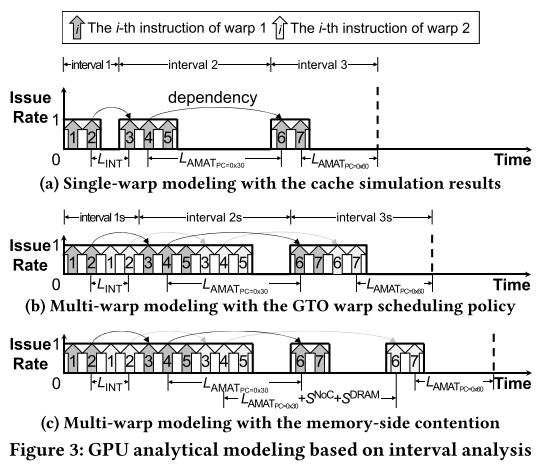

为了准确捕获GPU基于warp的执行模型，现有的GPU解析模型采用了缓存模拟器、单warp模型、多warp模型和内存端争用模型。图3显示了现有模型如何以自底向上的方式估计性能。首先，模型选择一个有代表性的变形，并使用功能单元延迟和平均内存访问时间(AMATs)的加载和存储指令的缓存模拟器估计，构建其执行时间轴。之前的研究[25,50]表明核的warp具有相似的执行行为，因此将warp抽象为代表性warp来估计性能可以获得较高的建模精度。缓存模拟器以轮询的方式接收来自每条warp的存储指令作为输入。其次，模型使用它们的单次变形模型将代表性变形的执行时间线分割成间隔(图3a)。每个间隔由实现最大发布速率的指令序列组成(即，每个周期一条warp指令)，然后是由各种失速事件引起的失速周期。第三，模型使用它们的多变形模型来推导每个SM的执行时间线，该模型应用变形的调度策略，例如GTO[42]，并假设SM被具有代表性的变形填充(图3b)。

在此之后，该模型考虑了由有限数量的缺失状态保持寄存器(MSHRs)和/或NoC和DRAM拥塞引起的内存端争用(图3c)。例如，MDM[50]主要关注由于MSHR争用而导致的内存请求批处理。MDM计算在执行并发发布的间隔期间的L1 D\$ cache读失败(例如图3b中的间隔2秒)。假设这些读请求以batch的形式发送给NoC，直到MSHR满，batch的数量是请求计数和MSHR大小的商。mshr争用的数量为包括NoC/DRAM排队延迟在内的所有批次的服务时间。批次NoC和DRAM排队延迟的计算是在假设所有SM都同样地发送一批读请求和写请求的基础上。根据并发内存请求的数量、L2缓存的平均miss率和NoC/DRAM的最大带宽，MDM估计排队延迟。最后，模型使用产生的多warp执行时间线来预测GPU性能。

### （3）挑战

失速事件：

* 首先，现代GPU核将其计算资源划分为子核，每个子核由一个warp调度器和一组具有有限通路的功能单元组成。有限的功能单元导致计算结构Stall，因为它们阻止warp调度器在每个周期发出一条warp指令。
* 其次，每个内核的L1数据缓存(D\$s)导致内存结构Stall，因为每个L1 D\$有有限的bank，现在由子核共享。有限的L1 D\$ bank使得它很难通过单个L1 D\$访问来获取数据，并且在子核之间共享L1 D\$会引起争用。
* 第三，现代GPU内核采用分区L1 D\$s，将缓存线分割为共享相同标签的更小sector(例如，一条128字节的线分割为4个32字节的sector)。sectored L1 D\$s通过访问sector粒度而不是缓存线粒度的L2 \$，对内存数据Stall有很大的影响。
* 第四，由于现代GPU具有较高的核数和每核子核数，核间和同一核内子核之间的负载失衡现象更加频繁地发生。负载不平衡导致核内和核间空转。

现有的GPU分析模型由于其过时和高度抽象的GPU核心微架构假设，与现代GPU相比存在很大的建模误差。假设GPU核没有被划分为子核，有足够数量的功能单元和L1 D\$资源，并且有相同数量的工作，它们就不能捕获核心端关键的stall事件。

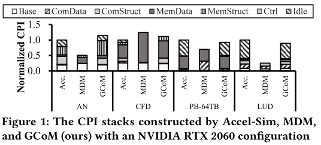

图1描述了最先进的GPU分析模型MDM[50]由于缺乏详细的现代GPU核心建模而导致的建模错误。Accel-Sim周期精确级GPU模拟器[30]构建的CPI堆栈表明，四个基准被核心侧的关键Stalls瓶颈制约：AN被计算和内存结构Stall瓶颈制约，CFD被内存结构Stall瓶颈制约，PB和LUD被核内和核间负载失衡导致的空闲Stall瓶颈制约。然而，MDM由于其抽象的GPU核心模型而忽略了核心端Stall，因此对性能提供了不准确的见解，这迫使计算机架构师依靠长时间运行的周期级模拟器来精确地探索设计空间。因此，本文需要一种新的GPU解析模型，能够准确捕捉核侧的失速事件，从而实现GPU设计空间的快速、准确探索。

本研究采用[2]中提出的GPU失速分类机制。下面的列表显示了一个总结的GPU Stall，考虑以下方面：

* 计算数据(ComData)：功能单元输出不存在未解决的数据风险。
* 计算结构(ComStruct)：(子)核不能发出ready warp，因为目标功能单元还没有完成执行之前的warp指令。
* 内存数据(MemData)：没有ready warp，由于未解决的数据危险的内存访问。
* 内存结构(MemStruct)：(子)核不能发出ready warp，因为内存端竞争。
* 控制/同步(Ctrl)：由于控制冒险(如tb级同步)没有ready warp。
* 空闲：(子)核没有warp执行。

为了实现更高的硬件利用率和计算吞吐量，GPU供应商对其GPU核心微架构进行了一些改进；然而，增强可能会触发许多核侧的失速事件，这可能会大大降低GPU性能。

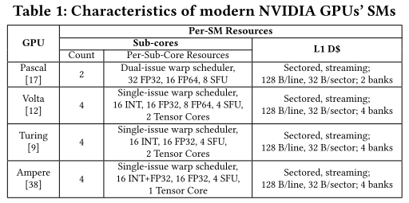

表1列出了现代NVIDIA GPU的几个关键核心微架构特征。作者发现了四个潜在的核心端失速事件，由于增强功能，这些事件可能变得非常重要。

* 首先，由于功能单元有限，每个子核都可能导致ComStruct停滞，因为它现在需要一个以上的周期来执行warp指令。
* 其次，由于每个核的L1 D\$在多个子核之间共享，并且有有限的bank，L1 D\$可能会引起争用，从而导致MemStruct停滞。
* 第三，sectored L1 D\$可以通过将每个缓存线分割成一组共享相同标签的更小sector，并通过在sector粒度上访问L2 \$和DRAM，显著地改变MemData Stall。
* 第四，当warp分布到许多核和子核时，由于核内和核间负载不平衡，空闲Stall可能会发生。由于现代GPU内核增强所导致的核侧延迟会大大降低性能，GPU分析模型应该忠实地捕捉它们，以提供对性能的准确洞察。特别是，分析模型提供的见解应该与现代详细的周期级模拟器(如Accel-Sim[30])兼容，后者认识到精确的GPU核心建模的重要性，并基于现代GPU核心微架构实现详细的时间模型。

不幸的是，本文发现现有的GPU分析模型忽略了核心端关键的失速事件。现有的模型采用的是一种过时且高度抽象的GPU核心微架构，无法捕获发生在现代GPU核心不同微架构级别上的关键核侧失速事件。

* 首先，现有的模型没有考虑到子核，因此未能揭示由于每个子核功能单元有限而导致的ComStruct停顿，以及同一核的子核之间的负载失衡所导致的Idle停顿。
* 其次，在核级别，现有模型不知道sectored L1 D\$及其对内存访问模式的影响，这使得它们难以正确估计sectored L1 D\$影响的MemData暂停。
* 第三，现有的模型无法识别GPU级别的空闲Stall，因为它们没有考虑核间负载失衡。现有的GPU核心微架构模型缺乏详细的分层模型，无法捕获核心侧的关键失速事件。

为了量化捕获核心端关键失速事件的重要性，本文研究了现代GPU核心微架构中的增强对性能的影响。本文还分析了增强对MDM[50,51]建模精度的影响，MDM是最先进的GPU分析模型。在本实验中，本文配置Accel-Sim周期级模拟器来模拟MDM假设的简化GPU核(即没有子核，每个功能单元32个lanes，32个L1 D\$ bank，以及非sectored L1 D\$)。然后，本文在baseline的MDM友好的Accel-Sim配置上应用现代GPU核心的三个主要微架构增强之一(即，每个核4个子核，4个L1 D\$ bank，以及L1 sectored D\$)，并比较MDM和Accel-Sim构建的CPI栈。

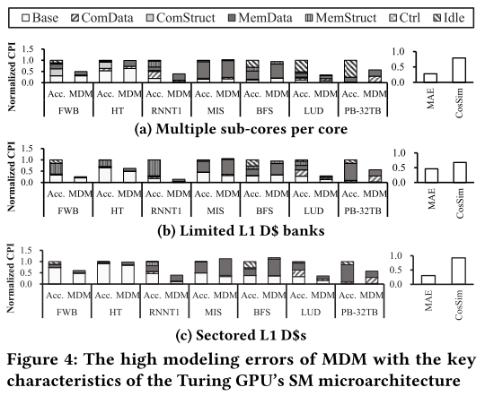

图4显示了关键的核心端失速事件可能成为各种应用程序的主要性能瓶颈。它还显示，MDM造成了很高的建模错误，因此对性能提供了不准确的见解。

* 首先，图4a显示了将一个核划分为四个子核对性能的影响。Accel-Sim的CPI堆栈显示，由于每个子核心功能单元的通路有限，一些基准测试受到ComStruct Stall的影响；然而，MDM假设有足够的功能单元资源，并不能准确预测ComStruct Stall。
* 其次，当我们将每核L1 D\$ bank从32个减少到4个时，可以从Accel-Sim的CPI栈中观察到增加的MemStruct Stall(图4b)。另一方面，MDM假设有足够的L1 D\$ bank，因此无法捕获MemStruct stall。
* 第三，在baseline配置之上引入sectored L1 D\$会影响MemData Stall，这可以从Accel-Sim的CPI堆栈中观察到(图4c)。然而，MDM的CPI堆栈往往高估了MemData Stall，因为它不建模sector，并假设L1 D\$s在它们的缓存线粒度上访问L2 \$和DRAM。
* 第四，Accel-Sim的CPI堆栈也揭示了由核内和核间负载不平衡引起的Idle stall。同样，MDM不能捕获Idle Stall，因为它假设分配给所有(子)核的工作量相等。结果表明，现代GPU的精确性能建模需要捕获核侧失速事件，现有的GPU分析模型由于其高度抽象的GPU核心模型，无法捕获核侧失速事件。

### （4）方案

本文提出了一种详细的GPU核心模型GCoM，该模型忠实地模拟了现代GPU的核心微架构特征。GCoM采用了一套分析表达式，以自底向上的方式对每个子核的有限功能单元、每个核L1 D\$的争用和sector以及核内/核间负载失衡进行建模。GCoM捕获了发生在现代GPU核的不同层次上的Stall：子核层上的计算结构Stall，核心层上的内存结构/数据和核内空闲Stall，以及GPU层上的核间空闲Stall。GCoM的主要组件是一个子核心模型、一个SM内的争用模型、一个sector/流缓存模拟器和一个核间负载不平衡模型。GCoM利用其详细的GPU核心模型，准确地模拟了现代GPU的性能，并揭示了现有GPU分析模型忽略的核心侧的关键问题。

##### 4.1 总体结构

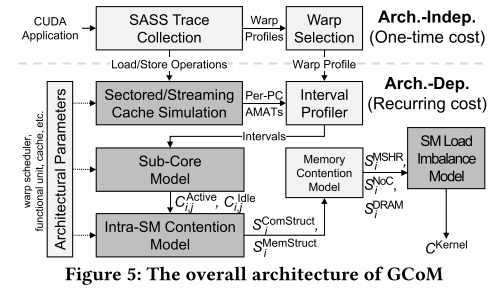

图5总体架构。GCoM将图形处理器应用程序和目标图形处理器的架构参数作为输入。然后，GCoM通过使用NVBit[49]在实际GCoM上的检测来收集应用程序的动态SASS指令跟踪。GCoM通过使用MDM作为其内存争用模型，利用了MDM精确的内存争用建模。

在收集了SASS trace之后，GCoM根据每warp profile选择内核的代表性warp。GCoM与之前的研究类似[25,50]，使用具有代表性的warp来近似其他warp的行为。这种近似方法已被证明可以获得较高的建模精度[25,50]。warp profile反映了其相应warp的体系结构无关特征(例如，动态指令数量，指令类型的分布)。为了选择具有代表性的warp，GCoM对warp profile进行类似GPUMech[25]的k-means聚类。

然后，GCoM使用收集的加载/存储指令和提供的体系结构参数执行缓存模拟。间隔分析阶段使用缓存模拟输出(例如，每个加载/存储指令AMATs)来将有代表性的warp的执行分割成间隔。时间间隔、缓存仿真输出和架构参数随后被GCoM的以下关键组件使用：子核模型、SM内争用模型和SM间负载不平衡模型。首先，子核模型使用间隔估计每个子核的执行周期。然后，SM内部竞争模型预测每个SM的执行周期和SM内部的竞争周期。之后，GCoM使用MDM计算内存争用周期。最后，GCoM的SM负载不平衡模型捕获了SM间负载不平衡引起的空闲周期。

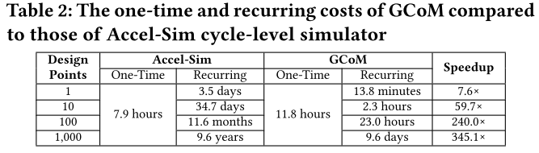

GCoM的跟踪收集和有代表性的warp选择阶段对每个应用程序产生一次性的成本。GCoM的其他组件会产生与评估设计点数量成比例的经常性成本。表2比较了gcom和accel - sim周期级模拟器的成本，在一台服务器上使用我们的31个基准来评估不同的设计点，该服务器配备了AMD EPYC 7713P CPU、NVIDIA RTX 2060 GPU和1-TB DDR4 DRAM。对于Accel-Sim，一次性成本是SASS跟踪收集开销，而重复成本是模拟基准测试所需的时间。尽管GCoM具有较大的一次性成本，但通过产生较低的重复成本，它可以执行比Accel-Sim更快的设计空间探索。

##### 4.2 估计一个内核的总周期

GCoM通过平均GPU SMs的执行周期来构造内核 $C^{Kernel}$ 的周期堆栈：
$$
C^{Kernel} = \frac{sum^{numSMs-1}_{i=0}{C_i}}{numSMs}
$$
$C_i$ 是第 $i$ 个SM的整体执行周期。

 为了捕获由于SM间负载不平衡而导致的Idle stall, GCoM将第 $i$ 个SM的执行周期分为活跃周期和空闲周期：$C_{i}^{Active}$ 和 $C_{i}^{Idle}$ 代表第 $i$ 个SM的活跃周期和空闲周期。当SM执行一个或多个线程块时，它是活动的。当一个活动的SM完成执行它的线程块时，它就变成空闲的，并等待所有其他活动的SMs也变成空闲的。

##### 4.3 对子核的周期进行建模

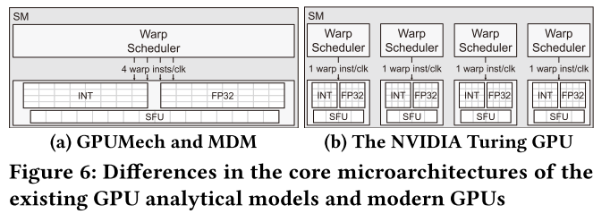

现有的GPU分析模型将子核抽象为单个多发射调度器(图6a)。然而，由于每个子核的功能单元有限，以及子核之间的负载不平衡导致的空闲Stall，这样的抽象无法捕获ComStruct Stall。因此，为了准确识别ComStruct和Idle stall, GCoM需要忠实地建模子核及其有限的功能单元，如图6b所示。

第一步，GCoM将子核的总周期 $C_{i,j}$ 划分为活动周期和空闲周期，以揭示子核之间的负载不平衡导致的空闲Stall：
$$
C_{i,j}=C_{i,j}^{Active}+C_{i,j}^{Idle}
$$
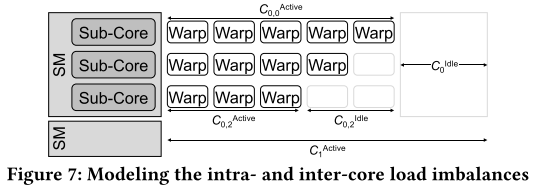

Idle stall是核内负载失衡的原因，所以GCoM将其计算为一个子核的活动周期与同一SM中运行时间最长的子核的活动周期之差(图7)：
$$
C_{i,j}^{Idle}=\underset{k}{max}(C_{i,k}^{Active})-C_{i,j}^{Active}
$$
然后，GCoM将一个子核的活动周期拆分为Base、ComData、MemData三部分，如下：
$$
C_{i,j}^{Active}=C_{i,j}^{Base}+S_{i,j}^{ComData}+S_{i,j}^{MemData}
$$
其中 $C_{i,j}$ 表示第 $i$ 个SM的第 $j$ 个子核的执行周期。Base部分表示子核执行其分配的warp指令所花费的周期，而其他两个部分描述了功能单元输出(如ComData)和长延时内存访问(如MemData)上的数据冒险。

GCoM通过计算一个子核需要多少周期来计算 $C_{i,j}^{Base}$ ，并假设所有的指令都需要一个周期，并且没有冒险发生：
$$
C_{i,j}^{Base}=\frac{totalNumWarpInsts_{i,j}}{issueRate}
$$

$$
totalNumWarpInsts_{i,j}=\#Warps_{i,j} \times NumWarpInsts
$$

$\#Warps_{i,j}$ 是第 $i$ 个SM的第 $j$ 个子核执行的warp指令数， $NumWarpInsts$ 代表warp指令的数量，而 $totalNumWarpInsts_{i,j}$ 则表示子核执行的总指令数。

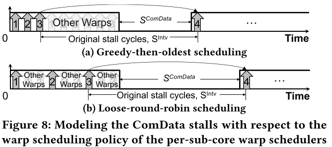

基于区间分析，GCoM模型由长延时操作的数据依赖关系引起的失速周期 $S^{ComData}_{i,j}$ 和 $S^{MemData}_{i,j}$ 。如图8所示，warp的执行由中断失速事件分隔的多个间隔组成。GCoM将失速周期分为 $S^{ComData}_{i,j}$ 或 $S^{MemData}_{i,j}$ ，这些失速点如果与内存操作有关即为 $S^{MemData}_{i,j}$ (如果存在对长延时内存访问的数据依赖)，否则为 $S^{ComData}_{i,j}$ 。由于GPU的高度多线程执行模型，一些停滞周期会被其他并行执行的指令所隐藏。因此，为了准确计算失速周期，GCoM需要估计在失速期间其他warp可以发出多少指令。

warp调度器的调度策略极大地影响了warp的执行顺序，从而影响了可能被隐藏的失速周期的数量。GCoM对两种典型的warp调度策略进行建模：贪婪过时的(GTO)和松散轮询的(LRR)。GTO策略执行当前warp的指令，直到遇到一个失速事件。然后，它调度有现成指令的最古老的warp(图8a)。GCoM估计在失速周期 $S^{Intv}_k$ 中可以发出的warp指令的数量，并计算不能隐藏的失速周期的数量 $S^{ComData}_{i,j}$ ，如下:
$$
S^{ComData}_{i,j}=\underset{k\in Intervals}{\sum}max(S^{Intv}_k-Cycles_{other}, 0)
$$

$$
Cycles_{other}=\frac{P_{warp}\times (\#Warps_{i,j}-1)\times AvgIntvInsts}{IssueRate}
$$

$$
P_{warp}=min(S^{Intv}_k\times P_{inst}, 1)
$$

其中 $S^{Intv}_k$ 是代表warp的第 $k$ 个间隔的stall周期， $Cycles_{other}$ 是并发warp的执行周期， $AvgIntvInsts$ 表示间隔的平均指令数。 $P_{inst}$ 和 $P_{warp}$ 分别表示指令和warp发射概率。所有必要的统计信息(例如， $AvgIntvInsts$ ,  $P_{inst}$ )都是在区间分析阶段获得的。如果停顿事件是由于内存操作，GCoM将周期分类为 $S^{MemData}_{i,j}$ 。

另一方面，LRR策略以循环方式发射就绪的warp的指令。该策略发出一个warp指令，然后移动到下一个就绪的warp。如果warp调度程序采用LRR策略，则只有剩余warp的最后一条指令可以隐藏失速周期，如图8b所示。因此，GCoM利用指令发射概率 $P_{inst}$ 估计指令数量，使用如下公式:
$$
S^{ComData}_{i,j}=\underset{k\in Intervals}{\sum}S^{Intv}_k-(\#Warps_{i,j}-1)\times P_{inst}
$$

##### 4.4 建模一个核心的周期

GCoM的sm内部争用模型旨在准确捕捉由于L1 D\$ bank有限而导致的MemStruct停滞。由于子核模型假设每个子核独立工作，有足够的资源用于执行，并且不考虑任何SM内的争用，GCoM在子核模型的基础上调整它的SM间争用模型，以捕获内核的负载失衡。SM内部争用模型计算子核的执行周期，平均每个子核的周期来构建SM的周期堆栈，并在周期堆栈中增加stall周期:
$$
C_{i}^{Active}=\frac{\sum_{j=0}^{numSubCoresSM-1}C_{i,j}}{numSubCoresSM}+S_i
$$
其中 $S_i$ 为第 $i$ 个SM的失速周期， $numSubCoresSM$ 为每个SM的子核数。

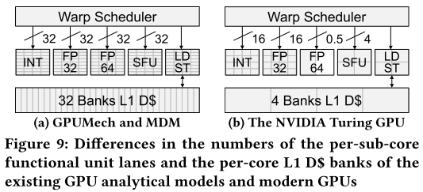

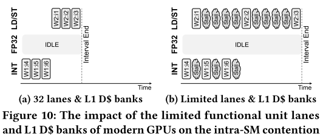

SM内部争用模型量化了由每个核L1 D\$资源争用引起的额外的stall周期的影响。现有的GPU分析模型允许子核在每个周期执行加载/存储指令，假设有足够数量的L1 D\$ bank。然而，在现代GPU中，L1 D\$的bank更少，因此导致MemStruct停滞，如图9和图10所示。为了精确建模MemStruct档位，以及子核心的ComStruct档位，GCoM将 $S_i$ 分解为五个部分:
$$
S_i = S^{ComStruct}_i + S^{MemStruct}_i + S^{MSHR}_i + S^{NoC}_i + S^{DRAM}_i
$$
需要注意的是，内存端争用(即 $S^{MSHR}_i$ ,  $S^{NoC}_i$ ,  $S^{DRAM}_i$ )是 ***由MDM (GCoM的内存争用模型)估计*** 的。

由于ComStruct失速的数量与子核上并发执行的warp的数量不同，GCoM将 $S^{ComStruct}_i$ 派生为:
$$
\begin{aligned}
S^{ComStruct}_i = &S^{ComStruct}(numCncrWarps)\times \lfloor \frac{numWarps_i}{numCncrWarps} \rfloor + \\&S^{ComStruct}(numWarps_i\ mod\ numCncrWarps)
\end{aligned}
$$
其中 $numCncrWarps$ 是一个SM可以同时执行的最大warp次数， $numWarps_i$ 表示第 $i$ 个SM的warp次数。

GCoM将结构冒险延迟的时间间隔建模为一个warp调度程序在考虑和不考虑每个子核功能单元的限制的情况下发射所有指令的周期之间的差。据此得到:
$$
S^{ComStruct}(x) = \underset{k \in intervals}{\sum} (C^{IssueMax}_k(x)-C^{IssueBase}_k(x))
$$
其中 $x$ 是子核并发执行的warp数， $C^{IssueMax}_k$ 是在第 $k$ 个区间中花费最长时间的功能单元的发射周期。 $C^{IssueBase}_k$ 是在假设功能单元有足够通道的情况下得到的基本发射周期。这些是按以下方式计算的:
$$
numActSubCores(x)=min(x, numSubCoresSM)
$$

$$
C^{IssueMax}_k(x)=\underset{m\in FU}{max}\{C^{IssueBase}_k(x), C^{Issue}_{k,m}(x), C^{Issue}_{k,L1}(x)\}
$$

$$
C^{IssueBase}_k(x) = \frac{I_k\cdot x}{numActSubCores(x)\cdot IssueRate} 
$$

$$
C^{Issue}_{k,m}(x) = \frac{I_m\cdot II_m\cdot x}{numActSubCores(x)\cdot IssueRate} \ (I_m\leq I_k)
$$

$$
C^{Issue}_{k,L1}(x)=\lceil \frac{b_k}{B^{L1}_k}\rceil \times x
$$

其中， $x$ 是子核上并发执行的warp指令数， $I_k$ 是代表warp指令在第 $k$ 个间隔内的warp指令数， $I_m$ 是发给第m个功能单元的warp指令数， $II_m$ 表示功能单元的启动间隔。 $C^{Issue}_{k,m}$ 表示第k个区间第 $m$ 个功能单元的发射周期。 $C^{Issue}_{k,L1}$ 表示第 $k$ 个区间内L1 D\$的发射周期，将在下文中讨论。由于L1 D\$ Bank有限，GCoM捕获了MemStruct的停滞，这与它估计ComStruct停滞的方式类似。如果L1 D\$引发了最大数量的结构冒险，GCoM将识别出的结构停顿分类为MemStruct而不是ComStruct。也就是说，当 $C^{Issue}_{k,L1}(x)$ 变成 $C^{IssueMax}_{k}(x)$ 时，GCoM用下面的公式代替:
$$
S^{MemStruct}(x) = \underset{k \in intervals}{\sum} (C^{Issue}_{k,L1}(x)-C^{IssueBase}_k(x))
$$
其中， $b_k$ 是代表性warp引起的L1 D\$访问次数， $B^{L1}_k$ 是第 $k$ 个时间间隔的有效L1 D\$带宽。请注意，GCoM在缓存模拟阶段收集所有必要的内存相关信息，包括L1 D\$访问和带宽。

##### 4.5 建模sectored和streaming L1缓存

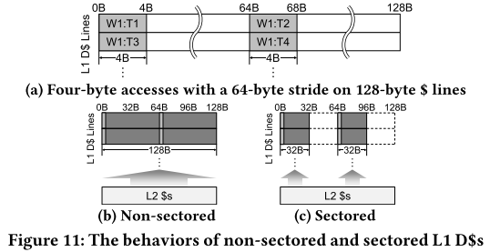

如表1所示，现代GPU现在采用分区L1 D\$，因为它们可以大大减少内存流量。不幸的是，现有的GPU分析模型忽略了扇区L1 D\$，高估了内存端争用。图11展示了非扇区缓存和扇区缓存的不同行为，当四个线程具有相同的warp发射4字节内存请求时(图11a)。假设缓存是cold的，非扇区缓存使用它的行大小作为内存访问粒度，并从L2 \$中获取行大小的数据。然而，在扇区缓存中，所有必要的数据都可以只使用缓存线的两个扇区来传输，从而从L2 \$中获取更少的数据(图11c)。由于缓存的行为存在显著差异，GCoM需要对sectored L1 D\$进行精确建模。

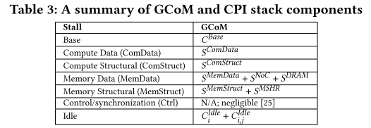

GCoM使用缓存模拟器精确地模拟扇区L1 D\$。缓存模拟器同时支持扇区和非扇区L1 D\$。当提供的架构参数使用扇区L1 D\$时，缓存模拟器会向L2 D\$发出扇区大小的内存请求，而不是行大小的内存请求。在模拟之后，缓存模拟器将每个扇区的缓存统计数据(例如，每个扇区的命中率)传递给内存争用模型。L1 D\$不仅是分段的，而且是流式的。为了建模L1 D\$的流行为，GCoM利用了MDM[50]。MDM通过假设有大量MSHR条目(例如[50]中的4096)来模拟流L1 D\$的无锁特性。GCoM遵循MDM的方法，通过假设每个L1 D\$有足够数量的MSHR条目来模拟无锁特性。总之，表3显示了CPI堆栈组件如何映射到GCoM的分析表达式。请注意，与现有的模型类似，GCoM忽略了前端的失速事件(例如，控制冒险)，因为它们会导致可以忽略不计的开销[25]。
