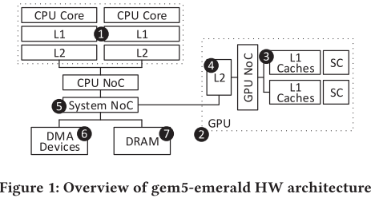
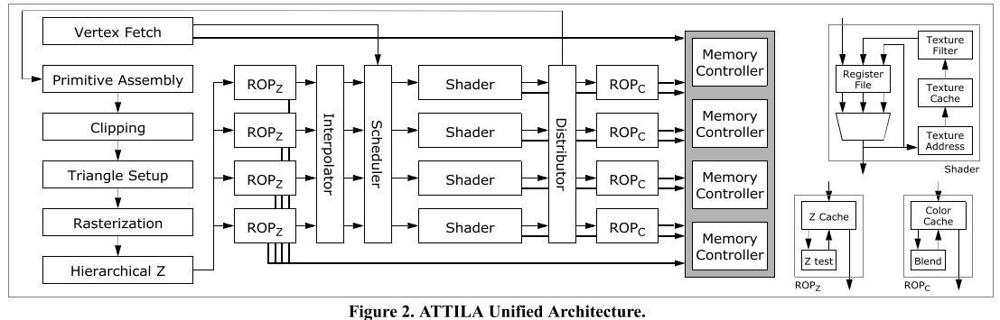
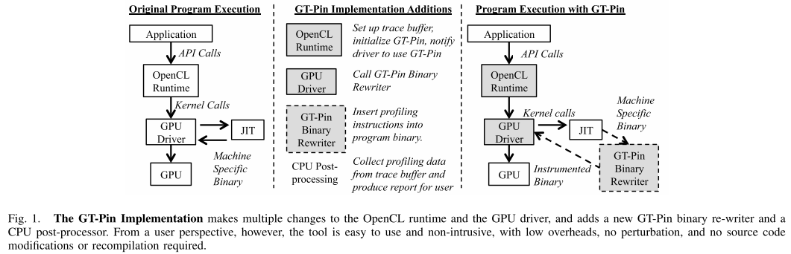
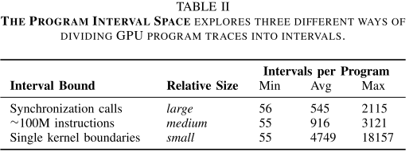
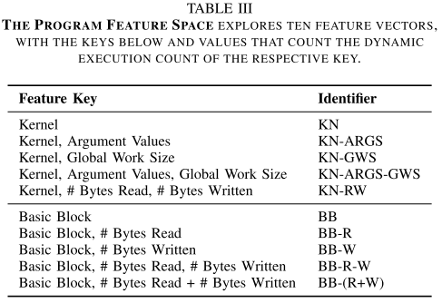

# 一、模拟器相关

## 1. Directed Statistical Warming through Time Traveling

**会议/作者信息：** 

> MICRO 2019
>
> Nikos Nikoleris，剑桥ARM研究院
>
> Lieven Eeckhout，根特大学
>
> Erik Hagersten，瑞典Uppsala University
>
> Trevor E. Carlson，新加坡国立大学

**作用：**

> 低相关，采样模拟需要预热cache，预热时需要挑选重用距离

**研究层次：**

> 采样模拟中的cache预热方法，采样模拟中挑选重用距离对cache预热

**研究重要性：**

> 一般，算是重用距离的应用

**研究差异：**

> 同：重用距离对cache性能有指导意义
>
> 异：着重讲挑选重用距离和预热方法

### （1）研究问题

快速评估方法允许使用更多工作负载对设计空间进行更彻底的探索，从而改进设计。加快架构评估的一种常用技术是对工作负载进行采样，即详细评估小区域的执行，然后推断到整个执行[28,34]。然而，采样评估的一个主要挑战是快速准确地预热每个详细区域的微架构状态，这对于处理器中最大的结构(缓存)来说尤其具有挑战性。虽然采样不是一种新的方法，但快速准确的缓存升温仍然是一个未解决的问题，特别是在新兴的超大DRAM缓存中。

这项工作提出了DeLorean，一种新的统计预热和抽样方法，建立在两个关键贡献的基础上：直接统计预热和时间旅行。与随机统计预热中收集大量随机选择的重用距离不同，定向统计预热收集选定数量的关键重用距离，即详细区域中引用的每个唯一内存位置的最近重用距离。时间旅行利用虚拟化的快进来快速“展望未来”——确定关键缓存——然后“回到过去”——通过虚拟化的定向分析以接近本地硬件的速度收集这些关键缓存的重用距离。

## 2. Emerald: Graphics Modeling for SoC Systems

**会议/作者信息：**

> ISCA 2019
>
> Ayub A. Gubran，Tor M. Aamodt
>
> University of British Columbia

**作用：**

> 弱相关，作为图形渲染/OpenGL模拟器的背景

**研究层次：**

> 周期精确的图形渲染应用OpenGL模拟器（CPU+GPU）

**研究重要性：**

> 重要，连接CPU和GPU模拟器，支持Android应用

**研究差异：**

> 同：支持GPU模拟，扩展了GPGPU-Sim
>
> 异：Emerald面向新场景（图形渲染/OpenGL程序）

### （1）研究问题

为了提供一个有用的模型来研究SoC系统范围的行为，作者认为当代异构SoC的架构模型必须:(1)支持完整的操作系统软件栈(例如，Linux和Android)，(2)模拟主要硬件组件(例如，CPU, GPU和内存层次结构)，(3)提供一个灵活的平台来模拟额外的特殊组件(例如，专用加速器)。满足这些需求的工具将允许架构研究人员评估捕获当前用例的复杂行为的工作负载，从计算机游戏到人工智能和增强现实。

本文提出了GPU模拟器Emerald。Emerald与gem5集成，以提供仅GPU和全系统性能建模，并满足上述三个要求。gem5-Emerald建立在GPGPU-Sim上，并扩展了gem5全系统仿真以支持图形程序。Emerald的图形模型能够使用GPGPU-Sim使用的相同模型来执行图形着色器，从而使相同的微架构模型能够用于图形和GPGPU工作负载。还添加了其他模型来支持特定于图形的功能。此外，为了在全系统SoC模型下使用Emerald，修改了Android，添加了一个类似驱动程序的层来控制GPU模型。

本文的贡献如下:

* Emerald1，一个扩展GPGPUSim的模拟器，为图形和GPGPU工作负载提供统一的模拟器;
* 使用Android和gem5模拟SoC系统的模拟器;
* 对SoC系统中内存行为的研究，强调了将组件之间的依赖关系、系统反馈和事件时间结合起来的详细建模的重要性;
* DFSL，一种利用图形时间一致性提高GPU性能的动态负载平衡技术。

### （2）其他研究

* 系统仿真。研究人员创建了几种工具来模拟多核和异构系统[17,19,55]。然而，这些模拟器主要侧重于模拟异构CPU内核，或者缺乏对gpu和dsp等专用内核的支持。其他工作集中在CPU-GPGPU仿真[56,73]，而gemDroid提供了一个SoC仿真工具，该工具使用gem5 DRAM模型结合了软件模型Trace[20,48,49,77]。另一个基于gem5的模拟器gem5-aladdin[66]提供了一种使用动态轨迹对专用加速器建模的方便方法。阿拉丁和翡翠可以集成，以提供更全面的模拟基础设施。gem5[17]和MARSSx86[55]能够运行完整的操作系统，但缺少图形渲染等关键元素的模型。gem5模拟器[17]可以评估多核系统，包括执行操作系统代码，并已扩展到模拟其他系统组件。GemDroid[20]、gem5-gpu[56]两个模拟器分别扩展gem5以捕获内存交互并合并现有的GPGPU模型。
* GPU模拟器。Attila[25]是一个流行的图形GPU模拟器，它使用统一的着色器对IMR架构进行建模。Attila项目已经沉寂了几年，他们的自定义图形驱动程序仅限于OpenGL 2.0和D3D 9。另一个工具，Teapot模拟器[13]，已经被用于使用TBR架构和OpenGL ES进行图形研究[8,14]。然而，Teapot并没有公开发布。此外，Teapot用非统一着色器内核的旧架构建模流水线。qsilver[67]是一种较旧的模拟基础设施，也使用非统一着色器。最后，最近的一项工作GLTraceSim[65]着眼于启用图形的系统的行为。GLTraceSim并不建模一个特定的GPU架构，但它使用由Mesa 3D[1]提供的功能模型生成的内存Trace来近似GPU行为。除了图形GPU模拟器，其他GPU模拟器专注于GPGPU应用;这包括像Macsim[38]和GPGPU-Sim[16]这样的模拟器，其中Emerald建立在后者之上。
* SoC内存调度。在多核CPU系统中开发了几种内存调度技术[15,39,40,43,69]。对于GPU, Jog等人的工作主要集中在GPGPU工作负载[35]下的GPU核间内存调度。另一项工作提出了针对异构系统的技术[34,58,74]。然而，以前在异构系统上的工作依赖于使用独立的CPU和gpu工作负载的混合，而不是使用同时使用两个处理器的工作负载。本文的工作引入了一个广泛的基础设施来模拟现实的异构SoC工作负载。
* GPU负载均衡。有几个提案解决了GPGPU工作负载的负载平衡问题。Son等人[68]和Wang等人[76]研究GPGPU内核的调度。其他技术使用软件方法利用GPGPU线程组织来提高局部性[42,75,76]。另一方面，DFSL试图找到工作负载执行粒度的解决方案，通过利用图形时间一致性来达到局部性和性能之间的平衡。其他GPGPU调度技术，例如Lee等人的工作[41]，可以在DFSL之上采用，以控制GPU上的执行流。

### （3）方案

图1显示了gem5-emerald模型的SoC架构概述。SoC模型由一个CPU集群(1)组成，该集群具有多个缓存级别的有序或无序内核。GPU集群(2)由多个GPU shader core(sc)组成。每个SC由多个执行流水线组成，以锁步方式执行多个GPU线程。GPU L1缓存(3)连接到非一致互连网络;同时，GPU的二级缓存(4)与CPU缓存一致(遵循与[56]类似的设计)。系统网络(5)是一个连接CPU集群、GPU集群、DMA设备(6)(例如，显示控制器)和主存储器(7)的连贯网络。更改连接和网络类型相对容易(gem5提供了几个可替换的网络模型)。本文使用gem5经典网络模型，因为它们为更快的全系统模拟提供了有效的实现，使用不支持快速转发的较慢模型(例如gem5 Ruby)会消耗相当多的时间。cpu的数量、GPU的sc、专用加速器的类型和数量以及连接它们的片上网络也可以广泛配置。此外，缓存层次结构和一致性也是可配置的。

## 3. ATTILA: A Cycle-Level Execution-Driven Simulator for Modern GPU Architectures

**会议/作者信息：**

> ISPASS 2006
>
> Victor Moya del Barrio, Carlos González, Jordi Roca, Agustín Fernández，西班牙加泰罗尼亚理工大学
>
> Roger Espasa，巴塞罗那Intel

**作用：**

> 弱相关，作为图形渲染/OpenGL模拟器的背景

**研究层次：**

> 周期精确的图形渲染应用OpenGL模拟器

**研究重要性：**

> 不太重要，已经不维护了

**研究差异：**

> 同：支持GPU模拟
>
> 异：ATTILA面向图形渲染/OpenGL程序场景

### （1）研究问题

本文提出了一个用于现代GPU架构的周期级执行驱动的模拟器。基于boxes和signals的概念，讨论了GPU模拟器的仿真模型，以及时序模拟器和功能模拟器之间的关系。使用的仿真模型有助于提高精度并减少时序模拟器中的错误数量，同时允许模拟GPU架构的易于扩展。本文还介绍了OpenGL框架，用于向模拟器提供来自实际应用程序的Trace(UT2004, Doom3)和性能调试工具(Signal Trace Visualizer)。提出的ATTILA模拟器支持从嵌入式部分到高端PC部分的各种GPU配置和架构的仿真，支持统一和非统一的着色器架构模型。

## 4. Fast Computational GPU Design with GT-Pin

**会议/作者信息：**

> 2015 IEEE International Symposium on Workload Characterization， IISWC
>
> Melanie Kambadur，Martha A. Kim，哥伦比亚大学
>
> Sunpyo Hong，Juan Cabral，Harish Patil，Chi-Keung Luk，Sohaib Sajid，Intel

**作用：**

> 强相关，提出了Intel设计的英特尔架构插桩工具GT-Pin，量化了采样的interval和特征向量选择的速度/精度

**研究层次：**

> 采样加速模拟较大的GPU应用程序如何选择interval和特征向量

**研究重要性：**

> 重要，特征向量选择的速度/精度对比结果有指导意义

**研究差异：**

> 同：都是通过采样加速大型应用程序模拟
>
> 异：GT-Pin需要有OpenCL源代码，支持不同架构，可以采集基于基本块的特征向量

### （1）研究问题

大得惊人的模拟时间迫使架构师将评估重点放在图形内核上(可能会忽略重要的计算工作负载)，或者只使用内核而不是完整的应用程序来评估计算工作负载。因此，计算机体系结构社区需要对商业规模的计算GPU应用程序进行详细分析，而不需要全程序模拟的开销。 

这项工作从三个方面解决了这一需求：

* 首先，它提供了一个快速分析工具，可以测量应用程序在现有硬件上本机 Runtime的性能统计数据(第III节)。这个新的工业级工具称为GTPin，可以收集各种指令级数据，为硬件设计提供信息。使用GT-Pin进行性能分析通常需要比正常执行多210倍的时间，不会干扰程序执行，也不需要修改源代码或重新编译。
* 第二，本文使用GT-Pin对非常大的OpenCL程序进行表征研究，平均每个3080亿个动态GPU指令(第4节)。所研究的商业和基准应用程序比任何公开表征的OpenCL程序都要大得多。报告的统计信息包括动态指令计数、内存故障、控制、计算和逻辑指令、内核和基本块执行计数、SIMD长度和内存访问信息。这一特征揭示了计算GPU工作负载的广度，这意味着在评估未来GPU设计时更需要全面的模拟。
* 最后，本文演示了如何选择小的、有代表性的OpenCL程序子集来加速对未来GPU架构的模拟(第V节)。这些小子集可以在一小部分时间内代替完整的程序进行模拟，同时仍然提供对未来硬件上应用程序性能的准确评估。

### （2）其他研究

* GPU应用分析。佐治亚理工学院有两个相关的分析工具:Ocelot[5]、[11]和Lynx[6]。Ocelot是一个GPU编译器，它在编译时测量程序的各种性能统计数据。与本文的工作不同，Ocelot模拟程序而不是在本机硬件上运行它们，它还没有完全支持OpenCL编译。Lynx是一个源于Ocelot的二进制检测工具，确实支持在本地硬件上执行OpenCL，但与GT-Pin不同的是，Lynx只被证明可以在小程序上工作(他们测试的应用程序平均比本文的动态GPU指令少200万倍)。Lynx仅支持为NVIDIA PTX指令集，而不是GEN ISA，并没有提供任何解决方案来选择模拟子集。
* 一些额外的工作也描述了GPU程序，尽管大多数研究更小的应用程序，并专注于CUDA工作负载，这是NVIDIA特定的，而不是独立于架构的OpenCL工作负载。Zhang等人([31])对GPU的指令管道、共享内存访问和全局内存访问进行建模，以准确预测并最终提高覆盖应用程序的性能。他们测试的应用程序的指令比本文工作中研究的平均应用程序少6500倍。Mistry等人使用内置的OpenCL API调用而不是外部分析器来分析计算机视觉算法的内核调用持续时间、处理视频帧的平均和变化时间以及GPU命令队列活动。与GT-Pin的基于插桩的分析相比，他们基于api的分析在可以收集的数据类型方面要有限得多。Bakhoda等人使用插桩化版本的GPGPU-Sim模拟器来收集各种数据，包括指令混合，内存和分支统计数据，以及大量基准测试的并行执行活动，但与GT-Pin不同，他们的工具有沉重的开销。大约是原程序执行时间的一百万倍。
* 模拟区域选择。在GPU仿真子集选择领域还有另外两项工作。第一个是Huang等人的[9]，他们使用与本文工作相似的总体方法找到了具有代表性的GPU模拟子集，其中包含单个内核调用间隔和复合特征向量，其中包括类似于本文的全局工作大小的度量，内存请求计数和内核内并行性度量。除了在特征向量构建上的不同，本文的工作在两个重要方面也有所不同。首先，他们只证明了他们的特征向量构造适用于12个非常小的应用程序，每个应用程序平均只调用34个内核(而本文的应用程序平均每个内核调用4749个)。其次，虽然本文节省的模拟时间完全来自跳过整个内核调用，但它们的节省主要来自跳过部分内核调用。第二篇GPU子集选择论文是Yu等人的工作。这项工作还通过选择部分内核调用来减少模拟大小，但不是让模拟器执行内核内部样本，而是重建可以完全模拟的减少循环计数的微内核。这种部分选择方法可以与本文跳过整个调用的方法相结合，以提高模拟速度。
* 自首次提出CPU仿真子集选择[25]以来，该领域已经发表了数十篇论文。在这里，本文只讨论那些与本文最相关的内容，例如Patil等人的PinPoints论文。像本文的工作一样，PinPoints使用动态插桩工具来找到有代表性的模拟子集，但它只对CPU程序这样做。同一作者的后续工作解决了在分析和Trace运行[22]之间出现的可重复性问题(本文通过使用CoFluent记录来避免这个问题)，以及一个用于确定地找到代表性子集并为基于引脚的x86程序模拟[23]检查它们的工具包。正如本文对GPU所做的那样，Lau等人探索了各种适合CPU模拟的特征向量，发现基本块、循环频率计数和寄存器重用计数最适合封装间隔行为。最后，Carlson等人最近的BarrierPoint工作。[2]通过将间隔划分与同步点对齐来找到并行OpenMP程序中的代表性子集，就像本文通过将GPU程序限制在内核调用边界或更大范围内所做的那样。

### （3）挑战

这是第一个描述大型OpenCL程序的工作，也是第一个通过选择代表性子集来探索加速GPU模拟的工作之一。

### （4）方案

##### A. GT-Pin插桩工具

图1的左侧显示了一个未插装的OpenCL应用程序的执行。首先，应用程序通过调用API与OpenCL Runtime通信。然后，当调用clEnqueueNDKernelRange时，OpenCL Runtime将相关的内核源代码和参数传递给适当的设备驱动程序，在这个例子中是GPU驱动程序。GPU驱动程序jit编译内核源代码，通常是在发出clBuildProgram() API调用时。最后，编译后的特定于机器的二进制代码被传递给GPU执行。

GT-Pin在两点上修改了这个过程，如图1的中间和右侧所示。首先，当OpenCL Runtime最初被应用程序调用时，GT-Pin拦截调用并插入GT-Pin初始化例程，该例程通知GPU驱动程序GT-Pin已被调用。此时，使用malloc分配一个称为Trace缓冲区的内存空间。Trace缓冲区可以被CPU和GPU访问，并将用于保存分析数据。

GPU驱动程序是GT-Pin必须修改的第二个点。在驱动程序将内核源代码编译成特定于机器的汇编之后，而不是允许驱动程序直接将二进制文件发送到GPU执行，二进制文件被转移到GT-Pin二进制重写器。二进制重写器将分析指令插入到程序的汇编代码中。根据GT-Pin用户希望收集的分析数据，注入的指令会有所不同。例如，为了Trace动态基本块计数，GT-Pin添加了一些指令，在程序开始时初始化基本块计数器，在每个块上更新计数器，并在程序结束时将最终计数器值写入Trace缓冲区。一旦重写器完成插入分析指令，GPU驱动程序将插桩后的二进制文件传递给GPU。然后，在程序执行时，分析数据被发送到Trace缓冲区。

最后，当GPU执行结束时，GT-Pin让CPU从Trace缓冲区读取分析结果，对数据进行后处理并生成用户报告。

##### B. GT-Pin可收集的信息类型

* 源程序和汇编程序的静态和动态指令执行计数;
* 操作码的静态和动态分布;
* 静态和动态SIMD宽度计数;
* 静态和动态基本块计数;
* 内核和非内联函数的线程周期;
* 每个线程的内存指令延迟;
* 通过使用内存Trace缓存模拟;
* 每个指令读取和写入的内存字节;
* 每个执行单元SIMD流水线的利用率。

##### C. GT-Pin的开销和限制

从用户的角度来看，GT-Pin分析的运行时间只比非插桩化的执行时间长一点。在为第4节中的基准表征研究收集数据时，观察到2-10倍的开销。与通过模拟收集相同信息所需的高达2,000,000倍的减速相比，这些开销非常小。当前版本的GT-Pin仅适用于英特尔架构和OpenCL程序，尽管其设计理念可以应用于其他供应商的GPU架构。这将需要为每个体系结构提供新的驱动程序实现和新的特定于ISA的二进制重写器。

##### D. 模拟子集的选择

一个标准的程序被用来选择仿真子集的步骤如下:(1)配置程序。(2)将程序Trace划分为多个区间，以达到封装周期性程序行为和标记模拟子集的起始点和停止点(将在未来步骤中选择)的双重目的。(3)对于每个区间，构造一个唯一的特征向量来反映该区间的建筑特征。特征向量的条目对选择的runtime事件的动态发生次数进行计数，例如特定基本块或过程的执行。(4)使用机器学习将相似的特征向量分组为少量的聚类(例如，10个)。(5)为每个聚类选择一个具有代表性的特征向量，通常为质心。此外，通过将集群中跨间隔的总动态指令数除以整个程序中的总动态指令数，计算每个集群的表示比率。该指标衡量给定集群对总体程序性能的影响。(6)所选择的特征向量所属的少量区间构成所选择的仿真子集。详细模拟程序间隔的这个子集，同时通过快速转发或检查指向忽略程序的其余部分。(7)从模拟代表性子集的结果推断整个程序的性能。要做到这一点，只需取每个间隔的模拟性能的平均值，并按表示比率加权。

为了使上述过程适用于gpu，必须回答几个开放式问题。首先，如何构建一个架构独立的GPU选择方法，而不是绑定到特定的GPU平台或ISA。为了实现体系结构的独立性，本文基于OpenCL编程单元和概念的方法。下一个具有挑战性的决定是如何将程序划分为间隔。区间划分1)不能造成同步问题，2)必须在足够大以捕获周期性行为但又不能太大以捕获多种类型的行为之间取得平衡，3)必须有适当的边界以供以后的模拟，因为区间标记了所选子集的开始点和停止点。***根据与本文交谈过的GPU硬件设计师的说法，任何GPU模拟子集选择至少是一个完整的内核调用长度，并且它们不能跨越多个OpenCL同步调用，这是一个严格的限制。***另一个悬而未决的问题是，什么样的特征向量可以准确地总结GPU执行间隔的行为。

**间隔空间**。以前的CPU工作将程序Trace划分为给定数量的动态指令的统一间隔，例如100M指令[25]。然而，这种严格的划分在GPU上不起作用，因为它们违反了GPU间隔不应该跨越内核边界或同步调用的约束。相反，本文用表II中总结的三个可变长度区间大小进行实验。同步间隔是最大的划分，在每个OpenCL同步调用用来划分Trace。下一个最小的间隔进一步将它们细分为大约100M的动态指令段。为了不跨内核拆分一个间隔或跨间隔拆分一个内核，这将导致一些间隔略大于或小于恰好100条指令，因此本文称这种分割为“大约100M条指令”。最后，本文考虑每个内核调用都有自己的时间间隔。虽然有些内核的指令数大于100M，但大多数内核的指令数都小于100M，这就导致了最小的平均间隔大小。

**特征空间**。将程序分解为多个间隔后，第二个问题是使用哪些程序特性来描述该间隔以进行聚类。本文对表III中总结的十种特征向量进行了实验。每个特征向量本质上是一组(键，值)对，其中键是一个不同的程序事件，例如“调用内核foo”或“调用内核foo带参数256”，值是该事件在给定间隔内发生的次数的计数。如表III所示，本文的实验探讨了增加事件的特异性是否有价值，不仅包括内核或基本块ID等计算信息，还包括内核参数或读取或写入的字节数等数据交互。为了确保这些向量在不同大小的内核和基本块上放置适当的值，本文根据指令计数对每个向量项进行加权。例如，如果一个间隔执行块A 10次，执行块B 5次，那么这些计数就表明A是这个间隔更重要的特征。但是，如果A有3条指令长，B有20条指令长，那么B的5 × 20 = 100和A的10 × 3=30的加权分数更能反映它们的实际重要性。注意，这个权重也会影响下一节计算的聚类簇表示比率。

**量化仿真误差**。一旦划分了区间并构造了特征向量，就可以使用任何工具对它们进行聚类和评分。本文使用了之前CPU工作的标准工具SimPoint。具体来说，本文使用了SimPoint 3.0版本，它可以处理可变大小的间隔[8]。SimPoint以程序特征向量为输入，使用k-means聚类算法对相似的特征向量进行分组。然后，它根据每个向量的总元素计数计算每个簇的质心，并返回这些质心。本文将这些报告的特征向量质心追溯到它们的相关间隔，以获得本文的模拟子集选择。除了聚类质心，SimPoint还返回每个选定特征向量的表示比率。SimPoint允许用户指定集群和选择的最大数量，但如果它的机器学习算法认为这样做是合适的，则可能返回少于这个最大值的值。在接下来的所有实验中，最大聚类和选择子集计数被设置为10。

传统上，整个程序的详细模拟是用来评估所选子集的代表性。然而，由于本文需要为25个大型应用程序评估30个间隔大小/特征向量配置，因此详细的全程序模拟是不可能的。相反，本文开发了一种启发式方法，用于验证基于每个内核计时数据的单个选择，这些数据是本文使用CoFluent CPR工具收集的。验证启发式是从选择的时间和权重推断出的测量的每条指令的 seconds per instruction (SPI)与预计的整个程序SPI的错误率:
$$
Error = \frac{abs(Measured\ SPI − Projected\ SPI)}{Measured\ SPI}*100\%
$$
**区间和特征选择结果**。图5显示了30种类型的间隔/特征向量组合在选择代表性程序子集方面的表现。为简洁起见，该图仅展示了3个示例应用程序的错误和选择大小结果，但本文在所有25个应用程序上测试了所有30种组合。其余22个应用程序的结果与3个应用程序的结果相同:在所有应用程序中，就interval size和feature vector而言，区间大小和特征向量的单一组合没有“最佳”。然而，跨应用程序有几个趋势。例如，**基于基本块的特性往往优于基于内核的特性，对于大多数应用程序，具有内存访问计数的特性改进了基于基本块的特性。当使用仅内核特性时，具有最少唯一内核的应用程序往往具有较高的错误率。**至于区间大小，同步有界的区间往往会产生最小的错误，但由于它们也是最大的分割，因此会产生最大的选择大小。**对于基于基本块的特征，区间大小对错误率的影响往往小于区间大小对基于核的特征的影响。**如果要选择30个测试的最佳平均间隔大小/特征向量组合，那么**错误率最小的组合将是没有内存特征的基本块间隔(BB)和同步有界间隔。**这种组合在所有25个应用程序中平均误差为1.5%，并选择占总程序指令1.9%的子集(对应于53倍的模拟加速)。在最坏的情况下，一个单独的应用程序的错误率为8.8%，而另一个应用程序的选择包含了总程序指令的24.0%。

## 5. FireSim: FPGA-Accelerated Cycle-Exact Scale-Out System Simulation in the Public Cloud

**会议/作者信息：**

> ISCA 2018
>
> Sagar Karandikar，Howard Mao，Donggyu Kim，David Biancolin，Alon Amid，Dayeol Lee，Nathan Pemberton，Emmanuel Amaro，Colin Schmidt，Aditya Chopra，Qijing Huang，Kyle Kovacs，Borivoje Nikolic，Randy Katz，Jonathan Bachrach，Krste Asanovi，UC Berkeley

**作用：**

> 弱相关，作为硬件实现的模拟器背景

**研究层次：**

> FPGA实现的大规模集群模拟器，大型硬件仿真器

**研究重要性：**

> 重要，用来探索仓库规模机器设计方案

**研究差异：**

> 同：无
>
> 异：FireSim是硬件实现，面向大规模集群性能模拟

### （1）研究问题

本文介绍了FireSim，这是一个开源仿真平台，通过将fpga加速仿真与可扩展的分布式网络仿真相结合，可以实现大规模集群的周期精确微架构仿真。与之前的FPGA加速仿真工具不同，FireSim运行在Amazon EC2 F1(一个公共云FPGA平台)上，这大大提高了可用性，提供了弹性，并降低了大规模基于FPGA的实验的成本。本文描述了FireSim的设计和实现，并展示了它如何提供足够的性能来运行大规模的现代应用程序，从而实现真正的硬件软件协同设计。作为示例，本文演示了自动生成和部署一个由1,024个3.2 GHz四核服务器节点组成的目标集群，每个节点具有16 GB的DRAM，通过200 Gbit/s网络相互连接，具有2微秒延迟，模拟3.4 MHz处理器时钟速率(实时速度低于1,000倍)。总的来说，这个FireSim实例模拟了4,096个内核和16 TB的内存，每秒运行约140亿个指令，并利用价值1280万美元的fpga，每小时模拟用户的总成本仅为约100美元。本文提供了几个例子来展示如何使用FireSim来探索仓库规模机器设计的各种研究方向，包括高带宽和低延迟的网络建模，为各种商品和专业数据中心节点集成任意RTL设计，以及各种数据中心组织建模。以及重用横向扩展的FireSim基础设施，以实现快速、大规模并行的周期精确的单节点微架构实验。
