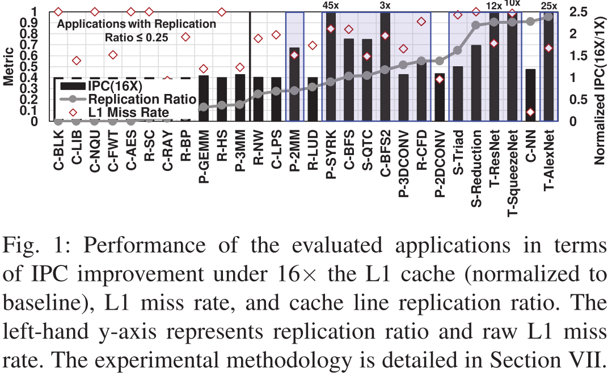
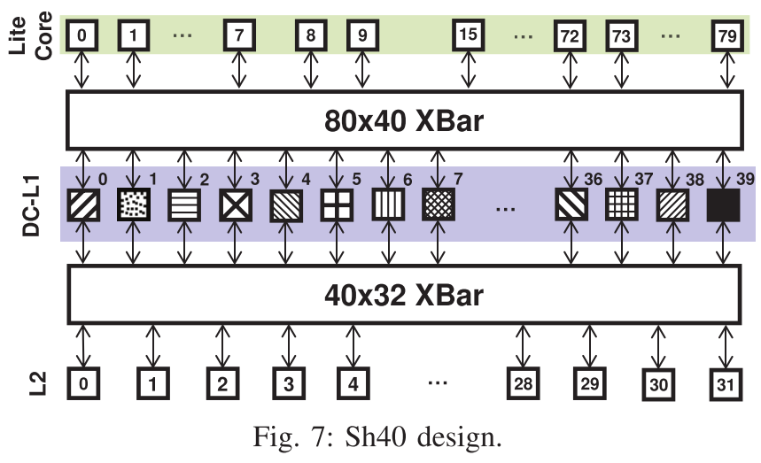
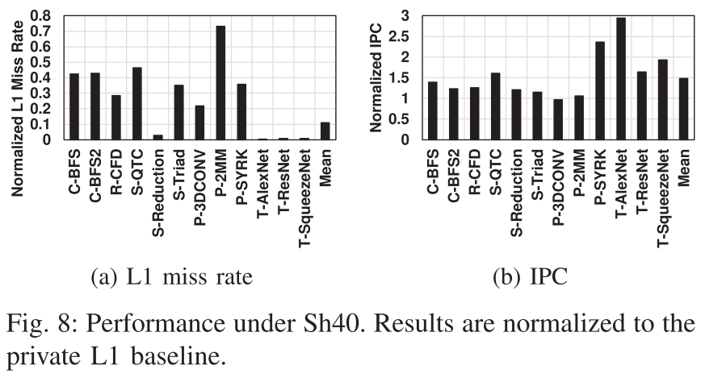
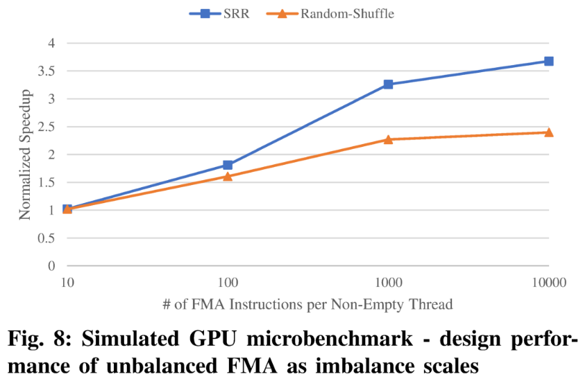
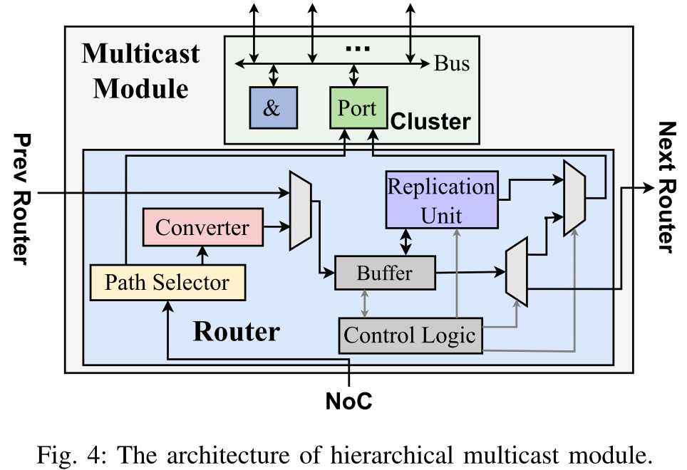

# 一、架构相关

## 1. Analyzing and Leveraging Decoupled L1 Caches in GPUs

**会议/作者信息：**

> HPCA 2021
>
> Mohamed Assem Ibrahim，Adwait Jog，William & Mary
>
> Onur Kayiran，Yasuko Eckert，Gabriel H. Loh，AMD

**作用：**

> 强相关，解决私有L1缓存利用率效率低下的问题。
>
> 按照改进的顺序一步步叙述。

**研究层次：**

> 共享解耦L1 Cache

**研究重要性：**

> 重要，与Morpheus异曲同工，都是增大L1 Cache。

**研究差异：**

> 同：
>
> 异：

### （1）研究问题

解决传统的私有L1、共享L2导致高速缓存利用率效率低下的问题。

* 第一个低效率源于L1和L2 Bank之间的多对少通信。相对总和L1 Bank（=L1 Banks per Core $\times$ Num of Cores）来说，只有少数Bank的L2压力很大，而众多的每核L1压力较小，这导致每核L1的带宽利用率较低[12]。

* 第二个低效率是私有L1高速缓存[3]、[5]、[13]、[14]之间的高速缓存行（数据）有多个备份。这种复制浪费了整个L1容量，导致L1命中率较低，因此减少了其有用带宽。

### （2）其他研究

**GPU中核内局部性。**以前的工作集中在利用私有L1缓存中存在的局部性[6]，[7]，[9]，[29]，[30]。在这项工作中，本文专注于跨L1缓存存在的地方。其他工作提出了CTA缓存器[28]，[31]，[32]使用不同的算法来利用跨CTA的局部性并提高缓存性能。然而，这些缓存器并不理想，并且跨L1缓存的不受控制的复制的问题仍然存在。本文提出的设计将复制限制在预设的限制（例如，Sh 40 +C10+Boost最多10份），不需要任何软件支持。通常，现有的L1高速缓存容量管理技术[17]、[32]-[34]不控制跨L1的复制。然而，这些工作可以提高每个单独的DC-L1的性能，而本文的设计促进了DC-L1之间的协调，以更好地利用它们。

**GPU核间局部性。**先前的工作集中于通过利用核间局部性和实现核间通信来提高私有L1带宽利用率。这是通过使用环来连接GPU核心[14]或类似一致性的机制[35]来实现的。Ibrahim等人[3]通过数据共享预测和并行探测方案优化了核间通信。这些工作不会减少跨L1的复制。然而，本文的设计减少了复制，消除了对内核间通信的需求。先前的工作[36]，[37]提出了在一组核心之间共享L1数据缓存。这种高速缓存设计类似于私有DC-L1高速缓存设计（第IV节），与本文的设计（第VI节）相比，该设计遭受高数据复制。Zhao等人[10]利用内核间局部性，通过在不同的L2切片上复制缓存行来解决L2的带宽瓶颈。这项工作是对本文工作的补充，因为它针对L2带宽，而本文的工作提高了L1容量及其带宽利用率。

**CPU中的复制控制。**先前的CPU工作研究了最后一级缓存的共享和私有缓存设计之间的权衡[38]-[47]。这些工作集中在延迟上，因为它通常是CPU工作负载中的一阶挑战。然而，据本文所知，本文的工作是第一个提出复制控制和集群共享解耦的L1缓存设计的GPU，以提高片上带宽。

### （3）挑战

##### A. 低效来源1：L1之间的数据备份

L1缓存扩大16倍以后明显降低复制率（**复制率被定义为可以在其他L1缓存中找到的L1未命中与总L1未命中的比率—num_replication=0; num_L1misses=0; L1未命中一个数据，但是这个数据在别的Core中已被缓存，那么num_replication++, num_L1misses++; L1未命中一个数据，且这个数据没有在别的Core中被缓存，那么仅执行num_L1misses++，最后复制率=num_replication/num_L1misses**）、L1未命中率，以及提升IPC。

L1未命中率低的应用程序（例如，C-NN）可能不会受到私有L1缓存的影响，因为它们的大多数请求可以在本地得到满足。一般来说，作者认为一个应用程序是复制敏感的，如果它1）具有> 25%的复制率，2）具有> 50%的L1未命中率，3）在16倍容量下观察到>5%的加速比。根据这些标准，作者观察到12个应用程序是复制敏感的（由图1中的蓝框标记）。

如果所有GPU内核都访问单个L1缓存（同时保持总的L1缓存容量和带宽不变），并确保没有复制。L1未命中率显著降低，平均降低89.5%。

##### B. 低效来源2：较低的L1 Cache利用率

L1缓存和GPU内核的紧密耦合以及多对少的通信模式（L1和L2存储体之间）给少数L2 Bank带来了更大的压力，而给许多L1缓存带来的压力较小。这导致每核L1高速缓存的低带宽利用率。**每个核心的L1带宽利用率定义为核心的L1访问（请求）与总周期计数的比率。**图2显示了在所有评估的应用程序（按升序排序）下，所有L1缓存数据端口的最大带宽利用率。作者观察到，L1数据端口的最高带宽利用率为18%。L1缓存的低带宽利用率也由最近的工作[12]、[16]显示。为了全面了解，作者还研究了NoC链路的利用率，这些链路将数据从L2传输到GPU核心。图2显示了所有评估应用程序的最大NoC链路利用率，包括连接到GPU核心的所有链路。与数据端口类似，最大链路利用率较低（30%），这进一步表明每核L1的利用率不足。

### （4）方案

本文提出去耦合L1（DC-L1），将L1缓存与GPU Cores分离，做共享使用，以减少复制。但共享DC-L1缓存设计需要GPU内核和DC-L1之间的全对全通信，会带来显著的NoC面积/功耗开销和NoC可扩展性/时钟挑战。因此，本文改变共享粒度（分组共享，几个Cores共享一个DC-L1）使用一个重复的DC-L1缓存设计，以平衡复制浪费和NoC开销之间的权衡。本文还改进了NoC设计来将DC-L1高速缓存连接到GPU内核和内存分区。更新后的NoC设计取决于DC-L1聚集的粒度和集群DC-L1缓存设计下的共享粒度。此外，考虑到L2切片的共享性质和分配给集群内每个DC-L1的唯一地址范围，每个DC-L1将仅与几个L2切片通信。

##### A. DC-L1 Cache设计

##### B. 私有DC-L1 Cache

把共X个大小为C的DC-L1分为Y组，一组称为一个Node，每个Node缓存大小为X*C/Y，每个Node通过NoC#1中的N × 1交叉开关连接到N=X/Y个核心进行私有访问。这种私有聚合DC-L1设计称为PrY（Y为分为多少组）。

表I显示了在80个核心基线下使用不同Y值的私有DC-L1设计的不同NoC配置（第VII节）。例如，图5显示了Pr 40的设计，其中80个DC-L1被聚合为40个DCL 1，每个DCL 1具有双倍的该高速缓存容量。使用Pr 40，每个DCL 1节点由两个核心通过NoC#1中的2×1 crossbar进行私有访问。这种专用高速缓存组织允许每个DCL 1高速缓存任何行。例如，给定由图5中的不同模式表示的不同地址范围，专用DC-L1高速缓存可以存储来自所有地址范围的任何行。

**专用DC-L1缓存性能。**根据IPC和DC-L1未命中率（标准化为图4中的私有L1基线）评估了私有DC-L1缓存设计在复制敏感型应用程序上的性能。作者从Pr 80开始，在那里作者解耦L1缓存而不进行任何聚合。如表I所示，Pr 80在NoC#1中使用32字节直接链路将GPU核心连接到对应的DC-L1节点，而在NoC#2中使用80×32交叉开关将DC-L1节点连接到L2/存储器。**由于32 B链接，从给定DC-L1提取的128 B高速缓存行将被分解成四个32 B块（假设没有控制元数据），以顺序地传递到请求者核。因此，峰值理论DC-L1缓存带宽比基线低4倍（表I）。**尽管如此，如图4a所示，Pr 80在IPC方面的性能与基线相似（平均下降3%）。这归因于GPGPU应用程序的延迟容忍特性。这也表明峰值L1带宽足够丰富（如[12]、[16]所示）。然而，如图4 b所示，Pr 80不会降低DCL 1未命中率。这表明跨DC-L1的数据复制没有减少。这是预期的，因为在Pr 80下，作者不聚合DC-L1。

在聚合DC-L1下，一组核心访问公共缓存资源（单个DC-L1）。例如，在Pr 40下，两个核访问单个DC-L1。由于在单个高速缓存内不存在高速缓存行复制，因此DC-L1聚合应当减少复制并提高DC-L1的集体命中率。如图4 b所示，在Pr 40、Pr 20和Pr 10下，DC-L1未命中率分别下降了19%、49%和74%。在吞吐量方面，与基线相比，Pr 40将复制敏感型应用程序的IPC平均提高了15%。这是因为减少了数据复制，从而提高了DC-L1命中率，从而提高了片上带宽和整体性能。**另一方面，Pr 20和Pr 10分别使平均性能降低3%和34%。这是由于它们的峰值L1带宽（表I）的显著下降以及由于在NoC#2中使用较小的交叉杆而导致的较低NoC二等分带宽。**为了理解在不同DC-L1节点数下的私有DC-L1设计的范围，作者假设具有100%命中率的完美DC-L1。图4c显示了在标准化为私有L1基线的正常和完美DC-L1下，复制敏感应用程序的平均IPC改进。有三点意见是符合要求的。首先，Pr 10在完美的DC-L1下仍然会导致性能下降28%，这是由于DC-L1缓存和NoC带宽的减少。其次，Pr 20和Pr 40在完美DC-L1下的性能分别比它们的正常DC-L1对应物提高了40%和90%。然而，与使用普通L1缓存的基线相比，Pr 40具有更高的IPC提升2.2倍。最后，与使用普通DC-L1的Pr 80相比，完美DC-L1 $下的Pr 80将性能提高了3.3倍。然而，它不匹配在基线私有情况下（表示为Base）具有完美的L1缓存的5.2倍改进。这是由于在Pr 80下峰值L1带宽下降4倍。

**面积和功率。**作者研究了不同私有DC-L1配置下的NoC面积和静态功耗降低，标准化为图6中的私有基线。作者使用DSENT [19]对NoC#1和NoC#2中的交叉开关进行建模，假设采用22 nm技术，并假设所有评估的交叉开关都可以在相同的时钟频率下工作。作者观察到以下情况。首先，与基线相比，Pr 80增加了微不足道的面积和静态功率开销。这是因为Pr 80仅添加链接以将给定GPU核心连接到其对应的DC-L1节点。其次，Pr 40、Pr 20和Pr 10分别使NoC面积减少28%、54%和67%。这是由于将基线80×32 crossbar分解为更小的crossbar，从而减少了NoC面积[10]，[20]。第三，Pr 40下的静态功率降低仅为4%。这是因为Pr 40的小交叉开关减少了来自交叉开关和交换分配器组件的每路由器静态功率;但是，它增加了来自缓冲器组件的静态功率（由于更多的路由器）。最后，Pr 20或Pr 10下的静态功率降低大于Pr 40。这是因为Pr 40在NoC#1中使用更多的小交叉杆，而在NoC#2中使用更大的交叉杆。

**总结。**由于Pr 40提高了吞吐量，同时减少了NoC面积并保持了功耗（与基线相比），因此本文选择了40个DC-L1节点用于本文的其余部分。然而，为了弥合正常和完美DC-L1之间的Pr 40性能差距，需要研究其他创新方法来减少数据复制，从而进一步提高DC-L1的集体命中率。

##### C. 共享DC-L1 Cache

为了消除DC-L1缓存之间的数据复制，启用共享DC-L1缓存组织。在共享组织中，整个地址范围在所有DC-L1之间交错，并且这种映射是固定的。换句话说，每个DC-L1排他地缓存来自非重叠地址范围的数据。可以缓存给定高速缓存行的DC-L1是该行的Home DC-L1。例如，图7示出了全黑色地址范围仅由DC-L1 39高速缓存。换句话说，DC-L1 39是黑色地址范围的Home。因为地址范围的独占切片映射到单个DC-L1，所以共享组织确保没有跨DC-L1缓存的缓存行复制。

要启用共享DC-L1组织，任何核心都需要访问任何DC-L1节点。图7显示了在作者的设置下实现这一点的一种可能的设计。在此设计中，80个GPU核心通过NoC#1中的80×40 crossbar连接到40个DC-L1节点。将这种设计称为Sh 40（或一般的ShY，其中Y是DC-L1节点的总数）。为了为给定的高速缓存行选择Home DC-L1，作者使用Home 位。这些本地位是从请求的物理地址中选择的。选择这些位的过程类似于基于物理地址选择适当的L2存储体。通常，ShY设计需要log2(Y)个Home 位来标识Home DC-L1。L1或非L1请求/应答（读或写）遵循section A中的相同流程。唯一的区别是请求/应答被转发到Home DC-L1。

**共享DC-L1缓存性能。**作者根据DC-L1未命中率和IPC评估了Sh 40在复制敏感型应用程序上的性能，标准化为图8中的私有L1基线。在Sh 40下，DC-L1未命中率显著下降，平均为89%（最小= 27%，最大= 99%）。DC-L1未命中率的显著下降是预期的，因为这些应用在DC-L1之间具有高数据复制，这在共享DC-L1设计下被消除。这有效地提供了L1高速缓存容量以存储更多的高速缓存行，从而提高了L1命中率和片上带宽。DC-L1提升的片上带宽转化为平均48%的吞吐量提升（T-AlexNet高达2.9倍），如图8b所示。然而，两个复制敏感的应用程序没有从Sh 40中受益。具体来说，P-2 MM仅实现了6%的加速比，因为Sh 40可能导致分区驻留问题。分区驻留[21]是由偏向DC-L1节点子集的缓存访问引起的。这导致DC-L1之间的负载不平衡，并限制了共享缓存设计的优势。至于P-3DCONV，由于其对可用L1缓存带宽的敏感性，Sh 40的性能损失为3%。具体地，NoC#1中的业务量高，这是由于GPU核心中不存在L1高速缓存以及Sh 40的高DC-L1命中率。因此，40个DC-L1（表I）的峰值缓存带宽降低限制了P-3DCONV在Sh 40下的性能优势。

**面积和功率。**虽然Sh 40提高了复制敏感型应用的性能，但它在NoC#1中使用80×40交叉开关来路由来自任何GPU核心的流量，以及来自任何DC-L1节点的流量。除了NoC#2中的40×32交叉开关之外，与私有基线相比，该交叉开关还导致69%的NoC面积开销和57%的NoC静态功率开销。复制不敏感的应用程序。在图9中作者评估了Sh 40被分类为复制不敏感的应用程序上的性能。作者观察到以下情况。首先，这些应用程序中的大多数执行得与基线一样好（例如，R-LUD和C-BLK）。这些应用对DCL 1设计引起的延迟开销具有很高的容忍度。第二，R-SC的性能优于基线。这是因为在基线下，R-SC遭受工作分配不平衡，因为一些核被分配了更多的协作线程阵列（CTA）。这会导致内核之间的L1缓存访问不平衡。然而，考虑到Sh 40下DC-L1的共享性质，DC-L1高速缓存访问中的这种不平衡被缓解，这减少了瓶颈并提高了性能。其次，五个应用程序在Sh 40下性能下降（最小= 40%，最大= 85%）。在图9中，作者将这些应用程序称为性能较差的应用程序。这些应用程序要么具有高L1命中率和低延迟容限（C-NN），要么遭受分区驻留（C-RAY、P-3 MM和P-GEMM），要么对降低的峰值L1缓存带宽敏感（P-2DCONV）。

**总结。**虽然Sh 40显著提高了复制敏感型应用的性能，但它带来了相当大的NoC面积和静态功耗开销。此外，一些复制不敏感的应用程序遭受显着的性能损失。因此，要为基于DC-L1的设计提供强有力的理由，作者需要解决这两个问题。

##### D. 集群共享DC-L1 Cache

作者需要一种设计，能够为复制敏感型应用提供性能提升，同时降低面积和能耗要求。此外，它不应该对复制不敏感的应用程序产生负面影响。因此，在本节中，作者研究限制复制而不是消除复制。此外，作者利用NoC#1中较小的交叉开关可以以更高的频率运行的事实来提高复制敏感和复制不敏感应用的性能。

Sh 40的NoC面积和功耗开销背后的主要原因是NoC#1中使用的80×40 crossbar。这个crossbar对于启用完全共享的缓存组织是必不可少的。另一方面，在Pr 40的情况下，复制仍然很高，但整体NoC面积和静态功率降低。这在复制的减少和NoC面积/功率要求之间呈现了折衷。因此，作者提出了一个基于集群的共享DC-L1设计，作者使共享缓存模型跨集群的DC-L1缓存，而不是所有的。这消除了跨同一集群的DC-L1的复制，如图10所示。但是，它仍然允许跨不同群集中的DC-L1进行复制。使用集群的数量作为设计参数，作者可以限制复制，同时控制片上网络的面积和功耗要求。

通过这种设计，N个核通过NoC#1中的N × M交叉开关访问M个DC-L1节点的集群。作者将这种设计称为ShY+CZ，其中Y是DC-L1节点的总数，Z是集群的数量（Z = Y/M）。此外，由于L2切片的共享性质以及集群内的每个DC-L1被分配唯一的地址范围，给定的DC-L1将仅与几个L2切片通信。因此，不是在NoC#2中使用完整的Y × L交叉开关来将Y个DC-L1节点连接到L个L2切片（L ≥ M，L mod M =0），而是给定的DC-L1将经由NoC#2中的Z × O交叉开关仅与O = L/M个L2切片通信。例如，图10显示了具有40个DC-L1和10个集群的Sh 40 +C10的设计。每个集群由8个核心组成，通过NoC#1中的8×4 crossbar访问4个共享DC-L1。40个DC-L1通过NoC#2中的4个10×8交叉杆连接到32个L2切片。具体地，跨被分配相同地址范围的集群的所有10个DC-L1经由NoC#2中的10×8交叉开关访问服务于这样的地址范围的8个L2片。为了说明，在图10中，服务于交叉阴影线地址范围的DC-L1连接到共同服务于这样的地址范围的L2片0到7（示出为不同的颜色）。选择Home DC-L1。如在章节V-A中所讨论的，Home DC-L1的选择基于Home 比特。唯一的区别是从请求的物理地址使用的位数。具体而言，ShY+CZ设计需要log 2（Y/Z）个起始位。

**集群共享DC-L1缓存性能。**在图11中，作者评估了集群共享DC-L1缓存设计在不同集群数下对复制敏感的应用程序的性能。将结果标准化为私有L1基线。在此图中，C1和C40分别等效于Sh 40和Pr 40设计。作者提出几点意见。首先，当集群计数大于1（C> 1）时，L1未命中率较高。这是由于与C1情况相比，复制增加了，C1情况仅在DCL 1上保留给定缓存行的单个副本。具体而言，最多5、10、20、40和80个缓存行副本可以分别存在于具有C5、C10、C20、C40和基线的DC-L1上。这导致C5、C10和C20的平均L1未命中率分别降低72%、61%和41%（与基线相比）。其次，即使L1未命中率降低较小（与C1相比），C5、C10和C20下的性能改进仍然很显著。例如，与私有L1基线相比，C10平均提高了41%的性能。这意味着与C1相比，性能下降了5%。第三，大多数对复制敏感的应用程序使用C1执行得更好，因为它们对通过消除复制而获得的额外有效缓存容量非常敏感。另一方面，一些应用（例如，T-AlexNet）在聚类方面表现更好。这是因为使用集群的受控复制平衡了来自额外高速缓存容量和来自具有给定高速缓存行的多个副本（因此源）的有用L1带宽。这表明受控的数据复制可能不会对整体性能产生负面影响，甚至可以帮助提高整体性能。最后，P-3DCONV没有获得集群设计的加速，S-Reduction失去了性能（下降15%）。如第V-B节所述，P-3DCONV的低性能是由于其对基于DC-L1设计的峰值缓存带宽降低的敏感性。至于S-Reduction，由于其复制模式，其性能仅在完全共享的C1设计中提高。C1的L1未命中率下降了97%，这是显而易见的。使用其他群集选项时，L1未命中率不会下降，这意味着复制不会减少。因此，片上带宽和性能都没有提升。相反，由于DC-L1设计的解耦性质和应用程序的延迟容忍度，作者观察到性能下降。

**面积和功率。**在图12中，作者评估了不同集群计数的NoC面积和静态功率，标准化为私有L1基线。与作者在第IV-B节中的观察类似，用C1（Sh 40）打破NoC#1中的80×40交叉，并使用较小的交叉形成集群，可以节省NoC面积和静态功耗。此外，在NoC#2中使用更小的交叉杆而不是40×32交叉杆进一步提高了这种节省。具体而言，与基线相比，作者观察到C5、C10和C20分别节省了45%、50%和45%的NoC面积。至于NoC静态功率，作者观察到C5、C10和C20分别降低了15%、16%和14%。考虑到C10的性能改进和面积/功耗节省，作者选择这种设计用于本文的其余部分。作者称之为Sh 40 +C10。

**复制不敏感的应用程序。**图13 a显示了严重受Sh 40影响的性能较差的应用程序的性能。作者观察到，与Sh 40相比，Sh 40 +C10大大提高了其中三个应用程序的性能。具体地，C-RAY、P-3 MM和P-GEMM由于分区驻留的效果而受益于集群设计。换句话说，通过具有多个Home DC-L1（在Sh 40 +C10下为10个）来缓解来自分区驻留的DC-L1竞争。然而，即使有了这种改进，与私有L1基线相比，这五个应用程序的性能损失仍然很大，P-2DCONV的最大下降幅度为49%。因此，作者需要进一步提高这些应用程序的性能。

为了进一步提升复制敏感和复制不敏感（尤其是性能较差）应用的性能，作者改进了NoC#1的性能。由于GPU内核中没有L1缓存以及集群共享设计下DC-L1的高命中率，GPU内核和DC-L1节点之间的NoC忙碌忙于请求和应答流量。为了提高性能，作者利用Sh 40 +C10在NoC#1中使用更小的交叉杆的事实。这使作者能够提高这些小交叉杆的频率，而对整体NoC动态功率的影响最小（在第VIII节中评估）。使用DSENT，作者估计了图13 b中设计中使用的不同交叉开关的最大工作频率。作者观察到基线中使用的80×32 crossbar和Sh 40中使用的80×40 crossbar的最大工作频率较低。另一方面，Pr 40（2×1）和Sh 40 +C10（8×4）中使用的小横杆可以在更高的频率下工作。因此，在Sh 40 +C10中，作者将NoC#1中8×4交叉杆的基线频率加倍，同时保持NoC#2中10×8交叉杆的基线频率相同。1作者将此设计称为Sh 40 +C10+Boost。从图13 a中，作者观察到频率提升设计显著提高了性能较差的复制不敏感应用程序的性能。性能影响在P-2DCONV中特别明显，因为它对可用的峰值缓存带宽很敏感（在第V-B节中讨论）。通过将NoC#1的频率加倍，Sh 40 +C10+Boost部分补偿了由于使用40个DC-L1而导致的峰值缓存带宽下降（表I）。具体来说，Sh 40 +C10 + Boost的峰值缓存带宽减少了4倍，而不是Sh 40 +C10+C10+Boost的峰值缓存带宽减少了8倍（与基线相比）。

**总结。**Sh40+C10+Boost是一种平衡的设计，将复制限制为最多10个副本。它实现了显着的性能改善的复制敏感的应用程序，同时减少了片上网络的面积和静态功耗。此外，NoC#1中提升的频率恢复了性能差的应用的大部分损失的性能。

## 2. COLAB: Collaborative and Efficient Processing of Replicated Cache Requests in GPU

**会议/作者信息：**

> ASPDAC 2023
>
> Bo-Wun Cheng，En-Ming Huang，Chen-Hao Chao，Wei-Fang Sun，Chun-Yi Lee，台湾清华大学
>
> Tsung-Tai Yeh，台湾阳明交通大学

**作用：**

> 强相关，减少缓存行复制，进而减小NOC带宽浪费，同时也相当于增大了L1缓存容量

**研究层次：**

> 添加SM集群内部共享缓存，减少缓存行复制和NOC带宽浪费

**研究重要性：**

> 重要，基本与Analyzing and Leveraging Decoupled L1 Caches in GPUs，Morpheus都差不多，都相当于增大L1 Cache。

**研究差异：**

> 同：
>
> 异：

### （1）研究问题

先前的研究已经指出[3-5，7-9，23]，许多缓存请求被发出以获取已经被其他SM缓存的行，导致NoC带宽的低效使用并对其造成负担。

图2量化了在复制率方面跨几个基准的低效，其定义为在同一集群内的其他L1缓存中可以找到的缓存未命中的百分比。**将诱导25%或更高复制率的基准定义为复制敏感基准**。在复制敏感的基准中，平均52%的该高速缓存未命中被发出以获取已经驻留在同一SM集群内的其他L1高速缓存中的至少一个中的高速缓存行。换句话说，基线架构中超过一半的NoC带宽被复制的缓存请求消耗，这些缓存请求本可以在SM集群内得到服务。如果启用SM间通信，可以避免由复制缓存请求引起的冗余NoC流量，这减轻了NoC压力并提高了性能。

### （2）其他研究

已经提出了几种方法来解决GPU中的复制缓存请求的问题。它们中的一些利用合并的L1缓存[4，7，8，23]或基于探测的SM间通信方案[5，9]来减少发送到NoC互连的复制缓存请求的数量。尽管如此，这些方法要么引入新的性能瓶颈[4，7，8，23]，要么对无法由其他SM服务的缓存请求产生延迟和能量开销[5，9]。同时，另一项工作[22]提出利用类似目录的结构来捕获整个GPU上的SM间复制，以减少其片外内存流量。然而，[5]指出[22]中提出的架构并没有给现代GPU带来积极的好处。

### （3）方案

##### A. 整体方案

本文提出了高速缓存线所有权可重复性（COLAB），以处理复制缓存请求的难题，使SM能在本地集群内协作处理这些请求。具体地，在SM集群内，COLAB记录高速缓存行所有权信息，并相应地将复制的高速缓存请求重定向到它们对应的所有者。通过将COLAB合并到基线架构中，复制的缓存请求可以在集群内轻松地得到服务，而不是通过NoC互连求助于L2缓存。这使得NoC流量得以缓解，进而缓解SM中的停顿并提高整个GPU的吞吐量。

图3示出了SM集群内的这种过程的示例。在该示例中，SM 0和SM 7都需要提取高速缓存行A。当SM7发出对A的请求时，A的副本已经缓存在SM0中，并由COLAB记录以反映这种情况。在SM7发出其对A的请求时，SM7咨询COLAB，COLAB将该高速缓存请求重定向到SM0，而不是将其发送到L2高速缓存。通过在集群内重定向和服务高速缓存请求（如在该示例中描绘的高速缓存请求），可以避免经由NoC结构到L2高速缓存的不必要的traffic，并且因此可以减轻NoC上的traffic负担。

##### B. 工作流程

图4说明了一个用COLAB扩充的SM集群的工作流。工作流的详细过程描述如下。(1)当高速缓存请求的响应退出response buffer时，COLAB被更新以将该高速缓存线与请求SM相关联。(2)在L1高速缓存未命中时，该高速缓存请求被发送到COLAB的输入队列，COLAB用于串行化来自SM的同时请求。但是，如果输入队列已满，则后续未命中请求将被发送到L2缓存，直到有可用的槽为止。当该高速缓存请求到达输入队列的头部时，访问COLAB以检查丢失的行是否驻留在集群内的任何L1高速缓存中。(3)如果COLAB访问导致命中，则将该高速缓存请求重定向到由COLAB指示的SM的访问队列。当请求到达访问队列的头部时，执行正常的L1高速缓存访问。(4)如果L1查找导致命中，则从L1高速缓存中检索所请求的行，并将其推送到响应缓冲区的尾部，以发送到请求SM。(5)随后，当被请求的行到达响应缓冲器的头部时，它被发送到请求SM，完成访问过程。(6)另一方面，如果L1查找由于COLAB中的过时信息而导致未命中，则请求被定向到L2高速缓存。(7)类似地，如果COLAB访问导致未命中或者如果目标SM的访问队列已满，则请求也被发送到L2缓存。请注意，**在(5)中，不更新COLAB，并且不将该高速缓存行填充到请求SM的L1高速缓存中，以避免存储复制的高速缓存行。**另外请注意，COLAB只处理读请求，而写请求遵循基线GPU的默认机制。因此，COLAB的合并不会影响基线GPU的该高速缓存一致性策略[9]。

##### C. 假阳性和假阴性错误。

由于COLAB的共享特性，COLAB中的条目可能在其对应的行从L1缓存中逐出之前被覆盖，从而导致COLAB查找未命中。这在下文中被称为假阴性误差。此外，由于COLAB未被通知从L1高速缓存中驱逐高速缓存行，因此COLAB保存的信息可能变得陈旧。这又会导致L1查找失败，因为缓存请求由于过时的信息而被错误地重定向。这种误差在下文中被称为假阳性误差。

##### D. CoLab和本地L1请求之间的仲裁策略

由于来自CoLab的请求和本地缓存访问共享一级缓存带宽，因此需要一种机制来仲裁这些访问。在这项工作中，CoLab请求优先于本地L1访问。通过对来自CoLab的请求进行优先排序，他们不太可能遭受可能导致CoLab过度停滞的饥饿。仲裁策略极大地减少了重定向到L2高速缓存的请求数量(即(2)和(7))，从而允许在群集中处理更多复制的高速缓存请求。

##### E. COLAB的详细架构

为了支持高速缓存线所有权信息的快速查找，COLAB被实现为一个典型的集关联标记阵列。图5描述了COLAB的组织结构。COLAB中的每个条目由1位有效指示符和27位标记字段组成，并且**COLAB中的条目使用最近最少使用（LRU）替换策略来替换。**与存储完整的128字节行的正常数据高速缓存不同，**COLAB中的每个条目仅保留3位SM指针（假设8-SM集群）以指示先前已请求该高速缓存行的SM。**为了重定向缓存请求，COLAB利用解码器将请求转发到SM指针所指向的SM。

##### F. 估计硬件开销

合并COLAB的硬件开销主要由COLAB所需的存储容量以及E节中提到的相关队列贡献。在这项工作中，COLAB中的条目数被配置为与集群内的L1缓存条目总数相匹配（假设8个SM的集群，每个SM的L1缓存为64 KB）。此外，COLAB配备了一个32入口的输入队列，每个SM都增加了一个8入口的访问队列。

如表1所示，合并COLAB的总开销是每个SM集群12.375KB的额外存储，这仅是集群的L1缓存总容量的2%。此外，由于L1缓存只消耗GPU的总芯片面积的一部分，我们得出结论，COLAB的合并只会产生最小的开销。

## 3. BOW: Breathing Operand Windows to Exploit Bypassing in GPUs

**会议/作者信息：**

> MICRO 2020
>
> Hodjat Asghari Esfeden，Amirali Abdolrashidi，Shafiur Rahman，Daniel Wong，Nael Abu-Ghazaleh，加州大学河滨分校

**作用：**

> 强相关，减少Bank冲突、读写RF能耗高的问题。

**研究层次：**

> 操作数收集器旁路给就近3条指令

**研究重要性：**

> 重要，通过指令窗口减少读写Bank冲突、降低RF读写能耗

**研究差异：**

> 同：
>
> 异：

### （1）研究问题

提出了一种新的GPU架构技术，呼吸操作数窗口（BOW），利用寄存器访问的时间局部性，以改善访问延迟和功耗的寄存器文件。更具体地说，作者观察到，寄存器经常在短的指令窗口中被多次访问，因为值被增量计算或更新并随后使用。因此，**如果存在将寄存器读取和寄存器写入访问直接从一个指令转发到下一个指令的机制，则相当一部分寄存器读取和寄存器写入访问可以绕过寄存器文件。**这种操作数旁路通过消除来自RF的寄存器访问（读和写）来降低动态访问能量，并通过减少端口争用和对寄存器Bank的其他访问延迟来提高整体性能。

### （2）其他研究

许多先前的研究已经探索了RF优化，主要是为了减少其能耗。许多工作已经探索了不同的方法来减少寄存器文件的有效大小[3]，[10]—[12]。减小寄存器文件大小的效果是改善RF的静态能量消耗，但其不影响RF的性能或动态能量消耗。与本文的工作最相似的是，RF缓存[13]增加了一个寄存器文件缓存，以保存每个活动warp的最常用数据，从而节省动态RF能量。这种缓存的组织方式与原始RF类似，但更小，因此它可以提高能量，但与BOW不同，它不会提高性能。

### （3）挑战

作者通过研究不同指令窗口大小内的寄存器重用模式来激励操作数旁路。作者观察到，有很高的时间局部性的访问寄存器：换句话说，相同的寄存器值读取和更新附近的指令，在一个短窗口内。如果确实是这种情况，则通过寄存器堆重复读取和写入这些操作数的传统执行模式导致对RF的冗余昂贵操作，从而增加了该大型结构的功耗以及由于RF的有限端口上的增加的压力而增加的访问时间。

为了表征时间重用机会[21]-[23]，图3中显示了针对不同窗口指令大小和15个不同基准的对寄存器文件的读（顶部）和写（底部）请求的所有旁路机会。指令窗口（IW）指的是来自同一线程束的连续指令的数量：IW为2时考虑一次两个指令的滑动窗口，并检查第一个指令的操作数是否也被第二个指令需要。注意，即使IW为2，在三个连续指令中重用的值也可以继续被旁路，因为用于旁路的指令窗口是滑动窗口。虽然我们可以用两个指令的窗口绕过对寄存器文件的45%的总读访问和35%的总写访问，但三个指令的窗口将消除更多的访问：平均59%的总读和52%的总写。超过三条指令的窗口大小，重用机会继续缓慢增加，在指令窗口为7时达到70%以上。显然，如果我们保存寄存器堆访问的这一部分，我们可以显著地改善寄存器堆的动态能耗（通过减少RF访问的数量）以及性能（通过减少寄存器Bank中的访问时间和端口争用）。更大的窗口大小增加了重用的机会，但代价是更宽（更大）的操作数收集器，这增加了这些组件内的面积和能耗。有效的BOW配置平衡了这些相互竞争的考虑。

操作数收集阶段延迟对性能的影响：GPU流水线的操作数收集阶段保存已发出的指令，直到它们的操作数可以被收集为止，通常是从寄存器文件中收集。图4显示了流水线的操作数收集阶段内内存指令与非内存指令平均占用的周期百分比的细分。在我们的实验中，我们排除了获取指令所花费的时间;总执行时间假设为从指令被其中一个warp调度器调度到完成执行的时刻。总的来说，大约四分之一的指令执行时间（对于STO等基准测试，高达47%）花费在操作数收集器单元上。我们注意到，这个百分比被具有较长执行时间以及较少操作数的存储器访问指令（特别是具有高速缓存未命中的全局加载和全局存储指令）warp。如图4所示，操作数收集器单元消耗了非内存指令执行时间的很大一部分。OC中的主要延迟发生在从RF读取寄存器并在单端口操作数收集器中收集寄存器时。如前所述，每个OC的寄存器读取都是串行化的，因为它是一个单端口缓冲区结构。此外，由于寄存器Bank冲突，一些读取被延迟。通过旁路，随着RF流量的减少，以及OC中已有更多操作数可用，我们预计OC中花费的时间将显著减少，从而提高整体性能。

### （4）方案

BOW由三个主要组件组成。(1)扩展操作数收集器（BOC），增加了活动寄存器操作数的存储，以实现指令之间的旁路。每个BOC专用于单个线程束；由于每个缓冲区仅由单个线程束访问，因此该限制简化了缓冲空间管理。BOC的大小由指令窗口大小确定，在该指令窗口大小内，旁路是可能的;（2）修改的操作数收集器逻辑，其考虑可用的寄存器操作数并且旁路对可用的操作数的寄存器读取（而基线操作数收集器从RF获取所有操作数）；以及（3）修改的回写路径和逻辑，其使得能够将由执行单元产生的值或从存储器加载的值引导到BOC中（to enable future data forwarding from one instruction to another）或寄存器文件（for further uses out of the current active window）。在改进的BOW-WR中，使用编译器辅助提示进一步优化了写回逻辑。

我们提出了一种新的GPU架构技术，呼吸操作数窗口（BOW），利用寄存器访问的时间局部性，以改善访问延迟和功耗的寄存器文件。更具体地说，我们观察到，寄存器经常在短的指令窗口中被多次访问，因为值被增量计算或更新并随后使用。因此，如果存在将寄存器读取和寄存器写入访问直接从一个指令转发到下一个指令的机制，则相当一部分寄存器读取和寄存器写入访问可以绕过寄存器文件。这种操作数旁路通过消除来自RF的寄存器访问（读和写）来降低动态访问能量，并通过减少端口争用和对寄存器Bank的其他访问延迟来提高整体性能。BOW重新构建了GPU执行流水线，以利用操作数旁路的机会。具体而言，在基线设计中，我们考虑在指令窗口内重用操作数：增加旁路机会的关键是仔细选择指令窗口大小，以捕获寄存器时间重用机会，同时保持转发的可接受开销。为了便于旁路，我们为每个线程束专用一个操作数收集器，以便它可以在一个专用于每个线程束的简单高性能缓冲结构中保存该线程束的一组活动寄存器。每当指令需要寄存器操作数时，BOW首先检查操作数是否已经缓冲，以便它可以直接使用它，而无需从RF库加载它。如果操作数不存在于操作数收集器单元中，则将向RF生成读请求，该请求被发送到仲裁器单元。在基线BOW中，在指令完成执行之后，计算结果被写回到操作数收集器单元以及寄存器文件（即，直写配置）。这种组织方式支持操作数读取的重用，并避免了在操作数收集器的值滑出窗口时将其写回RF的额外路径的需要。根据我们的实验，在我们所有的基准测试中，窗口大小为3条指令的BOW将物理寄存器读取访问减少了59%。但是，它不支持写旁路，因为每次写操作仍然写入RF;事实上，它增加了现在写入操作数收集器和RF的写操作的开销。

BOW重新构建了GPU执行流水线，以利用操作数旁路的机会。具体而言，在基线设计中，我们考虑在指令窗口内重用操作数：增加旁路机会的关键是仔细选择指令窗口大小，以捕获寄存器时间重用机会，同时保持转发的可接受开销。为了便于旁路，我们为每个线程束专用一个操作数收集器，以便它可以在一个专用于每个线程束的简单高性能缓冲结构中保存该线程束的一组活动寄存器。每当指令需要寄存器操作数时，BOW首先检查操作数是否已经缓冲，以便它可以直接使用它，而无需从RF库加载它。如果操作数不存在于操作数收集器单元中，则将向RF生成读请求，该请求被发送到仲裁器单元。在基线BOW中，在指令完成执行之后，计算结果被写回到操作数收集器单元以及寄存器文件（即，直写配置）。这种组织方式支持操作数读取的重用，并避免了在操作数收集器的值滑出窗口时将其写回RF的额外路径的需要。根据我们的实验，在我们所有的基准测试中，窗口大小为3条指令的BOW将物理寄存器读取访问减少了59%。但是，它不支持写旁路，因为每次写操作仍然写入RF;事实上，它增加了现在写入操作数收集器和RF的写操作的开销。为了能够利用写旁路的机会，我们引入了BOW-WR，这是一种改进的设计，它使用回写原理来克服BOW中存在的冗余写入。具体来说，改进的设计只将任何更新的寄存器值写回操作数收集器。当指令滑出活动旁路窗口时，仅当其更新的寄存器值未被窗口中的后续指令再次更新时，才将其更新的寄存器值写回到RF（在这种情况下，由于更新是瞬态的，第一次写入已被旁路）。如所描述的，BOW-WR屏蔽RF免受一些写入流量的影响，但不捕获所有写入旁路机会，并且保留一些冗余和低效的写入行为。考虑以下两种情况：（1）不必要的OC写入：当一个值不再被重用时，先将其写入OC，然后再写入RF会导致冗余更新。我们最好将这样的值直接写入RF;（2）不必要的RF写入：当更新的寄存器值不再有效时（即，在更新之前不会再次读取），则当指令滑出活动窗口时，将不必要地将其写回到RF。在这种情况下，我们最好不要将值写回RF。

不幸的是，很难在体系结构中直接捕获这些机会，因为它们依赖于程序的后续行为。因此，为了利用机会消除BOWWR中的这些冗余回写，我们要求编译器进行活性分析，并将每个目标寄存器分类为以下三组之一：（处理上面的情况1）;将只写回操作数收集器的操作数（处理情况2）;最后，首先需要驻留在操作数收集器中的操作数，然后由于其较长的生命周期，需要写回寄存器Bank以供以后使用（这是编译器提示之前BOW-WR的默认行为）。我们通过在指令中使用两位编码每条指令的写回策略，将这些编译器提示传递给架构。这种编译器优化不仅大大减少了对寄存器文件的写访问量并修复了冗余写回问题，而且还减少了寄存器文件的有效大小，因为寄存器操作数的很大一部分是瞬态的，在指令窗口之外不需要（窗口大小为3的52%）：我们避免在RF中为这些值分配寄存器。

关于实现，由基线BOW（和BOW—WR）引起的主要成本是增加操作数收集器的数量（使得每个线程束有一个专用的）以及每个操作数收集器的大小的成本，以使其能够保持窗口中活动的寄存器值。关于增加OC的数量，我们认为这符合GPU的当前趋势：虽然早期的Nvidia GPU的操作数收集器单元数量较少，但从Kepler系列开始，其操作数收集器单元的数量已经增加。例如，NVIDIA TITAN X GPU（Pascal架构）具有32个操作数收集器，与SM上的最大in-flightwarp数相匹配。关于每个OC的大小，基线实现向每个操作数收集器添加附加条目以将操作数保持在活动窗口内（窗口中的每个指令4个寄存器）。在基线实现中，这在所有OC中为窗口大小3增加了大约36KB的临时存储，这是非常重要的（但仍然只有现代GPU RF大小的14%左右）。为了减少这种开销，我们观察实验，这种最坏的情况下的大小大大超过了旁路缓冲区的平均有效占用。因此，我们提供BOWWR与较小的缓冲结构。然而，由于在最坏的情况下可能会超过可用的缓冲区，我们必须重新设计OC，以便在必要时驱逐值。我们还将窗口大小限制为预定的固定窗口大小，并且即使在缓冲结构中存在足够的缓冲空间，也不旁路超过窗口大小的指令。这种保守选择背后的原因是为了方便编译器分析，并在编译器中正确标记BOW—WR中的写回目标，同时考虑可用的缓冲区大小。如果没有这个简化的假设，一个被编译器标记为不写回RF的条目，如果在所有重用发生之前被驱逐，可能需要保存它。我们能够将存储大小减少50%，而性能降低不到基准BOW—WR的2%。考虑到其他开销（如修改的互连），BO W需要增加总片上面积的0.17%。

## 4. Mitigating GPU Core Partitioning Performance

**会议/作者信息：**

> HPCA 2023
>
> Aaron Barnes，Fangjia Shen，Timothy G. Rogers，普渡大学

**作用：**

> 强相关，减少Bank冲突

**研究层次：**

> warp调度策略

**研究重要性：**

> 重要，通过warp调度器调度访问Bank数少的指令优先读操作数减少Bank冲突

**研究差异：**

> 同：
>
> 异：

### （1）研究问题

Nvidia和AMD的最新GPU架构将大核划分为子核[3]、[23]和双计算单元[2]，同一SM内的子核共享同一存储器系统。核心的划分可能导致不平衡和争用问题。将全连接的核与分区的核进行比较，存在四个潜在的性能问题：

* 第一个是增加的寄存器Bank冲突。每个子核可以访问SM上的1/4的寄存器Bank，增加了存储体冲突的可能性，这降低了操作数读取阶段的吞吐量。
* 第二，如果分配给每个调度器的工作不平衡，每个线程束调度器只能向一个子核发出指令，则SIMD执行单元可能不被使用。
* 第三，在分配给同一SM的线程束具有不同执行单元需求的工作负载中，（即，有些warps大量使用张量核心，而另一些则不使用），无法访问所有核心的执行单元会降低利用率。
* 第四，如果分配给SM的线程束具有不同的寄存器文件容量需求，这可能在SM执行并发内核时发生，则一个子核上缺少寄存器空间可能会阻止其他具有容量的子核接受工作。

作者测量了来自8个基准测试套件的112个工作负载上的假设单片核的效果[10]，[12]，[13]，[16]，[22]，[30]，[55]，并**观察到寄存器Bank冲突和发射不平衡是造成实际子核性能损失的主要原因。**

### （2）其他研究

操作数收集器（Operand Collector）是**Nvidia专利[47] [24]**中描述的一种GPU硬件结构，用于通过同时处理来自多个线程束的寄存器文件访问来减少存储体冲突。通过一次处理多个指令，操作数收集器通过处理对其他指令的寄存器文件请求来隐藏单个指令的存储体冲突。

已经提出了几种技术来提高GPU寄存器文件吞吐量并降低功耗和面积需求[29]，[17]，[41]，[33]，但寄存器文件存储是最简单和最常用的。

### （3）挑战

划分SM的一个主要副作用是减少了每个线程可用的寄存器堆存储体的数量。例如，在Volta/Ampere中，每个SM有8个寄存器Bank，但每个子核只能访问两个[34]，[35]。即使在Bank之间使用编译器协调的寄存器混洗，GPU仍然需要使用操作数收集器[24]，[47]以在操作数读取阶段保持多个线程束并最大化寄存器文件带宽。增加每个周期请求操作数的线程束数量是提高寄存器Bank利用率的直接方法。然而，这样做涉及到扩大每个子核中的收集器单元的数量，这增加了SM的面积和能量（在第VI-B2节中评估），降低了通过首先移动到子核设计所获得的收益。

### （4）方案

为了减轻这些因素，本文开发了一种新的warp调度机制来减轻额外Bank冲突的影响，并提出了散列子核warp分配来减少不平衡。据我们所知，我们是第一个研究GPU子核的影响，开发调度技术来减轻GPU中的存储体冲突，并检查子核分配策略的工作。我们开发了一种新的寄存器Bank感知（RBA）线程调度机制，以更好地利用GPU子核中有限的存储库和收集器单元，而不是盲目地扩展收集器单元。虽然warp调度已被广泛研究用于其他目的[37]，[39]，[42]，[46]，[48]，[49]，[52]，[53]，我们是第一篇使用它作为缓解寄存器Bank冲突的机制的论文，这些冲突在最近几代GPU中被分区的核心加剧。

##### A. 寄存器文件Bank冲突

GPU需要巨大的寄存器文件来支持每个周期可以调度的大量线程。这种大型结构具有高面积和功耗成本，并且添加额外的端口可能非常昂贵。寄存器文件存储以比增加端口更有效的方式增加了最大带宽，然而存储体冲突降低了有效吞吐量。减少库的数量增加了库冲突的可能性。操作数收集器及其相关的CU也在子核之间划分，这降低了其隐藏库冲突的能力。

##### B. 发射不平衡

本文确定了现代GPU硬件中使用的子核线程束分配机制的两个关键特征：

* 第一，一个简单的round-robin线程束分配方案被用于将线程束分配给子核。
* 一旦一个线程束被分配给一个子核，它就不能被重新分配以在不同的子核上执行。***<u>分配给线程束的资源只有在线程束所属的整个线程块完成后才能被释放，因为编程模型保证了整个线程块都能访问一个公共的片上共享存储器暂存器</u>***。如果分配给子核心的所有线程束都处于这种Stall状态，则整个子核心将停止。

当warp在子核之间不正确地平衡时，静态分配会导致大量的性能损失。图3显示了由于子核不平衡而导致的性能损失。图4显示了三个应用程序的线程块warp布局。warp是一组32个线程，以锁步执行，warpID =threadID/32。基线应用程序包括256个线程（8个warp）/每个线程块。每个线程执行4096个融合乘加（FMA）后，驻留在寄存器文件中的数据上的指令在退出之前在线程块范围的屏障处等待。平衡和非平衡应用程序也具有每个线程块8个线程束，以与基线应用程序相同的方式执行融合乘加指令，然而，768个“空“线程（24个线程束）被额外地分配在其他程块中。

##### C. 寄存器Bank感知的Warp调度

子核分区导致了每个warp指令可用的CU和寄存器Bank数量的减少[34]。增加CU的数量是提高有效吞吐量和寄存器文件利用率的有效方式，但是以高面积和功率为代价。扩展寄存器Bank的数量对于面积和功率来说同样昂贵[36]。鉴于这些因素，我们提出了寄存器Bank感知（RBA）warp调度器，其优先化具有最少挂起访问请求的访问寄存器Bank的线程束。图6概述了RBA设计的关键结构。支持RBA调度所需的附加或修改的硬件以红色示出。非红色结构是基线设计的一部分。

对于每个就绪线程束指令，我们定义它的**RBA得分——为每个操作数的队列长度之和**。RBA分数是5位宽，并存储在Warp PC表（（3））中。Warp调度器负责仲裁来自指令缓冲区的已解码就绪Warp，并在每个周期选择一个发送到空CU。类似于研究Warp调度器的许多工作[27]，[28]，[36]，[42]，[43]，[46]，我们将Warp PC表（3）建模为完全关联表。Warp发射问题由Warp选择逻辑（（4））选择，该逻辑（（4））实现为分层比较器网络（（5））选择最低（或最高）得分条目。在基线设计中，线程束是根据贪婪然后最旧（GTO）优先级排序的，因此，线程束选择逻辑根据条目的年龄进行比较。我们的设计修改了线程束选择逻辑，使其在[RBA score，<u>warp age</u>]的级联字段上比较线程束。这里，下划线表示取年龄的补码，因此较旧的线程束得分较低。**选择RBA得分最低的线程束，在平局的情况下选择较旧的指令。**然后，将所选的线程束发送到操作数收集器（Operand Collector，简称OCA）中的可用CU。

在分配时，CU向仲裁单元（8）发送存储体访问请求，仲裁单元为寄存器文件的每个存储体维护一个单独的请求队列。仲裁单元内的优先级逻辑随后在每个周期选择对CU的存储体访问。为了支持RBA，对操作数收集器所需的唯一修改是将每个存储体的请求队列中的请求数发送到线程束调度器，然后，评分逻辑（9）使用这些请求队列长度来计算每个就绪线程束指令的评分，并更新线程束PC表中的结果。通过对指令的每个操作数的每个队列的长度求和来计算评分。例如，如果指令有三个操作数，两个存储在存储体0中，一个存储在存储体1中，则评分将被计算为：**score = 2 x length(queue0) + length(queue1)**。此计算需要两条信息：指令的每个操作数的bank ID（存在于基线设计中），以及每个Bank请求队列的长度（由修改的操作数收集器发送）。仲裁单元每个收集器单元每个操作数具有专用端口，执行就绪有效的握手协议（（a）），因此可以通过对具有有效请求的端口的数量求和来方便地找到队列长度（（b））。RBA可以容忍score更新中的延迟，我们在0-20个cycle的分数更新延迟下评估了RBA，观察到0.1%的性能下降（第六节B4）。

##### D. Hashed Sub-Core Warps Assignment

###### 1）对散列多路复用的硬件支持：

具有大量线程束间发散的内核对子核不平衡高度敏感。线程束到调度表的分配应该被设计为减轻任何可编程线程束不平衡。为了减少病态不平衡的可能性，**线程束的子核分配应该从其线程束ID中抽象出来。用平衡散列函数取代当今硬件中使用的循环子核调度器可以有效地实现这一目标。**图7显示了支持每个SM上的散列子核线程束分配所需的硬件结构。基线循环结构以黑色显示，支持散列的附加结构用红色标记。线程块调度器（1）在SM上分配和释放资源，因为它们在线程块粒度上变得可用。它包含确定哪个线程块将被调度在哪个SM上并通过互连发送和接收消息以与每个SM通信的逻辑。当在SM上调度线程块时，必须发生四个关键操作： 1）分配寄存器文件空间 2）分配共享内存空间 3）将内核参数写入常量内存 4）将warp程序计数器（PC）加载到warp程序计数器PC表。为了执行这些操作，线程块调度单元对有关线程块的信息进行编码（例如共享内存大小、内核参数、线程数等）并通过互连将其发送到正在调度的SM。在接收到数据时，SM互连仲裁器（2）填充SM内的相应存储结构。同样，当线程块完成执行时，SM通过互连向线程块调度单元发送消息，通知线程块调度单元释放的资源。每个子核都有自己的线程束调度器，每个线程束调度器都包含一个线程束PC表（8）。在基线架构中，通过经由循环复用器填充子核心线程束调度器PC表来在SM上分配线程块。SM将线程束PC加载到线程束调度器表中的方法形成子核心分配平衡问题的关键。基线循环分配可以通过4:1多路复用器（3），具有由2位二进制递增计数器（4）驱动的选择线，该计数器每次将线程块中的新线程束分配给子核时递增。为了支持散列子核分配，我们添加了一个小的4条目散列函数表（5），附加的4:1多路复用器（6），和两个4 bit的移位寄存器（7）。

哈希函数表的每个条目包含确定4个连续warp分配的1字节条目。高4位用于驱动子核选择器的选择线0（（3）），而低4位用于驱动选择线1。不是在每个warp分配位置上递增2位计数器，如在基线round-robin设计中所做的那样，互连仲裁器在每次写入新线程束PC时从散列函数表移位到移位寄存器中1 bit，同时每4个线程束递增2位计数器。以这种方式，每4个线程束选择一个散列函数表的新条目。注意，散列函数表支持多达16个线程束的直接分配，但是线程块可以具有多达64个线程束。该表简单地循环，因此，第17个warp将重新使用条目0。

###### 2）哈希函数灵敏度中编码的分配模式：

虽然特定的子核分配散列函数对于某些内核可能是最佳的，但是对于具有不同的线程间发散分布的应用，它可能表现得不太理想。我们提出并评估了两种不同的散列函数，Skewed Round-Robin（SRR）和Randowm Shuffle。SRR散列函数在下面的等式（1）中示出，其中N是子核的数量，W>=0是先前分配给该SM的线程束数量的计数。

$subcoredID = (W + \lfloor\frac{W}{N}\rfloor)\ mod\ (N)$

我们创建了SRR哈希函数来保持每个子核的线程束数量平均，通过每N个warp移位subcoreID。这个移位因子是通过检查TPC-H基准测试并观察到大多数内核每4个线程束显示一个长运行线程束来确定的。然后，SRR被精心设计为将长运行线程束均匀地分布在子内核中，以匹配这个特定的线程束平衡分布。Shuffle设计随机地将传入线程束分布到子核心，同时确保分配给每个子核心的线程束的数量相差不超过一个。Shuffle消除了病态的不平衡，但对于高度不平衡的内核是次优的。随着应用程序的线程束间发散量的增加，一个优化的子核心warp分配变得越来越重要。

图8显示了非平衡FMA应用程序的模拟性能（在第III-B节中描述）。与TPC-H基准测试一样，FMA应用程序每四个线程束中有一个长时间运行的线程束，因此通过SRR哈希函数进行了理想的平衡。请注意，Random Shuffle的次优分配随着不平衡的增加而变得越来越有害。

## 5. Collaborative Coalescing of Redundant Memory Access for GPU System

**会议/作者信息：**

> ASP-DAC 2024
>
> Fan Jiang，Chengeng Li，Wei Zhang，Jiang Xu，香港科技大学

**作用：**

> 强相关，集群间合并访存请求，减少NOC带宽浪费

**研究层次：**

> 集群间合并访存请求

**研究重要性：**

> 重要，集群间合并访存请求，减少NOC带宽

**研究差异：**

> 同：
>
> 异：

### （1）研究问题

考虑到SM数量不断增加，现代GPU实施了一种集群结构，将多个SM组合成一个集群，以应对GPU NoC可伸缩性的挑战[2]-[4]。同一群集中的SM共享几个端口，从而减少了网络中的端口总数。因此，集群结构有效地缩小了网络规模，从而降低了硬件成本。GPU系统中庞大的并行线程执行量带来了频繁的内存访问。因此，许多存储器请求从SM传输到存储器分区（由存储器控制器和L2组成），并且存储器应答从存储器分区发送回SM。由于网络带宽不足，大量的回复消息会导致NoC拥塞，导致严重的排队延迟。细粒度的线程上下文切换机制不能完全隐藏延迟，从而严重损害系统性能。

由于核间局部性，同一个高速缓存行在短时间内被多个不同的SM访问[7]。因此，提出了集群内合并（ICC）[8]作为减少冗余内存流量和提高性能的方法。ICC整合了来自相同集群的对相同存储器位置的存储器访问，从而仅需要跨NoC传输一个请求和一个应答。然而，这种方法只关注于合并同一集群内的内存访问，而忽略了集群之间的数据共享。我们的发现表明，集群间局部性也占了冗余内存访问的很大一部分，这也可以减少以进一步提高系统性能。

### （2）其他研究

内存合并[8]-[11]被广泛采用，通过利用内核间/内核内局部性来减少冗余内存访问，从而提高性能。合并背后的关键思想是将对同一缓存行的内存访问合并为一个。

### （3）方案

本文提出了协同合并（COCO）来解决上述问题。为了实现COCO，我们提出了两个专用的电路：合并单元和分层组播模块。这两个电路协同工作：合并单元在存储器控制器（MC）侧合并请求消息，而分层多播模块在集群侧分发回复消息。将合并单元放置在MC侧保证了从SM到相同地址的所有请求在访问存储器分区之前通过合并单元，从而将它们合并成单个存储器访问请求。稍后，当从L2高速缓存返回对应的应答时，经由NoC仅发送一个合并的应答消息。然后，集群端的分层组播模块将合并的应答消息传递到多个目的地。我们的协作合并机制有效地利用了集群间和集群内的局部性，这反过来又减少了大量的访问内存分区和回复消息注入到片上网络。

在这项工作中，我们专注于内核间局部性[8]，[11]，当多个SM在相对较短的时间内访问同一个缓存块时会出现这种情况。最初，对同一地址的所有请求和应答都必须注入NoC。通过合并，仅需要通过NoC发送一个副本，从而显著减少流量并缓解NoC拥塞。集群内合并（ICC）[8]旨在通过在集群和NoC端口之间实现合并表来合并来自同一集群的内存访问。合并表过滤对相同地址的存储器访问，仅允许在SM集群和存储控制器之间传输一个请求和一个应答消息。

然而，**ICC只能合并来自同一集群的内存访问，忽略了集群间的局部性。**因此，如果来自不同集群的多个访问请求相同的高速缓存行，则所有这些访问都需要经由NoC发送，这可能会妨碍性能。考虑到对同一地址的所有访问都来自不同集群的极端情况，这些访问不能在ICC中合并，并且应该通过NoC发送消息的多个副本。为了探索利用集群间局部性的潜在好处，我们通过**跟踪指向L2的内存请求并计算冗余内存访问的比率来量化集群间和集群内局部性。**当同一集群内的SM请求相同的高速缓存块时发生集群内局部性，而当来自不同集群的SM访问相同的高速缓存块时发生集群间局部性。请注意，我们只记录对全局地址空间的读请求；对其他地址空间的读请求和写请求不被考虑，因为它们不能合并。我们考虑不同的时间窗：128，256，512，1024和2048个周期，展示在图1中量化结果。

##### A. 协作合并整体架构

在典型的基于集群的GPU架构中，集群集成了共享一个公共NoC注入端口缓冲器的多个SM，并且所有集群和MC通过交叉开关连接。我们的设计在**MC侧结合了一个合并单元，便于在将请求和响应传输到NoC之前合并请求和响应。**同时，**每个集群都配备了一个分层组播模块，形成一个环形网络，以支持集群间和集群内的合并数据包的分发。**此外，在每个集群内，使用轻量级共享L1.5D缓存来实现数据重用。

##### B. MC侧合并

通常，现代GPU采用两个网络：请求网络和应答网络，分别承载请求消息和应答消息。请求消息很短，而应答消息很长，因为它们携带数据。由于与应答消息的长度相比，NoC的微片宽度较短，因此应答消息需要被分割成多个微片并且需要若干周期用于传输。当有大量并发内存访问时，大量的应答消息会在应答队列中积累，导致严重的拥塞。为了解决这个问题，我们建议在NoC端口和MC之间放置一个合并单元来合并内存访问。这种设计带来两个好处。(1) 通过将合并单元定位在MC而不是每个集群内，我们可以合并来自集群间和集群内的内存访问，因为对同一地址的所有访问都指向同一MC。(2) 可以消除在NoC中注入的冗余回复消息，从而缓解MC回复瓶颈。图3描绘了合并单元的架构。

合并单元由两部分组成：合并表和分组单元。合并表的目的是在将所有内存请求注入MC之前跟踪它们。合并表包含多个条目，每个条目由三个字段组成：地址字段、有效位和SM位。SM字段是60比特字段，其中每个比特指示SM是否已请求该地址。分组化单元被设计为将应答数据和SM列表合并成一个应答消息。合并过程解释如下：

**请求合并。**一旦来自SM的请求到达，它就查询合并表以检查是否有任何对同一地址的请求被注册。如果该地址的条目已经存在，则该条目的对应SM位被设置为1，并且该请求不被转发到L2，因为已经存在对缓存行的请求挂起。如果没有找到条目，则分配新条目，并相应地设置地址位和SM位。我们只记录对全局地址空间的读请求；对其他地址空间的读请求和写请求将绕过合并表，因为它们不能合并。在合并表达到满容量的情况下，意味着不能分配进一步的条目，它将与NoC流控制机制合作向NoC发出停止信号以阻止后续请求。

**应答打包。**当合并单元从L2高速缓存接收到回复时，它将查询合并表以查看哪些SM请求数据。修改数据包报头以包括SM列表，因为稍后的集群间和集群内数据包传递需要该信息。打包单元将SM列表与数据一起打包。这样，在MC侧，通过NoC只需要发送一条回复消息，有效地减少了traffic量和排队延迟（假设有n个SM请求消息，则原本需要发送n条回复消息）。**一旦回复被发送到NoC注入缓冲器，合并表就释放对应的条目。**

##### C. 扩展合并覆盖范围

合并表只能合并特定时间窗口内对同一地址的内存访问，即初始请求的L2访问延迟。 一般来说，GPU L2访问延迟很长（数百个周期），如果L2未命中，延迟会更长。 如此大的时间窗口足以覆盖大部分内存访问。 然而，仍然存在请求超出时间窗口的情况。 考虑到合并表无法覆盖的两种情况，我们相应地提出了两种优化方案。

**情况1：**回复消息被合并单元打包后，发送到NI并等待发送到NoC。 在NoC拥塞的情况下，回复消息会停滞，需要在NI中等待很长时间（数百个周期）。 在此期间，可能会有NoC发送的新的访问同一地址缓存行的请求。 然而，合并表中的相应条目已经被清除。 因此，请求无法合并，必须再次访问 L2 缓存并生成冗余回复。 

**优化1：**in-flight合并。 为了避免这种情况，我们提出了一种in-flight合并机制。 当**新请求到达合并表时，合并单元将首先检查NoC注入缓冲区中是否存在针对同一地址的回复数据包。 如果是，合并单元将修改该回复数据包的数据包头，并通过设置相应的 SM 位来添加新的目的地，并且该请求将被丢弃（不发送到合并表和 L2）。** 

**情况2：**当回复被 SM 接受并且内存访问完成，然后另一个 SM 向同一地址发出新请求时，会发生第二种情况。 在这种情况下，请求遍历NoC并到达合并表，没有找到有效的条目，然后它将分配一个新条目，再次访问L2缓存，并生成冗余回复。

**优化2：**缓存共享数据。 为了使共享数据能够在同一集群内的其他 SM 请求数据时重用，我们**为每个集群增加了一个小缓冲区，用于缓存共享数据。** 该缓冲区的作用类似于使用 LRU 替换策略的普通缓存，并且可以被视为轻量级共享 L1.5D 缓存。 缓冲区仅缓存那些被多个SM请求的数据，因为在这种情况下，该数据被其他SM重用的可能性较高。

##### D. 集群侧分层组播

通过合并的实现，一个数据包现在可以有多个目的地，我们将此类数据包称为多播数据包（即合并回复数据包）。 其余的数据包称为正常数据包。 鉴于仅通过 NoC 发送合并回复数据包的单个副本，因此需要一种机制来在从 NoC 弹出时将合并回复数据包传送到其目的地。 为了解决这个问题，我们引入了两级分层组播机制：集群间分发和集群内组播。

**(1) 分层组播模块：**为了支持分层组播，我们设计了一个专用的组播模块，包含一个定制的路由器和一个本地广播单元(如图4所示)。 每个组播模块都附属于一个集群，并充当NoC和集群之间的中间接口。 本地广播单元相当简单并且通过总线实现。 每个集群的定制路由器一一互连，形成单向环网，处理集群间数据包的传递。 路由器具有双输入和输出端口。 输入端口分别与环网中的前一个路由器和NoC端口连接，输出端口分别与下一个路由器和集群端口连接。 每个定制的路由器都包含三个主要单元：路径选择器、flit宽度转换器和复制单元，下面将详细介绍。

路径选择器——从 NoC 弹出后，数据包将被定向到路径选择器。 路径选择器解析数据包标头以识别数据包类型。 如果报头中有多个目标 SM，则该数据包将被识别为多播数据包并被发送到多播数据路径。 否则，如果数据包仅包含一个目的地，则将其视为正常的单播数据包并直接转发到集群。

复制单元——控制逻辑计算多播数据包的目标端口，并从数据包标头中包含的 SM 列表中推导出此信息。 如果数据包需要传输到本地集群和下一个路由器，复制单元会创建数据包的副本，并将该复制版本发送到本地集群。 此外，控制逻辑清除数据包报头内与当前集群相关的SM位。 此操作表示集群成功接收数据包，并确保每个目的地只接受一次数据包。 修改后的数据包随后被转发到下一个路由器。

**(2) 分层组播工作流程：**对于从 MC 发出的合并回复数据包，到达目的地 SM 涉及三个步骤：

步骤 1：端口选择。 如果报文包含多个目的集群，则需要先通过NoC发送到集群侧的特定组播模块，然后依靠集群间环网将报文传送到其他集群。 在我们的设计中，我们选择将数据包发送到导致起始集群和结束集群之间距离最短的端口。这是通过迭代计算距离来实现的，同时将每个集群视为起始节点并选择距离最小的集群。 

步骤2：集群间分发。 当组播数据包到达组播模块时，控制逻辑解析数据包以检查目的集群，从而导致三种情况：（1）当前集群是唯一剩余的目的地，数据包被转发到当前集群并终止 。(2) 当前集群不在目的集群中，将报文转发到下一个集群。 (3) 当前集群在目的地之中，并且还有其他剩余的目的地集群，在这种情况下，数据包在复制单元的帮助下被发送到本地集群和下一个路由器。

 步骤3：集群内广播。  SM、L1.5D 和端口使用总线连接到本地广播单元。 收到合并的回复数据包后，该数据包通过广播单元发送到所有节点。 当SM接收到数据包时，它会将其ID与数据包标头中的SM列表进行比较。 如果该 SM 在目标 SM 中，它将接受该数据包。 如果不是，SM 将丢弃该数据包。 对于 L1.5D，它总是接收数据包并存储数据以供以后重用。

