# 一、架构相关

## 1. CMRC: Comprehensive Microarchitectural Register Coalescing for GPGPUs

**会议/作者信息：**

> DATE 2021
>
> Ahmad M. Radaideh，高通
>
> Paul V. Gratz，德克萨斯农工大学

**作用：**

> 强相关，对寄存器文件Bank和子Bank组织比较详细

**研究层次：**

> 寄存器文件，长短位宽寄存器合并存储到单Bank，减少Bank冲突和能耗

**研究重要性：**

> 重要

**研究差异：**

> 同：
>
> 异：

### （1）研究问题

RF 消耗了 GPU 总动态功率的很大一部分，RF Bank和操作数收集器 (OC) 的端口数量有限，导致访问串行化并对性能产生负面影响。

* RF功耗高：先前对 Fermi GPU 进行的功耗分析表明，RF 是最耗电的组件之一，占芯片总动态功耗的 16%-18% [14]。
* 串行化访问：为了避免多端口RF设计的高成本，GPU 部署了多Bank结构，其中物理Bank由 6T SRAM 阵列构建，每个Bank都有一个读/写访问端口。6T 阵列比双端口 8T 阵列具有显着的面积优势，但代价是将端口数量从 2 个减少到 1 个。此外，GPU 使用单端口操作数收集器 (OC) 单元（较小的 SRAM 阵列）来捕获和缓冲从 RF Bank 读取的数据，并将其组织起来以供功能单元使用。OC 和 RF Bank 并行运行，以支持高访问需求并提供高带宽。然而，由于Bank以及OC单元的访问端口限制，同时针对同一Bank或OC单元的多个访问请求会遇到端口冲突，并且它们的访问被串行化。
* 浪费带宽和功耗：计算应用程序中使用的每线程数据值的大小各不相同，某些值可以用 8、16 或 24 位表示，其中最高有效位全为零或全 1（带有符号位）。然而，在读取和写入 RF 时，通用应用中常见的这些窄宽度值仍然被视为全宽度，浪费了 RF 带宽以及对不需要的字节的访问能量。

### （2）其他研究

##### A. 非合并优化技术

在降低 GPU 的 RF 功率方面存在大量工作。已经提出了 RF 缓存 [6]、分层 RF [7]、分区 RF [2]、RF 重命名 [9]、具有不同功率状态的 RF [1]、编译器辅助 RF [10] 和操作数分级单元 [12] 作为降低动态功耗的替代解决方案。已经提出了数据依赖机制来降低功率：使用数据压缩技术来降低功耗[13]，提出了另一种压缩形式来处理 GPGPU 中的标量执行 [16]，提出了一种在读写 bit-1 数据时降低 SRAM 存储器功耗的机制 [15]，提出了 RF 封装[19]以减少使用的寄存器条目的数量并关闭未使用的条目。已经提出了多种机制来提高 GPU 性能：只用 16 位 [8] 表示的窄宽度值来提高性能，在执行warp之间分时共享物理寄存器的子集[11]，增加并发线程块的数量以提高性能[18]。所有这些提出的功耗降低和性能改进技术都是正交的，并且可能与 CMRC 互补。

##### B. 寄存器合并技术

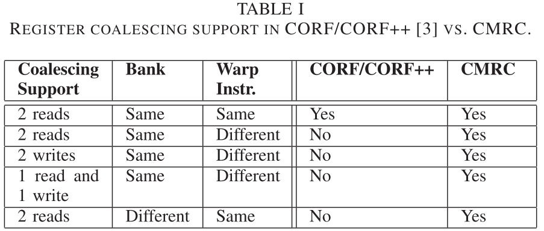

[3]引入了用于 GPU 的合并操作数寄存器文件 (CORF)，有两种设计风格：有限的 CORF 和增强的 CORF++，以提高 GPGPU 应用程序的性能并降低能耗。这项工作是一个重要的里程碑，引入了 GPU 寄存器合并的概念。然而，作为第一个此类工作，所采用的软件硬件方法存在许多限制和开销，我们将其视为改进我们提出的 CMRC 技术的关键目标。CMRC 相对于 CORF/CORF++ 来说是一个显着的进步。首先，CMRC 是纯粹的微架构，与 CORF/CORF++ 不同，不需要更改编译器。仅硬件方法消除了对编译时提示和软件更改的需要，并允许系统利用每个工作负载/程序的行为。编译时方法缺乏有关实际数据宽度和动态程序行为的信息，并增加了我们希望避免的更多硬件开销和复杂性（CORF/CORF++ 中的寄存器打包和重命名）。此外，CMRC 的方法不仅利用了warp寄存器内的窄宽度数据，而且还利用了软件方法无法做到的不同warp之间的窄宽度数据。其次，CMRC 支持更广泛的不同合并类型（2-5），如表 I 中所列，而 CORF/CORF++ 无法支持。凭借更多的合并功能，我们的设计能够实现比增强型 CORF++ 1.8 倍的加速，并且面积开销要低得多。

### （3）挑战

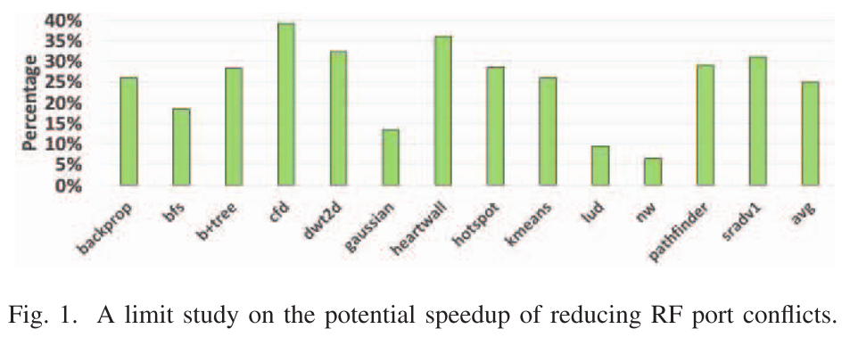

**有限访问端口的影响：**由于 RF Bank 和 OC 上的访问端口有限，读或写请求可能会遇到以下类型的端口冲突之一，导致其访问被串行化： (1) 写写冲突。(2)读写冲突。(3)读读冲突。(4)OC写冲突。图 1 显示了减少 RF 端口冲突的潜在好处，通过消除所有端口冲突（就好像Bank有无限个端口）所实现的性能改进范围为 7% 到 40%。

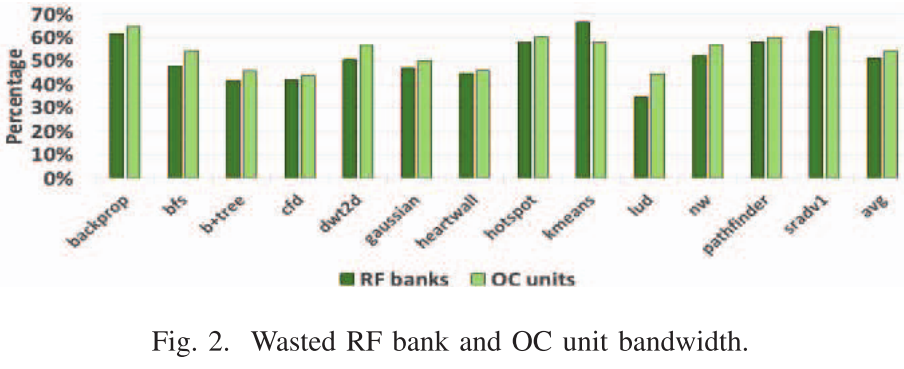

**浪费 RF 带宽：**窄宽度读取和写入访问未充分利用 RF 带宽，因为它们携带不需要的字节，其值中仅包含符号位。我们发现平均只有 29% 的 RF 访问、读取和写入需要完整的寄存器宽度。从图2可以看出，由于窄带访问，RF Bank和OC上的带宽浪费超过50%。此外，窄宽度值中不需要的字节在每次读写 RF 以及向下传播到 OC 时都会浪费动态功率。

### （4）方案

CMRC是一种新的 RF 微架构，支持 RF Bank 和 OC 中的读写访问合并，以提高 GPGPU 应用程序的性能并降低总体能耗。CMRC 通过利用应用中常见的窄宽度数据产生的合并机会来解决访问串行化问题。窄宽度数据的读写请求可以合并为更少数量的Bank访问，为 RF Bank和 OC 提供更高的带宽利用率，减少 RF 和 OC 端口争用，从而提高整体性能和 GPGPU 工作负载的能源效率。

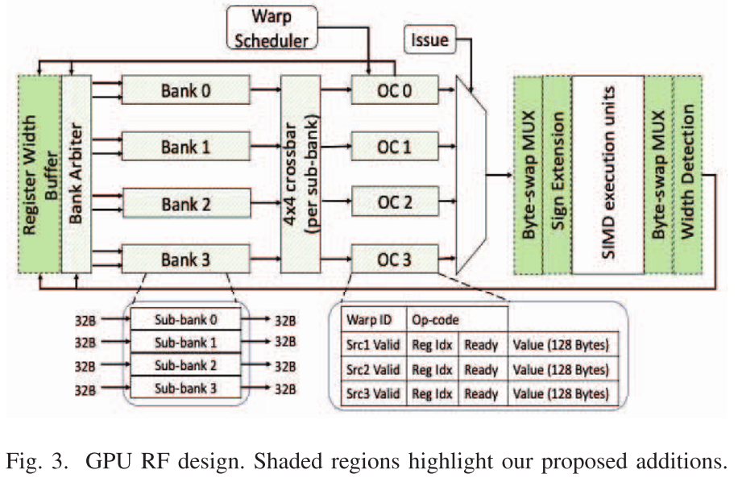

基线 RF 被平均划分为多个Bank。**每个Bank拥有多个寄存器条目，每个寄存器条目的宽度为 128B**。从物理上讲，该**Bank是使用四个狭窄的子Bank构建的，其中每个子Bank保存每个寄存器的 32B 片。** **每个Bank都提供一个 128B 访问端口，用于在一个周期内读取或写入完整寄存器。** 当源操作数在多个周期内从 RF Bank中读出时，OC 单元需要捕获源操作数。**每个 OC 提供一个 128B 写入端口，一次可供一个Bank使用。RF Bank 使用具有 128B 宽链路的纵横网络连接到 OC。** 

##### A. 寄存器数据格式

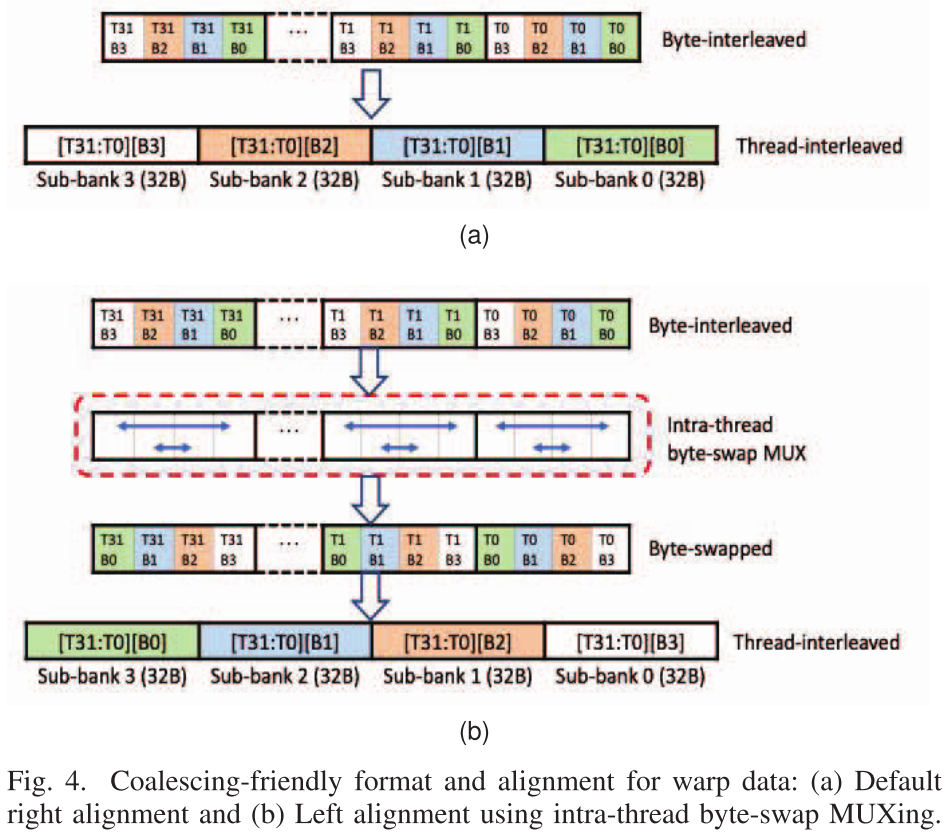

寄存器合并的基础是两个窄宽度请求能够同时访问一个Bank中的不同子Bank的能力。因此，我们使用如图 4a 底部所示的一种合并友好的数据格式，而不是如图 4a 顶部所示的基线 GPU 中使用的字节交错格式（这种格式对有效子Bank带宽的利用很差）。我们称之为**线程交错格式。** 这允许窄宽度请求仅消耗和充分利用子Bank的子集，并允许另一个合并访问使用空闲子Bank。我们仅在 RF（Bank、互连和 OC）内使用线程交错格式。

##### B. 寄存器数据对齐

默认情况下，以线程交错格式表示窄宽度数据将使其右对齐，并且仅允许使用Bank中较低的子Bank来保存数据。然而，为了支持访问合并，其他窄宽度寄存器需要左对齐或映射到高位子Bank，以便合并请求可以在一个Bank内访问非重叠子Bank获取两个目标寄存器。CMRC 以一种廉价的方式解决寄存器左对齐问题，因为warp数据不必以特定顺序（即小尾数法）存储在 RF 中。因此，如图 4b 所示，在写入 RF 时，CMRC 不会在整个warp宽度上移动数据，而是交换数据字节（**在每个线程内本地**），这样，当数据以线程交错格式表示时，所有 B0 都将被替换。映射到子Bank 3，B1 将映射到子Bank 2，依此类推。当从 RF 读取数据时，会使用相同的字节交换技术将数据恢复为其原始顺序。图 3 显示了位于 RF 写入侧和读取侧的字节交换多路复用器。CMRC 采用纯硬件解决方案来指导warp寄存器的数据对齐，目的是避免与动态分配和寄存器重命名相关的高复杂性和开销。CMRC 中的**寄存器根据其条目编号进行对齐，偶数条目右对齐，奇数条目左对齐。**

##### C. 具有子Bank控制的RF Banks

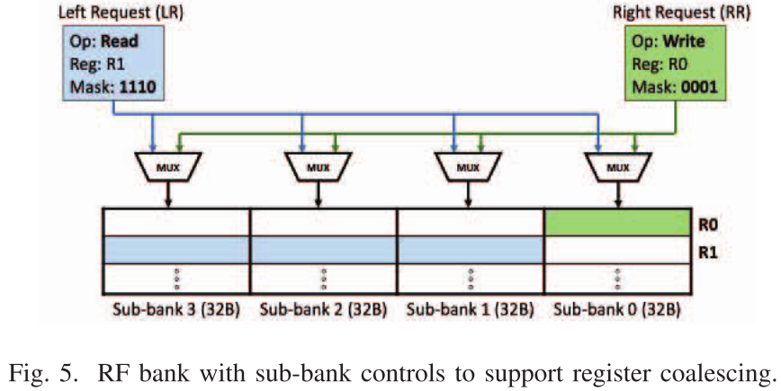

在数据格式化和对齐的支持下，可以同时访问两个寄存器（偶数和奇数），因为它们的**数据驻留在不重叠的子Bank中 。** 因此，CMRC 为每个子Bank提供单独的读/写和地址（条目号）控制，以允许针对偶数和奇数条目的两个窄宽度请求（读或写）进行合并并同时访问子Bank，如图5所示。**每个窄宽度请求使用4位掩码（根据有效宽度确定）来指示要访问的子Bank。两个合并请求掩码的 AND 运算必须为零，这意味着它们在任何子Bank上都不会冲突。**每个请求分别向目标子Bank提供读/写和地址控制。

##### D. RF 互连和 OC 写入

为了支持更多合并场景，我们更新了连接Bank与 OC 单元的 RF 交叉开关，以便对每个 32B 数据片进行单独控制。我们没有使用具有 128B 链路的交叉开关，而是将交叉开关分成四个较窄的交叉开关，每个交叉开关具有 32B 链路，且每比特复用成本相同。这允许每个 32B 交叉开关将给定子Bank（跨 4 个Bank）连接到 OC 写入端口的 32B 片。

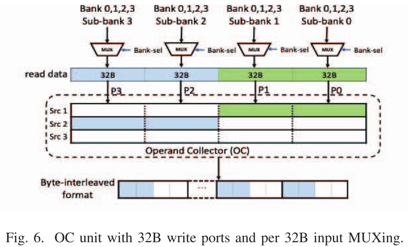

图 6 显示了一个 OC 上的独立交叉开关 (MUXing)。图 6 还突出显示了 OC 单元上用于处理合并读取的控制更新。CMRC 不是在单个缓冲区条目中捕获合并的读取数据并在读出时将其解包，这会花费额外的 MUXing，而是在将合并的数据写入 OC 时将其解包，以低成本方式通过单独写入 控制每个 32B 的 OC 数据缓冲区。我们使用的解包方法很自然，因为 OC 上的单个 128B 写入端口现在表现为四个 32B 写入端口，其中每个窄端口分别写入缓冲区条目的 32B 切片。

##### E. 寄存器宽度检测（子库掩码生成）

在执行管道的末尾（回写阶段）添加宽度检测。我们分别通过在具有相同字节位置的所有位上使用reduction-OR门和NAND门来检测正和负窄宽度值。这应用于所有warp线程的字节 1、2 和 3，并生成 3 位（子Bank）掩码（隐式设置字节 0 掩码位）。掩码被捕获在缓冲区中以用于正在写入的目标寄存器。所需的总缓冲区空间仅为 384B（3 位×1024 个warp寄存器）。生成的掩码用于当前寄存器写入和未来读取以启用寄存器合并。

##### F. 控制发散

这里我们注意到，所提出的解决方案在处理同一warp内线程的控制发散方面存在限制。这种限制也存在于类似的提案中[3]。

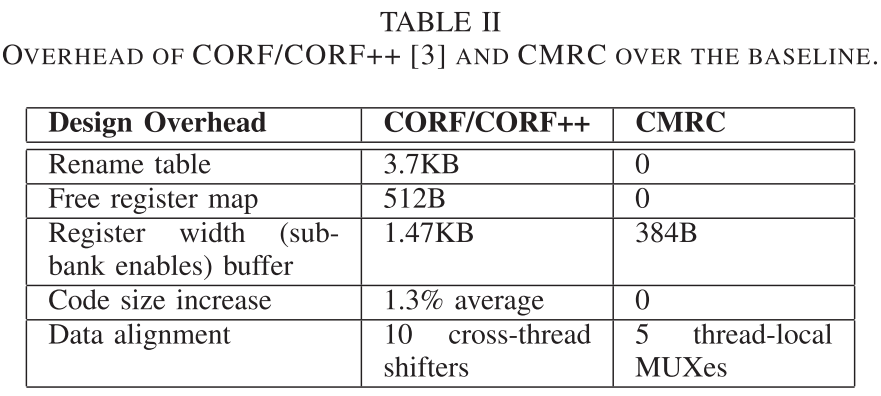

##### C. 设计开销

表 II 总结了 CORF/CORF++ 和 CMRC 相对于基线的开销。CMRC 避免了软件硬件方法中的大部分复杂性和开销，包括寄存器打包和重命名。CMRC 的大部分更新都支持对RF Bank、交叉开关互连和 OC 单元进行细粒度控制，这些控制的开销非常低。CMRC 使用一个小型缓冲区来捕获每个warp寄存器的子Bank使能。它还使用更便宜的线程本地多路复用器来执行warp数据对齐。两种设计都需要少量逻辑来检测寄存器宽度并在将窄宽度寄存器恢复为其全宽度时执行符号扩展。我们估计 CMRC 的功率开销不到 RF 动态功率的 2%，不到 GPGPU 总功率的 1%。

## 2. Reconciling QoS and Concurrency in NVIDIA GPUs via Warp-Level Scheduling

**会议/作者信息：**

> DATE 2021
>
> Jayati Singh，伊利诺伊大学厄巴纳-香槟分校
>
> Ignacio Sanudo Olmedo，Nicola Capodieci，Andrea Marongiu，摩德纳-雷焦·艾米里亚大学
>
> Marco Caccamo，慕尼黑工业大学

**作用：**

> 不太相关

**研究层次：**

> 多内核同时执行的调度策略

**研究重要性：**

> 一般

**研究差异：**

> 同：
>
> 异：

### （1）研究问题

NVIDIA GPU 和 CUDA 编程模型更看重吞吐量，而不是延迟和时序可预测性。因此，为 GPU 应用程序提供实时和服务质量 (QoS) 属性提出了一项有趣的研究挑战。在考虑同时多内核 (SMK) 场景时，这种挑战至关重要，其中内核在每个流式多处理器 (SM) 内同时执行。CUDA 流提供了一种优先级机制，允许控制 SMK 中的 QoS 要求。然而，这种机制在整个线程块的粒度上运行，这太粗糙而无法安全地限制内核延迟。在warp级别进行操作比流优先级具有显着的优势。然而，每个 SM 内的 warp 调度程序缺乏用户定义优先级的概念； 这使得在使用 SMK 时几乎不可能在内核之间强制执行 QoS 要求。因此，在本文中，我们提出了一种 QoS 感知的 Warp Scheduling (QAWS) 策略，以根据并发内核的 QoS 要求有效地确定并发内核的优先级。

## 3. WER: Maximizing Parallelism of Irregular Graph Applications Through GPU Warp EqualizeR

**会议/作者信息：**

> ASPDAC 2024
>
> En-Ming Huang，Bo-WunCheng，Chun-Yi Lee，台湾清华大学 
>
> Meng-Hsien Lin，Tsung Tai Yeh，台湾阳明交通大学

**作用：**

> 不太相关

**研究层次：**

> 图计算负载平衡

**研究重要性：**

> 一般

**研究差异：**

> 同：
>
> 异：

### （1）研究问题

不规则图在广泛的数据分析应用中变得越来越普遍。尽管它们具有多功能性，但这些图固有的复杂性和不规则性通常会导致在GPU上处理时SIMD资源的利用不足，源于两个主要问题：不活跃线程的出现和warp内负载不平衡。这些问题可能会产生空闲线程，导致 SIMD 资源使用效率低下，从而阻碍吞吐量并增加程序执行时间。

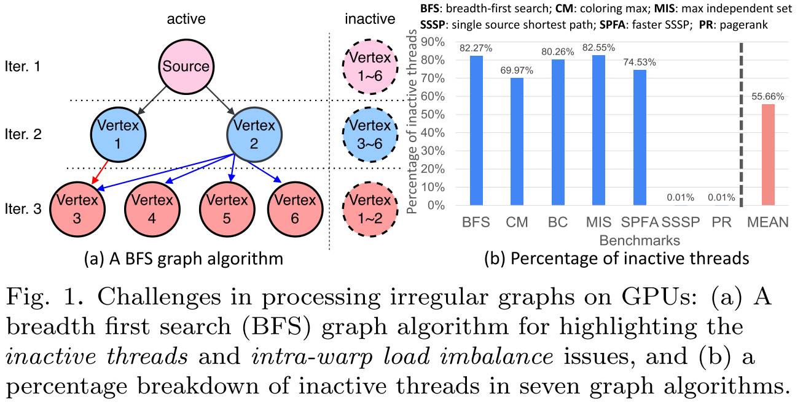

将图的顶点和边映射到 GPGPU 的 SIMT 执行单元，同时充分利用并行内核的潜力，提出了艰巨的挑战。由于与图中每个顶点相关联的边的数量通常在现实世界的图工作负载中表现出变化，因此出现了这种困难。如图 1 所示，这些挑战需要及时有效的解决方案。

### （2）其他研究

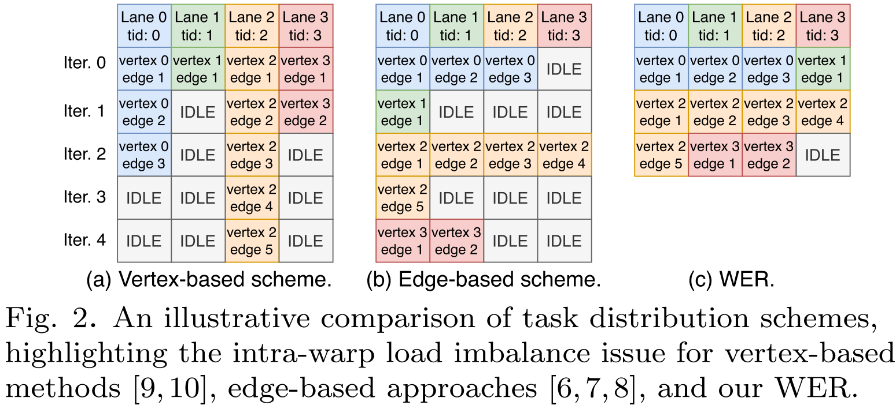

以前的 SOTA 软件方法，例如 collaborative task engagement (CTE) [6, 7] 和以 warp-centric [8]，都采用了基于边缘的处理方案，如图 2 所示。该方案通过单个warp内的线程同时处理单个顶点的工作负载。相比之下，Tigr [9] 旨在通过限制每个顶点的最大度数，使不规则图的数据布局适应 SIMD 执行友好的格式。另一方面，GraphPEG [10] 和 SCU [11] 提出了与 GPU 结合的定制硬件单元来平衡工作负载。然而，这些硬件方法需要额外的内存空间，并且上面提到的这些方法都没有解决不活跃线程的问题。

### （3）方案

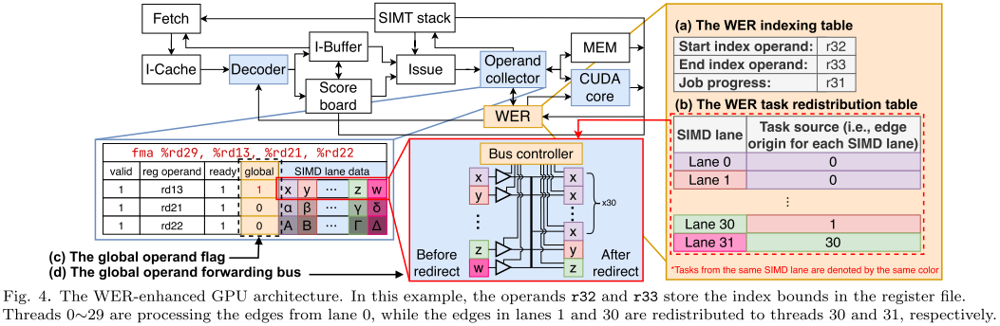

## 4. TURBULENCE: Complexity-effective Out-of-order Execution on GPU with Distance-based ISA

**会议/作者信息：**

> DATE 2023
>
> Reoma Matsuo，Toru Koizumi，Hidetsugu Irie，Shuichi Sakai，Ryota Shioya，东京大学

**作用：**

> 不太相关

**研究层次：**

> 混合指令集（寄存器编号+指令距离）支持乱序发射

**研究重要性：**

> 一般

**研究差异：**

> 同：
>
> 异：

### （1）研究问题

通过乱序执行来提取指令级并行性，以提供额外的性能改进机会。我们提出了 TURBULENCE 架构，用于在 GPU 上实现非常低成本的乱序执行。TURBULENCE 包括 1) 一种新颖的 ISA，它引入了通过指令间距离而不是寄存器编号来引用操作数的概念，以及 2) 一种执行新颖 ISA 的新颖微架构。我们提出的 ISA 和微架构可以在 GPU 上实现经济高效的乱序执行，而无需引入昂贵的硬件。

### （2）方案

在当前 GPU 上，每个线程中的指令通常按顺序执行，而不是乱序执行。乱序执行广泛应用于高性能CPU中，因为它可以有效隐藏线程内每条指令的延迟并提高性能。然而，乱序执行需要非常昂贵的电路，例如重命名逻辑、重新排序缓冲区（ROB）和加载存储队列（LSQ）[5]-[7]。如果在 GPU 上实现乱序执行，则需要与线程数量成比例的这些昂贵单元，从而使电路变得不切实际的大。因此，GPU 通常专注于通过多线程执行来隐藏延迟，并且不会引入昂贵的乱序执行来隐藏线程内的延迟。相比之下，我们发现 GPU 工作负载还包含可用的指令级并行性，可以通过乱序执行来提取这些并行性，以提供性能改进机会。

##### A. 混合指令集

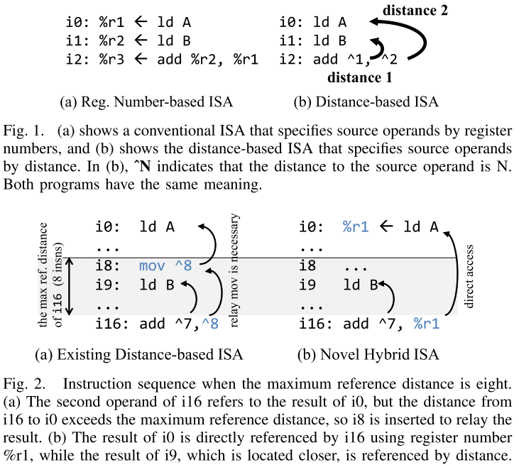

基于距离的 ISA 最初是为高性能 CPU 提出，它使用指令间距离而不是寄存器编号来指定操作数 [6]、[8]。图 1 显示了基于距离的 ISA 示例，以及现有的基于寄存器号的 ISA 示例。**由于操作数的基于距离的表示，基于距离的 ISA 不会产生任何错误的依赖关系，因此可以省略寄存器重命名[6]、[8]。** 然而，现有的基于距离的 ISA 会显着增加指令数量，从而降低性能。这种增加是由于插入中继指令来引用远程指令生成的结果等原因，如图 2 (a) [8] 所示。

我们提出了一种新颖的混合 ISA，它使用寄存器编号而不是具有长参考距离的特定操作数的距离，如图 2 (b) 所示。通过寄存器编号访问操作数必须按顺序执行，但 GPU 可以通过多线程有效隐藏延迟。因此，可以减少指令数量，同时最大限度地降低性能影响。

## 5. An Adaptive Framework for Oversubscription Management in CPU-GPU Unified Memory

**会议/作者信息：**

> DATE 2021
>
> Debashis Ganguly，Rami Melhem，Jun Yang，匹兹堡大学

**作用：**

> 不太相关

**研究层次：**

> 减少页面迁移（内存超额订阅）引起的互连内存流量

**研究重要性：**

> 一般

**研究差异：**

> 同：
>
> 异：

### （1）研究问题

数据密集型应用程序面临设备内存超额订阅的挑战，因为带宽优化的 GPU 内存的有限容量无法适应其不断增加的工作集。**内存超额订阅下的性能开销来自于缓慢的 CPU-GPU 互连上内存页面的迁移。**根据不同的计算和内存访问模式，每个应用程序都需要内存管理的特别关注。因此，有效利用 GPU 编程库和运行时支持的大量内存管理技术的责任完全落在应用程序员身上。本文提出了一种智能运行时，它利用故障和页面迁移信息来检测 CPU-GPU 互连流量中的底层模式。基于在线工作负载特征，扩展的统一内存运行时动态地从多种内存管理策略中选择并采用合适的策略来解决内存超额订阅的问题。

设备内存超额订阅下的性能开销在很大程度上取决于固有的应用程序特征。要解决超额订阅带来的性能挑战，有效的内存管理策略需要彻底了解相关工作负载的内存访问模式。尽管对主机固定内存的不可缓存zero-copy访问和基于访问计数器的延迟页面迁移减轻了数据密集型不规则应用程序的设备内存超额订阅的影响，但对于具有密集、顺序内存访问的常规应用程序来说却会产生反作用。同样，虽然具有 2MB 大页面粒度的 LRU 减少了流应用程序的写回延迟，但它加剧了常规和不规则应用程序的页面迁移。因此，应用程序程序员在选择合适的内存管理策略之前会进行广泛的应用程序分析。

### （2）背景

**统一内存中的按需页面迁移。**统一内存提供可从系统中的任何处理器访问的单个虚拟地址空间。在 CUDA 中，cudaMallocManaged 允许程序使用单个共享指针来分配可由主机代码和 GPU 内核访问的数据。统一内存的想法是通过按需内存分配和故障驱动的页面传输来实现的。Zheng等人[7]引入了replayable far-fault的概念。当寻址的内存页面物理上不存在于设备内存中时，就会发生replayable far-fault，这与缓存未命中时发生的nearfault不同。GPU内存管理单元（GMMU）只能执行页表查找。它不能处理far-fault和更新/添加页表条目。far-fault被注册在far-fault未命中状态处理寄存器 (MSHR) 中。warps被stalled。GPU 中断操作系统中托管的统一内存运行时以replay far-fault。根据far-fault的组合，运行时中的软件预取器确定并调度直接内存访问 (DMA) 请求，以通过 CPU-GPU 互连将内存块从主机传输到设备。相应的页面按需分配，页表和 TLB 条目在调度的的传输完成后创建/更新。MSHR 被咨询以通知相应的LDST单元，并reply内存访问，并将stalled的warp标记为可执行。

**软件预取器。**在统一内存中，GPU 的大规模线程级并行性 (TLP) 不足以掩盖far-fault处理延迟。研究人员 [7]、[8] 提出了软件预取器，以减轻程序员使用复杂的 cudaMemPrefetchAsync 结构编写手动调整代码的负担。通过研究 MIT 许可的开源 nvidia-uvm 模块并执行微基准测试，Ganguly 等人 [1] 发现 CUDA 统一内存运行时实现了基于树的软件预取器。用户请求的 cudaMallocManaged 分配大小首先四舍五入到下一个 2^i * 64KB。然后，分配的大小在逻辑上分为 2MB 大页面加上 2MB 的一小部分。这些块中的每一个在逻辑上被进一步划分为64KB的基本块，这是预取的单位。然后，创建一组全二叉树，其中叶级保存64KB基本块，根节点对应2MB大页地址。基于树的软件预取器是由这些完整二叉树控制的启发式方法。从 GPU 接收到一组far-fault后，运行时计算与这些故障页面对应的 64KB 基本块的基地址，并识别全二叉树结构的相应叶节点。驱动程序将这些基本块的地址传递给 I/O root complex 以调度数据传输。当块从主机迁移到设备并分配页面时，运行时会跟踪这些二叉树中每个节点的当前占用情况或有效内存的总大小。在任何给定实例中，如果运行时确定树数据结构中非叶节点的占用量超过该节点总容量的 50%，则会选择当前节点下的非有效叶节点作为进一步预取候选者。

**页面驱逐。** 在安排从主机到设备内存的任何新页面迁移之前，运行时通过查询低级系统 API 来评估设备内存的当前占用情况。当设备内存中没有可用空间时，运行时会调用页面替换例程，自动将页面从设备写回到主机内存。CUDA 运行时以 2MB x86-OS 大页面的严格粒度实现最近最少使用 (LRU) 页面驱逐。Ganguly 等人 [1] 引入了基于树的预驱逐，其灵感来自于基于树的预取器，它利用运行时创建和维护的全二叉树结构来进行托管分配。它采用基于阈值的启发式逆预取器。在任何情况下，如果非叶节点的当前占用率低于 50%，则运行时会预先驱逐其下的其他 64KB 有效叶节点。

**页面迁移和固定。** 研究人员 [4]、[8] 研究了异构系统环境中对主机固定内存的低延迟、不可缓存的直接内存访问与带宽优化的本地内存访问之间的权衡。他们提出了一种静态页面放置策略，该策略需要编译器支持分析和程序员干预来注释内存分配。NVIDIA CUDA 运行时还支持根据用户提供的提示将内存页面放置到主机或设备内存中。cudaMemAdviseSetAccessedBy 标志允许设备建立到主机内存的直接映射。此外，cudaMemAdviseSetPreferredLocation 允许指定要设置到主机内存的内存分配的首选位置。如果建议将分配软固定到主机内存，则页面不会在the first touch时直接复制到设备。相反，迁移会被延迟，直到读取请求的数量超过模型特定寄存器中配置的某个静态阈值。而在写入访问时，无论阈值如何，数据都会被迁移，以保持访问的排他性。Ganguly等人[5]在访问频率和逐出计数上实现了基于动态阈值的延迟迁移，以自适应地将热页迁移到设备内存并将冷页固定到主机内存。它在低延迟远程访问和高带宽本地访问之间取得平衡，以减少数据密集型不规则应用程序的内存页面移动。

### （3）相关研究

过去的研究依赖硬件增强和编译器注释来动态检测内存访问模式。Li 等人 [6] 使用硬件计数器对合并内存访问的数量进行采样。基于该计数器上的阈值方案，它们区分常规和不规则应用程序。根据编译时分析来确定多个内核启动时的数据重用。

Ganguly 等人 [1] 研究了超额订阅下软件预取器和页面替换算法之间的相互作用。受基于树的预取器语义的启发，他们提出了一种新的“预驱逐”策略，以减少页面迁移。遵循相同的方向，Yu 等人引入了分层页面逐出 [2]，以及协调的预取器和逐出策略 [3]。研究人员 [4] 还探索了带宽感知页面放置策略，以利用缓存一致的异构 NUMA 系统中的整体系统带宽。Ganguly 等人 [5] 提出了一种自适应统一内存运行时，用于页面迁移和固定，利用硬件访问计数器和延迟迁移和对主机固定内存的不可缓存访问等通用概念，以解决超额订阅的不规则应用程序的性能开销。

过去的研究主要集中在通过基于用户的侵入性分析或提出硬件扩展来识别设备内存访问模式。例如，Yu 等人 [2] 分析了模拟平台上的工作负载执行情况，以确定各种通用应用程序的设备内存访问模式的六种代表性类别。他们进一步提出了分层页面驱逐，依靠额外的微架构增强来减少页面迁移。Li等人[6]还将GPU应用分为三大类——1）没有数据共享的常规应用，2）有数据共享的常规应用和3）不规则应用。他们在每个 SM 的LDST单元中提出了一个硬件计数器，以对合并内存访问的数量进行采样，并确定正在执行的工作负载的内存访问模式。在检测到内存访问模式后，他们建议的运行时在主动驱逐、内存感知限制和容量压缩之间进行选择，以解决内存超额订阅的挑战。

### （4）挑战

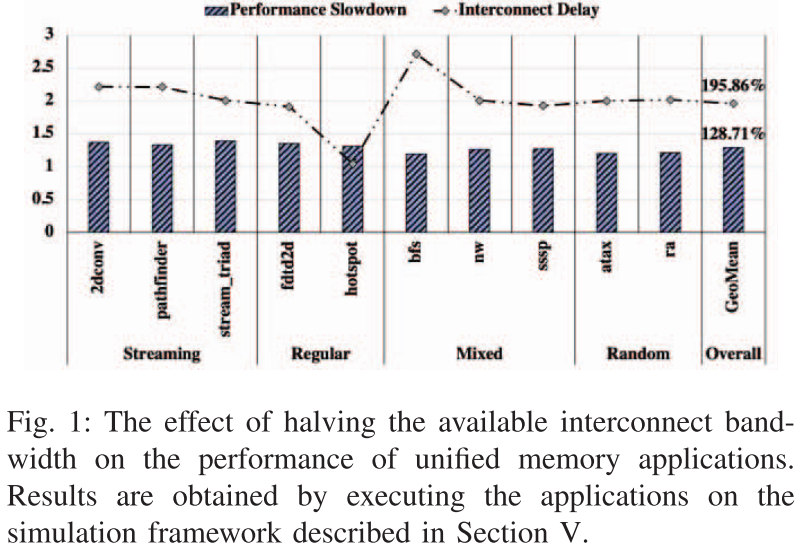

##### A. 慢速CPU-GPU互连

图 1 显示，当可用互连带宽减半时，CPU-GPU 互连的归一化延迟几乎达到两倍，这证明了通用应用程序集平均（几何平均值）1.29 倍的性能下降是合理的。与具有统一内存的经典“复制然后执行”模型相反，内核执行因故障驱动的迁移而停止。具有统一内存分配的应用程序的端到端执行时间类似于串行内存复制和内核执行时间的总和。甚至，GPU 的重度多线程在隐藏主机到设备页面迁移方面的长延迟也变得无效。因此，CPU-GPU互连流量成为性能瓶颈的根源。

##### B. 超额订阅开销

图 2 显示了不同内存超额订阅百分比下 GPGPU 工作负载的性能下降情况。结果是通过在 GeForceGTX 1080 ti 上运行工作负载（而不是在模拟环境上）获得的。为了模拟内存超额订阅，工作负载的工作集不会缩放，而是通过分配虚拟 cudaMalloced 变量来控制总可用空间，因为 cudaMalloced 分配是固定的并且不参与驱逐。GPU 应用程序的内存访问模式取决于细粒度并行性和固有的内存访问特性。不同的内存访问模式对内存超额订阅的反应可能不同，从而导致性能开销差异很大。而对于流媒体和常规应用程序，超额订阅下的性能下降源于基于故障的迁移在长延迟写回之后等待； 对于混合和随机应用程序，性能开销是由于过多的页面移动造成的。

### （5）方案

与之前的工作不同，本文既不依赖基于侵入式分析的编译器注释，也不依赖任何硬件扩展来检测 CPU-GPU 互连流量中的底层模式。 相反，作为统一内存运行时的一部分实现的模式检测引擎利用软件预取器识别的 64KB 基本块的信息来进行故障驱动的迁移。 然后，根据检测结果，智能框架自适应地选择并采用最适合的内存管理策略，以减少由页面移动引起的互连内存流量。 因此，所提出的运行时简单实用，不需要任何程序员帮助或新的硬件增强。
